# Multi-Entity Contact Suite (Spring Boot, React, and JUnit)
[](https://github.com/jguida941/contact-suite-spring-react/actions/workflows/java-ci.yml)
[](https://github.com/jguida941/contact-suite-spring-react/actions/workflows/codeql.yml)
[](https://codecov.io/gh/jguida941/contact-suite-spring-react)
[](#qa-summary)
[](#qa-summary)
[](#static-analysis--quality-gates)
[](#static-analysis--quality-gates)
[](LICENSE)


## Executive Summary

- **Overview**: Full-stack contact, task, appointment, and project tracker built with Spring Boot 4.0.0 and React 19.
- **Architecture highlights**: PostgreSQL + JPA with 13 Flyway migrations, JWT authentication with RBAC, per-user data isolation, token-bucket rate limiting, structured logging with PII masking, Prometheus metrics, Docker packaging, Kubernetes-ready health probes, and 6 GitHub Actions workflows (CI/CD, CodeQL, ZAP DAST, API fuzzing, Dependabot).
- **My role**: Designed the schema (13 migrations), built 6 domain aggregates with services and controllers, wired the JWT security and observability stack, created a React 19 SPA using TanStack Query, packaged everything with Docker + Compose, and automated the stack via a Makefile (30+ targets) and CI/CD pipelines.
- **Quality bar**: 920 test executions on the full Linux matrix run, ~89.9% line coverage (JaCoCo), ~83.1% mutation score (PITest), and 5 CI quality gates (JaCoCo, PITest, SpotBugs, Checkstyle, OWASP Dependency-Check).
  - Linux CI runs the full suite with Testcontainers/Postgres and enforces coverage/mutation gates; Windows CI uses the `skip-testcontainers` profile on H2 with a **reduced JaCoCo gate** that excludes container-only code paths while still running PITest. Legacy `getInstance()` suites are tagged `legacy-singleton` and can be run separately via `mvn test -Plegacy-singleton` without touching the main pipeline.

---

Started as the simple CS320 contact-service milestone and grew into a multi-entity suite (Contact, Task, Appointment, Project) with full persistence, Spring Boot 4.0.0, a React 19 SPA, and backward-compatible singletons. The work breaks down into:

1. Built the `Contact` and `ContactService` classes exactly as described in the original requirements.
2. Proved every rule with unit tests (length limits, null checks, unique IDs, add/update/delete behavior) using a shared `Validation` helper so exceptions surface clear messages.
3. Mirrored the same patterns for the `Task` entity/service (ID, name, description) and `Appointment` (ID, date, description) so all domains share validation, atomic updates, and singleton storage.
4. Persisted all aggregates through Spring Data JPA repositories and Flyway migrations (Postgres in dev/prod, Postgres via Testcontainers for SpringBootTests, H2 for targeted slices) while keeping the legacy `getInstance()` singletons alive for backward compatibility.
5. Added comprehensive security (JWT auth, per-user data isolation, rate limiting, CSRF protection) and observability (structured logging, Prometheus metrics, PII masking).
6. Built a production-ready React 19 SPA with TanStack Query, search/pagination/sorting, an admin dashboard, and full accessibility support.
7. Implemented Project/Task Tracker Evolution (ADR-0045 Phases 1–5): Project entity with CRUD operations and status tracking, task enhancements (status and due dates), task–project linking, appointment–task/project linking, and team collaboration via task assignment with access control.

Everything is packaged under `contactapp` with layered sub-packages (`domain`, `service`, `api`, `persistence`, `security`, `config`); production classes live in `src/main/java` and the JUnit tests in `src/test/java`. Spring Boot 4.0.0 provides the runtime with actuator health/info endpoints and Prometheus metrics.

## Table of Contents
- [Getting Started](#getting-started)
- [Phase Roadmap & Highlights](#phase-roadmap--highlights)
- [React UI Highlights](#react-ui-highlights)
- [Branches & History](#branches--history)
- [Folder Highlights](#folder-highlights)
- [Design Decisions & Highlights](#design-decisions--highlights)
- [Architecture Overview](#architecture-overview)
- [Backend Domain & Services](#backend-domain--services)
- [Security Infrastructure](#security-infrastructure)
- [Observability Infrastructure](#observability-infrastructure)
- [REST API Layer](#rest-api-layer-phase-2)
- [React UI Layer](#react-ui-layer-phase-4)
- [Spring Boot Infrastructure](#applicationjava--spring-boot-infrastructure)
- [Static Analysis & Quality Gates](#static-analysis--quality-gates)
- [Backlog](#backlog)
- [CI/CD Pipeline](#cicd-pipeline)
- [QA Summary](#qa-summary)
- [Self-Hosted Mutation Runner Setup](#self-hosted-mutation-runner-setup)

## System Requirements

| Tool | Version | Notes |
|------|---------|-------|
| **Java** | 17+ | Temurin JDK 17 recommended |
| **Apache Maven** | 3.9+ | For building and testing |
| **Node.js** | 22+ | For frontend development (matches pom.xml) |
| **npm** | 8+ | Comes with Node.js |
| **Python** | 3.8+ | For development scripts (`dev_stack.py`) |
| **Docker** | 20.10+ | For Postgres dev database (optional) |
| **Docker Compose** | 2.0+ | For multi-container setup (optional) |

**Hardware:** 2GB RAM minimum, 500MB free disk space.

**Operating Systems:** Linux, macOS, Windows (WSL2 recommended for Windows).

## Getting Started
1. Install Java 17 and Apache Maven (3.9+).
2. Run `mvn verify` from the project root to compile everything, execute the JUnit suite, and run Checkstyle/SpotBugs/JaCoCo quality gates. (Testcontainers-based integration tests are skipped locally by default; run `mvn verify -DskipITs=false` with Docker running to include them.)
3. **Development mode** (backend only): `mvn spring-boot:run` (base profile uses an in-memory H2 database in PostgreSQL compatibility mode so you can try the API without installing Postgres; use `--spring.profiles.active=dev` or `prod` to connect to a real Postgres instance that persists data between restarts)
   - Health/info actuator endpoints at `http://localhost:8080/actuator/health`
   - **Swagger UI** at `http://localhost:8080/swagger-ui.html`
   - **OpenAPI spec** at `http://localhost:8080/v3/api-docs`
   - REST APIs at `/api/v1/contacts`, `/api/v1/tasks`, `/api/v1/appointments`, `/api/v1/projects`
4. **Frontend development** (hot reload):
   ```bash
   cd ui/contact-app
   npm install
   npm run dev        # Starts Vite at http://localhost:5173
   ```
   The Vite dev server proxies `/api/v1` requests to `localhost:8080` (run Spring Boot in a separate terminal).

   > **Development URLs** (when running both servers):
   > | URL | Purpose |
   > |-----|---------|
   > | **http://localhost:5173** | React UI (use this for the web app) |
   > | http://localhost:8080/api/v1/* | REST API (JSON responses only) |
   > | http://localhost:8080/swagger-ui.html | API documentation |
   > | http://localhost:8080/actuator/health | Health check endpoint |
   > 
   > **One-command option**: `python scripts/dev_stack.py` starts `mvn spring-boot:run`, waits for `http://localhost:8080/actuator/health`, installs UI deps if needed, and launches `npm run dev -- --port 5173`. Press Ctrl+C once to shut down both services. Add `--database postgres` to have the helper start Docker Compose, set the `dev` profile, and inject datasource env vars automatically.
   
### Persisting Dev Data with Postgres
The default profile uses in-memory H2, so data disappears when the backend stops. To keep data between restarts, let the launcher handle the Postgres database setup:

```bash
python scripts/dev_stack.py --database postgres
```

This command runs `docker compose -f docker-compose.dev.yml up -d` (or `docker-compose` if needed), wires datasource env vars/credentials, activates the `dev` profile, and launches both servers.

Prefer manual control? Follow these steps instead:

1. Start Postgres via Docker Compose (ships with default `contactapp/contactapp` creds):
   ```bash
   docker compose -f docker-compose.dev.yml up -d
   ```
2. Export datasource credentials (or add them to your shell profile):
   ```bash
   export SPRING_DATASOURCE_URL=jdbc:postgresql://localhost:5432/contactapp
   export SPRING_DATASOURCE_USERNAME=contactapp
   export SPRING_DATASOURCE_PASSWORD=contactapp
   ```
3. Run the stack with the `dev` profile so Spring Boot connects to Postgres:
   ```bash
   mvn spring-boot:run -Dspring-boot.run.profiles=dev
   npm run dev
   ```

Flyway automatically creates the schema on first run. Stop the database with `docker compose -f docker-compose.dev.yml down` when you are done (data stays in the `pgdata` volume).
5. **Production build** (single JAR with UI):
   ```bash
   mvn package -DskipTests
   java -jar target/cs320-contact-service-junit-1.0.0-SNAPSHOT.jar
   ```
   Open `http://localhost:8080` — Spring Boot serves both the React UI and REST API from the same origin.
8. **Test profiles**:
   - Default CI/local run: `mvn test` (Linux) exercises the full suite with Testcontainers/Postgres.
   - Windows/`-DskipTestcontainersTests=true`: runs the same service/controller suites against in-memory H2 (no Docker) while still reporting JaCoCo.
   - Legacy singleton coverage: `mvn test -Plegacy-singleton` runs only the legacy `getInstance()` suites tagged `legacy-singleton` against H2 to avoid interfering with the main pipeline.
6. Open the folder in IntelliJ/VS Code if you want IDE assistance—the Maven project model is auto-detected.
7. Planning note: Phases 0-7 complete (Spring Boot scaffold, REST API + DTOs, API fuzzing, persistence layer, React UI, security & observability, DAST, packaging/CI, UX polish). **901 tests** (Linux full suite) cover the JPA path, legacy singleton fallbacks, JWT auth components, User entity validation, Project CRUD, and the validation helpers including the new `validateNotNull` enum helper (PIT mutation coverage ~83.1% with ~89.9% line coverage on the full suite). +84 mutation-focused tests added targeting boundary conditions, comparison operators, copy semantics, and helper adapters. ADR-0014..0046 capture the selected stack plus validation/Project evolution decisions. See [Phase Roadmap & Highlights](#phase-roadmap--highlights) for the consolidated deliverables list.

## Phase Roadmap & Highlights

The phased plan in [`docs/REQUIREMENTS.md`](docs/REQUIREMENTS.md) governs scope. This snapshot keeps the status and headline deliverables handy while future phases (8+) stay visible.

| Phase | Status | Focus | Highlights |
|-------|--------|-------|------------|
| 0 | Complete | Domain guardrails | Defensive copies in Contact/Task services; appointment date-not-past fix |
| 1 | Complete | Spring Boot foundation | Services promoted to `@Service` beans; actuator health/info endpoints |
| 2 | Complete | REST API + DTOs | CRUD controllers at `/api/v1/**`; Bean Validation DTOs; 71 controller tests |
| 2.5 | Complete | OpenAPI fuzzing | Schemathesis workflows with spec validation/hardening |
| 3 | Complete | Persistence & storage | Spring Data JPA + Flyway; Postgres dev/prod; H2 slices + Testcontainers-backed SpringBootTests |
| 4 | Complete | React SPA | CRUD UI with TanStack Query + Vite/Tailwind stack; Vitest + Playwright suites |
| 5 | Complete | Security & observability | JWT auth, per-user tenancy, rate limiting, sanitized logging, Prometheus |
| 5.5 | Complete | CI security gates | ZAP DAST scans, password strength validation, CSP/Permissions-Policy headers |
| 6 | Complete | Packaging + CI | Makefile (30+ targets), CI docker-build job, GHCR push, health checks |
| 7 | Complete | UX polish + Project Tracker (ADR-0045 Phases 1-5) | Search/pagination/sorting, toasts, empty states, admin dashboard; Project CRUD with status tracking, task status/due dates/project linking, appointment linking, task assignment with access control |

### Phase 5 Security & Observability Summary
- **Per-user data isolation**: `user_id` foreign keys on contacts, tasks, and appointments enforce multi-tenancy while services scope queries to the authenticated user.
- **Rate limiting**: Bucket4j with bounded Caffeine caches enforces login safeguards (5 attempts/min per IP address), register (3/min/IP), and API (100/min per authenticated user) limits. Exceeding limits returns HTTP 429 Too Many Requests.
- **Admin override safety**: Bulk export requests now flow through `POST /api/v1/admin/query` with CSRF tokens, JSON body flags, and `X-Admin-Override` headers plus immutable audit logging; legacy `?all=true` query strings remain temporarily for backward compatibility but are scheduled for removal after **2026-02-01**.
- **CSRF double-submit tokens**: `/api/v1/**` endpoints now require `X-XSRF-TOKEN` headers generated via `CookieCsrfTokenRepository` and `/api/auth/csrf-token`, keeping the HttpOnly cookie flow resistant to cross-site requests. The `XSRF-TOKEN` cookie explicitly sets `SameSite=Lax` and reuses `server.servlet.session.cookie.secure` (defaults to `true`; dev/test profiles override to `false` for localhost) so OWASP ZAP stops flagging missing attributes.
- **Sanitized request logging**: `RequestLoggingFilter` records method/URI/status plus masked query strings, redacted sensitive parameters, obfuscated client IPs, and normalized user agents for safe audit trails.
- **JWT authentication**: Spring Security + `JwtAuthenticationFilter` issues HttpOnly `auth_token` cookies (SameSite=Lax, Secure) with a 30-minute default TTL (`jwt.expiration`) and a dedicated `app.auth.cookie.secure` flag so cookie security stays explicit per environment while still honoring `Authorization: Bearer` headers for API clients.
- **Credentialed CORS**: Reverse proxy + Spring `CorsRegistry` ship with explicit origin lists, `Access-Control-Allow-Credentials: true`, and exposed `Authorization` header so `fetch(..., { credentials: 'include' })` succeeds without resorting to wildcards.
- **Structured logging**: Correlation IDs (`X-Correlation-ID`) flow through MDC for distributed tracing; `PiiMaskingConverter` redacts sensitive patterns in log output.
- **Prometheus metrics**: `/actuator/prometheus` exposes Micrometer metrics with custom timers for API endpoints; liveness/readiness probes remain on `/actuator/health`.
- **Production-ready Docker packaging**: Multi-stage build (Eclipse Temurin 17, non-root user, layered JAR extraction) keeps runtime images lean; detailed steps live in [`Dockerfile`](Dockerfile).

### Project/Task Tracker Evolution Summary (ADR-0045 Phases 1-5)

**Completed Features** (2025-12-01):
- **Phase 1 - Project Entity**: Full CRUD operations at `/api/v1/projects` with status tracking (ACTIVE, ON_HOLD, COMPLETED, ARCHIVED), per-user data isolation, migration V8
- **Phase 2 - Task Status/Due Date**: Enhanced Task with status enum (TODO, IN_PROGRESS, DONE), optional due dates, createdAt/updatedAt timestamps, migration V9
- **Phase 3 - Task-Project Linking**: Tasks can be assigned to projects for organization via nullable projectId FK, query parameters `?projectId={id}` and `?projectId=none`, migration V10
- **Phase 4 - Appointment Linking**: Appointments can reference tasks and/or projects for calendar context via nullable taskId/projectId FKs, query parameters `?taskId={id}` and `?projectId={id}`, migration V11
- **Phase 5 - Task Assignment**: Tasks can be assigned to team members via assigneeId FK, access control ensures users see tasks they own or are assigned to (plus project owners see all project tasks, admins see everything), query parameter `?assigneeId={userId}`, migration V12

**API Enhancements**:
- `POST /api/v1/projects` - Create project
- `GET /api/v1/projects` - List projects (with optional `?status=ACTIVE` filter)
- `GET /api/v1/projects/{id}` - Get project by ID
- `PUT /api/v1/projects/{id}` - Update project
- `DELETE /api/v1/projects/{id}` - Delete project
- `GET /api/v1/tasks?projectId={id}` - Filter tasks by project
- `GET /api/v1/tasks?status=TODO` - Filter tasks by status
- `GET /api/v1/tasks?assigneeId={userId}` - Filter tasks by assignee
- `GET /api/v1/appointments?taskId={id}` - Filter appointments by task
- `GET /api/v1/appointments?projectId={id}` - Filter appointments by project

**Database Schema**: 7 new migrations (V7-V13) add optimistic locking (V7), projects table (V8), task status/due dates (V9), task-project relationships (V10), appointment-task/project relationships (V11), task assignment (V12), and project-contact junction table (V13) with proper foreign keys and indexes.

**Test Coverage**: 901 total test executions on the full Linux run with comprehensive coverage across domain validation, persistence layers, service operations, and REST API endpoints for all implemented phases (700 execute on the Windows H2 lane via `-DskipTestcontainersTests=true`).

**Phase 6 Implementation**: Contact-Project Linking is fully implemented via V13 junction table with API endpoints for adding/removing contacts to projects (`POST /api/v1/projects/{id}/contacts`, `DELETE /api/v1/projects/{id}/contacts/{contactId}`) and retrieving project contacts (`GET /api/v1/projects/{id}/contacts`). See ADR-0045 for details.

## React UI Highlights
- Built with **Vite + React 19 + TypeScript + Tailwind CSS v4** plus shadcn/ui components for a professional look.
- Full CRUD pages for **Contacts, Tasks, and Appointments** with React Hook Form + Zod validation that mirrors the backend rules (length limits, date-not-past, etc.).
- Global theme system (Slate, Ocean, Forest, Violet, Zinc; each with light/dark) and instant theme switching via the top bar.
- Settings page (profile + appearance) and Help page (getting started steps, resource links, keyboard shortcuts).
- TanStack Query handles caching/revalidation, so edits in one tab immediately flow through the rest of the UI.
- Authentication-aware routing (`/login`, `RequireAuth`, `PublicOnlyRoute`) forces users through the JWT login screen before any `/api/v1/**` call runs; the auth helpers sync profile data with the backend and clear cached queries on logout.
- Build artifacts are bundled into the Spring Boot JAR (via `frontend-maven-plugin`), so `java -jar target/*.jar` serves the API and SPA from the same origin.

## Branches & History
- `master` (this branch) - the Spring Boot + React suite with persistence, CI, and the full UI.
- `original-cs320` - the unmodified CS320 milestone (HashMap-backed services + the original requirements/tests). Browse it at [`original-cs320`](https://github.com/jguida941/contact-suite-spring-react/tree/original-cs320) to compare the baseline against this modern implementation.

We tag releases from both branches so GitHub’s “Releases” view exposes the original assignment snapshot alongside the current platform.

## Folder Highlights
| Path                                                                                                                                 | Description                                                                                                                       |
|--------------------------------------------------------------------------------------------------------------------------------------|-----------------------------------------------------------------------------------------------------------------------------------|
| [`src/main/java/contactapp/Application.java`](src/main/java/contactapp/Application.java)                                             | Spring Boot entrypoint (`@SpringBootApplication`).                                                                                |
| [`src/main/java/contactapp/domain/Contact.java`](src/main/java/contactapp/domain/Contact.java)                                       | Contact entity enforcing the ID/name/phone/address constraints.                                                                   |
| [`src/main/java/contactapp/domain/Task.java`](src/main/java/contactapp/domain/Task.java)                                             | Task entity (ID/name/description/status/dueDate) with status enum and optional due date validation.                               |
| [`src/main/java/contactapp/domain/Appointment.java`](src/main/java/contactapp/domain/Appointment.java)                               | Appointment entity (ID/date/description) with date-not-past enforcement.                                                          |
| [`src/main/java/contactapp/domain/Validation.java`](src/main/java/contactapp/domain/Validation.java)                                 | Centralized validation helpers (not blank, length, numeric, date-not-past, enum not-null checks).                                 |
| [`src/main/java/contactapp/service/ContactService.java`](src/main/java/contactapp/service/ContactService.java)                       | @Service bean backed by a `ContactStore` abstraction (Spring Data or legacy fallback).                                            |
| [`src/main/java/contactapp/service/TaskService.java`](src/main/java/contactapp/service/TaskService.java)                             | Task service wired the same way via `TaskStore`, still exposing `getInstance()` for legacy callers.                               |
| [`src/main/java/contactapp/service/AppointmentService.java`](src/main/java/contactapp/service/AppointmentService.java)               | Appointment service using `AppointmentStore` with transactional CRUD + defensive copies.                                          |
| [`src/main/java/contactapp/persistence/entity`](src/main/java/contactapp/persistence/entity)                                         | JPA entities mirroring the domain objects without validation logic.                                                               |
| [`src/main/java/contactapp/persistence/mapper`](src/main/java/contactapp/persistence/mapper)                                         | Bidirectional mappers that re-validate persisted data via domain constructors.                                                    |
| [`src/main/java/contactapp/persistence/repository`](src/main/java/contactapp/persistence/repository)                                 | Spring Data repositories plus in-memory fallbacks for legacy `getInstance()` callers.                                             |
| [`src/main/java/contactapp/persistence/store`](src/main/java/contactapp/persistence/store)                                           | `DomainDataStore` abstraction + JPA-backed implementations injected into services.                                                |
| [`src/main/resources/application.yml`](src/main/resources/application.yml)                                                           | Multi-document profile configuration (dev/test/integration/prod + Flyway/JPA settings).                                           |
| [`src/main/resources/db/migration`](src/main/resources/db/migration)                                                                 | Flyway migrations (V1-V13) split by database (common/h2/postgresql): contacts (V1), tasks (V2), appointments (V3), users (V4), user FKs (V5), surrogate keys (V6), version columns (V7), projects (V8), task status/dueDate (V9), task-project FK (V10), appointment-task/project FKs (V11), task assignment FK (V12), project-contacts junction table (V13). |
| [`src/test/java/contactapp/ApplicationTest.java`](src/test/java/contactapp/ApplicationTest.java)                                     | Spring Boot context load smoke test.                                                                                              |
| [`src/test/java/contactapp/ActuatorEndpointsTest.java`](src/test/java/contactapp/ActuatorEndpointsTest.java)                         | Verifies actuator endpoint security (health/info exposed, others blocked).                                                        |
| [`src/test/java/contactapp/ServiceBeanTest.java`](src/test/java/contactapp/ServiceBeanTest.java)                                     | Verifies service beans are injectable and singletons.                                                                             |
| [`src/test/java/contactapp/domain/ContactTest.java`](src/test/java/contactapp/domain/ContactTest.java)                               | Unit tests for `Contact` class (+16 mutation tests: ID/name/address/phone boundaries, copy independence, max length validation).  |
| [`src/test/java/contactapp/domain/TaskTest.java`](src/test/java/contactapp/domain/TaskTest.java)                                     | Unit tests for `Task` class (+13 mutation tests: ID/name/description boundaries, atomic updates, copy semantics).                 |
| [`src/test/java/contactapp/domain/AppointmentTest.java`](src/test/java/contactapp/domain/AppointmentTest.java)                       | Unit tests for Appointment entity (ID/date/description validation).                                                               |
| [`src/test/java/contactapp/domain/ProjectTest.java`](src/test/java/contactapp/domain/ProjectTest.java)                               | Unit tests for `Project` class (+19 mutation tests: boundaries, empty description handling, status enum, trimming logic).         |
| [`src/test/java/contactapp/domain/ProjectStatusTest.java`](src/test/java/contactapp/domain/ProjectStatusTest.java)                   | Unit tests for `ProjectStatus` enum (all status values, display names).                                                           |
| [`src/test/java/contactapp/domain/ValidationTest.java`](src/test/java/contactapp/domain/ValidationTest.java)                         | Validation helpers (+14 mutation tests: length boundaries, digit validation, date millisecond precision, email max length).       |
| [`src/test/java/contactapp/service/ContactServiceTest.java`](src/test/java/contactapp/service/ContactServiceTest.java)               | SpringBootTest on the `integration` profile using Postgres via Testcontainers (Flyway applied).                                   |
| [`src/test/java/contactapp/service/TaskServiceTest.java`](src/test/java/contactapp/service/TaskServiceTest.java)                     | SpringBootTest coverage for TaskService persistence flows on Postgres via Testcontainers.                                         |
| [`src/test/java/contactapp/service/AppointmentServiceTest.java`](src/test/java/contactapp/service/AppointmentServiceTest.java)       | SpringBootTest coverage for AppointmentService persistence flows on Postgres via Testcontainers.                                  |
| [`src/test/java/contactapp/service/ProjectServiceTest.java`](src/test/java/contactapp/service/ProjectServiceTest.java)               | SpringBootTest coverage for ProjectService (28 tests: CRUD, status filtering, contact linking, per-user isolation) on Postgres via Testcontainers. |
| [`src/test/java/contactapp/service/*LegacyTest.java`](src/test/java/contactapp/service)                                              | Verifies the legacy `getInstance()` singletons still work outside Spring.                                                         |
| [`src/test/java/contactapp/persistence/entity`](src/test/java/contactapp/persistence/entity)                                         | JPA entity tests (protected constructor/setter coverage for Hibernate proxies).                                                   |
| [`src/test/java/contactapp/persistence/mapper`](src/test/java/contactapp/persistence/mapper)                                         | Mapper unit tests (Contact/Task/Appointment conversions + validation).                                                            |
| [`src/test/java/contactapp/persistence/repository`](src/test/java/contactapp/persistence/repository)                                 | `@DataJpaTest` slices for Contact/Task/Appointment repositories (H2 + Flyway).                                                    |
| [`src/test/java/contactapp/persistence/store`](src/test/java/contactapp/persistence/store)                                           | Store tests (JPA + InMemory implementations).                                                                                     |
| [`src/test/java/contactapp/persistence/store/JpaContactStoreTest.java`](src/test/java/contactapp/persistence/store/JpaContactStoreTest.java) | Tests JpaContactStore repository delegations (existsById, findById, deleteById branches).                                   |
| [`src/test/java/contactapp/persistence/store/JpaTaskStoreTest.java`](src/test/java/contactapp/persistence/store/JpaTaskStoreTest.java) | Tests JpaTaskStore repository delegations for mutation testing coverage.                                                        |
| [`src/test/java/contactapp/persistence/store/JpaAppointmentStoreTest.java`](src/test/java/contactapp/persistence/store/JpaAppointmentStoreTest.java) | Tests JpaAppointmentStore repository delegations and return code handling.                                              |
| [`src/test/java/contactapp/persistence/store/JpaProjectStoreTest.java`](src/test/java/contactapp/persistence/store/JpaProjectStoreTest.java) | Tests JpaProjectStore repository delegations (24 tests: CRUD, status filtering, per-user isolation).                             |
| [`src/test/java/contactapp/persistence/store/InMemoryContactStoreTest.java`](src/test/java/contactapp/persistence/store/InMemoryContactStoreTest.java) | Tests legacy InMemoryContactStore defensive copy semantics.                                                             |
| [`src/test/java/contactapp/persistence/store/InMemoryProjectStoreTest.java`](src/test/java/contactapp/persistence/store/InMemoryProjectStoreTest.java) | Tests legacy InMemoryProjectStore for non-Spring fallback.                                                              |
| [`src/test/java/contactapp/persistence/store/InMemoryTaskStoreTest.java`](src/test/java/contactapp/persistence/store/InMemoryTaskStoreTest.java) | Tests legacy InMemoryTaskStore defensive copy semantics.                                                                    |
| [`src/test/java/contactapp/persistence/store/InMemoryAppointmentStoreTest.java`](src/test/java/contactapp/persistence/store/InMemoryAppointmentStoreTest.java) | Tests legacy InMemoryAppointmentStore defensive copy semantics.                                                     |
| [`src/main/java/contactapp/api/ContactController.java`](src/main/java/contactapp/api/ContactController.java)                         | REST controller for Contact CRUD operations at `/api/v1/contacts`.                                                                |
| [`src/main/java/contactapp/api/TaskController.java`](src/main/java/contactapp/api/TaskController.java)                               | REST controller for Task CRUD operations at `/api/v1/tasks`.                                                                      |
| [`src/main/java/contactapp/api/ProjectController.java`](src/main/java/contactapp/api/ProjectController.java)                         | REST controller for Project CRUD + contact linking at `/api/v1/projects`.                                                         |
| [`src/main/java/contactapp/api/AppointmentController.java`](src/main/java/contactapp/api/AppointmentController.java)                 | REST controller for Appointment CRUD operations at `/api/v1/appointments`.                                                        |
| [`src/main/java/contactapp/api/AuthController.java`](src/main/java/contactapp/api/AuthController.java)                               | REST controller for authentication (login/register) at `/api/auth` (see ADR-0038).                                                |
| [`src/main/java/contactapp/api/GlobalExceptionHandler.java`](src/main/java/contactapp/api/GlobalExceptionHandler.java)               | Maps exceptions to HTTP responses (400, 401, 403, 404, 409 including optimistic locking conflicts). The Contact/Task/Appointment entities each use a JPA `@Version` column, so stale PUT/DELETE requests surface `ObjectOptimisticLockingFailureException` errors that the handler converts to HTTP 409 responses with “refresh and retry” guidance. |
| [`src/main/java/contactapp/api/CustomErrorController.java`](src/main/java/contactapp/api/CustomErrorController.java)                 | Ensures ALL errors return JSON (including Tomcat-level errors).                                                                   |
| [`src/main/java/contactapp/config/JsonErrorReportValve.java`](src/main/java/contactapp/config/JsonErrorReportValve.java)             | Tomcat valve ensuring container-level errors return JSON (see ADR-0022).                                                          |
| [`src/main/java/contactapp/config/TomcatConfig.java`](src/main/java/contactapp/config/TomcatConfig.java)                             | Registers JsonErrorReportValve with embedded Tomcat.                                                                              |
| [`src/main/java/contactapp/config/JacksonConfig.java`](src/main/java/contactapp/config/JacksonConfig.java)                           | Disables Jackson type coercion for strict schema compliance (see ADR-0023).                                                       |
| [`src/main/java/contactapp/config/ApplicationContextProvider.java`](src/main/java/contactapp/config/ApplicationContextProvider.java) | Captures the Spring context so `getInstance()` can return the DI-managed service even after instrumentation resets static fields. |
| [`src/main/java/contactapp/config/RateLimitConfig.java`](src/main/java/contactapp/config/RateLimitConfig.java)                       | Configuration properties for API rate limiting (login/register/api limits).                                                       |
| [`src/main/java/contactapp/config/RateLimitingFilter.java`](src/main/java/contactapp/config/RateLimitingFilter.java)                 | Servlet filter enforcing rate limits via Bucket4j token buckets.                                                                  |
| [`src/main/java/contactapp/config/CorrelationIdFilter.java`](src/main/java/contactapp/config/CorrelationIdFilter.java)               | Servlet filter generating/propagating X-Correlation-ID for request tracing.                                                       |
| [`src/main/java/contactapp/config/RequestLoggingFilter.java`](src/main/java/contactapp/config/RequestLoggingFilter.java)             | Servlet filter logging request/response details with MDC correlation.                                                             |
| [`src/main/java/contactapp/config/PiiMaskingConverter.java`](src/main/java/contactapp/config/PiiMaskingConverter.java)               | Logback converter that masks PII patterns in log output.                                                                          |
| [`src/main/java/contactapp/config/RequestUtils.java`](src/main/java/contactapp/config/RequestUtils.java)                             | Utility class for client IP extraction supporting X-Forwarded-For and X-Real-IP proxy headers.                                    |
| [`src/main/java/contactapp/security/User.java`](src/main/java/contactapp/security/User.java)                                         | User entity implementing `UserDetails` for Spring Security (see ADR-0037).                                                        |
| [`src/main/java/contactapp/security/Role.java`](src/main/java/contactapp/security/Role.java)                                         | Role enum (`USER`, `ADMIN`) for authorization.                                                                                    |
| [`src/main/java/contactapp/security/UserRepository.java`](src/main/java/contactapp/security/UserRepository.java)                     | Spring Data repository for User persistence with lookup methods.                                                                  |
| [`src/main/java/contactapp/security/JwtService.java`](src/main/java/contactapp/security/JwtService.java)                             | JWT token generation and validation service (HMAC-SHA256).                                                                        |
| [`src/main/java/contactapp/security/JwtAuthenticationFilter.java`](src/main/java/contactapp/security/JwtAuthenticationFilter.java)   | Filter that validates JWT tokens from HttpOnly cookies first, then Authorization header fallback (see ADR-0043).                  |
| [`src/main/java/contactapp/security/SecurityConfig.java`](src/main/java/contactapp/security/SecurityConfig.java)                     | Spring Security configuration (JWT auth, CSRF protection, CORS, security headers, endpoint protection).                          |
| [`src/main/java/contactapp/security/CustomUserDetailsService.java`](src/main/java/contactapp/security/CustomUserDetailsService.java) | UserDetailsService implementation loading users from repository.                                                                  |
| [`src/test/java/contactapp/security/UserTest.java`](src/test/java/contactapp/security/UserTest.java)                                 | Unit tests for User entity validation (boundary, null/blank, role tests).                                                         |
| [`src/test/java/contactapp/security/JwtServiceTest.java`](src/test/java/contactapp/security/JwtServiceTest.java)                     | Unit tests for JWT token lifecycle (+9 mutation tests: expiration boundaries, refresh window, case-sensitive username).           |
| [`src/test/java/contactapp/security/JwtAuthenticationFilterTest.java`](src/test/java/contactapp/security/JwtAuthenticationFilterTest.java) | Unit tests for JWT filter (missing cookie/header, invalid token, valid token scenarios).                                       |
| [`src/test/java/contactapp/security/CustomUserDetailsServiceTest.java`](src/test/java/contactapp/security/CustomUserDetailsServiceTest.java) | Unit tests for user lookup and UsernameNotFoundException handling.                                                        |
| [`src/main/java/contactapp/api/dto/`](src/main/java/contactapp/api/dto/)                                                             | Request/Response DTOs with Bean Validation (Contact/Task/Appointment + LoginRequest, RegisterRequest, AuthResponse).              |
| [`src/main/java/contactapp/api/exception/`](src/main/java/contactapp/api/exception/)                                                 | Custom exceptions (`ResourceNotFoundException`, `DuplicateResourceException`).                                                    |
| [`src/test/java/contactapp/ContactControllerTest.java`](src/test/java/contactapp/ContactControllerTest.java)                         | MockMvc integration tests for Contact API (32 tests).                                                                             |
| [`src/test/java/contactapp/TaskControllerTest.java`](src/test/java/contactapp/TaskControllerTest.java)                               | MockMvc integration tests for Task API (41 tests).                                                                                |
| [`src/test/java/contactapp/AppointmentControllerTest.java`](src/test/java/contactapp/AppointmentControllerTest.java)                 | MockMvc integration tests for Appointment API (22 tests).                                                                         |
| [`src/test/java/contactapp/ProjectControllerTest.java`](src/test/java/contactapp/ProjectControllerTest.java)                         | MockMvc integration tests for Project API (30 tests).                                                                             |
| [`src/test/java/contactapp/AuthControllerTest.java`](src/test/java/contactapp/AuthControllerTest.java)                               | MockMvc integration tests for Auth API (login, register, validation errors).                                                      |
| [`src/test/java/contactapp/ContactControllerUnitTest.java`](src/test/java/contactapp/ContactControllerUnitTest.java)                 | Unit tests for Contact controller getAll() branch coverage (mutation testing).                                                    |
| [`src/test/java/contactapp/TaskControllerUnitTest.java`](src/test/java/contactapp/TaskControllerUnitTest.java)                       | Unit tests for Task controller getAll() branch coverage (mutation testing).                                                       |
| [`src/test/java/contactapp/AppointmentControllerUnitTest.java`](src/test/java/contactapp/AppointmentControllerUnitTest.java)         | Unit tests for Appointment controller getAll() branch coverage (mutation testing).                                                |
| [`src/test/java/contactapp/AuthControllerUnitTest.java`](src/test/java/contactapp/AuthControllerUnitTest.java)                       | Unit tests for AuthController login branch coverage (mutation testing).                                                           |
| [`src/test/java/contactapp/SecurityConfigIntegrationTest.java`](src/test/java/contactapp/SecurityConfigIntegrationTest.java)         | Tests security filter chain order, CORS config, and BCrypt encoder setup.                                                         |
| [`src/test/java/contactapp/service/ContactServiceIT.java`](src/test/java/contactapp/service/ContactServiceIT.java)                   | Testcontainers-backed ContactService integration tests (Postgres).                                                                |
| [`src/test/java/contactapp/service/TaskServiceIT.java`](src/test/java/contactapp/service/TaskServiceIT.java)                         | Testcontainers-backed TaskService integration tests.                                                                              |
| [`src/test/java/contactapp/service/AppointmentServiceIT.java`](src/test/java/contactapp/service/AppointmentServiceIT.java)           | Testcontainers-backed AppointmentService integration tests.                                                                       |
| [`src/test/java/contactapp/service/ContactServiceMutationTest.java`](src/test/java/contactapp/service/ContactServiceMutationTest.java) | Additional tests targeting surviving mutants in ContactService.                                                                 |
| [`src/test/java/contactapp/service/TaskServiceMutationTest.java`](src/test/java/contactapp/service/TaskServiceMutationTest.java)     | Additional tests targeting surviving mutants in TaskService.                                                                      |
| [`src/test/java/contactapp/service/AppointmentServiceMutationTest.java`](src/test/java/contactapp/service/AppointmentServiceMutationTest.java) | Additional tests targeting surviving mutants in AppointmentService.                                                       |
| [`src/test/java/contactapp/GlobalExceptionHandlerTest.java`](src/test/java/contactapp/GlobalExceptionHandlerTest.java)               | Unit tests for GlobalExceptionHandler methods (5 tests).                                                                          |
| [`src/test/java/contactapp/CustomErrorControllerTest.java`](src/test/java/contactapp/CustomErrorControllerTest.java)                 | Unit tests for CustomErrorController (17 tests).                                                                                  |
| [`src/test/java/contactapp/config`](src/test/java/contactapp/config)                                                                 | Config tests (Jackson, Tomcat, JsonErrorReportValve, RateLimitingFilter).                                                         |
| [`src/test/java/contactapp/config/CorrelationIdFilterTest.java`](src/test/java/contactapp/config/CorrelationIdFilterTest.java)       | Tests correlation ID generation, header propagation, MDC lifecycle, boundary validation (64 vs 65 chars).                         |
| [`src/test/java/contactapp/config/RequestLoggingFilterTest.java`](src/test/java/contactapp/config/RequestLoggingFilterTest.java)     | Tests request/response logging, query string/user-agent sanitization, IP masking, and duration math (15 tests).                  |
| [`src/test/java/contactapp/config/RateLimitingFilterTest.java`](src/test/java/contactapp/config/RateLimitingFilterTest.java)         | Tests rate limiting per IP and per-user, retry-after headers, bucket counting, log sanitization, and bucket reset paths (24 tests). |
| [`src/test/java/contactapp/config/PiiMaskingConverterTest.java`](src/test/java/contactapp/config/PiiMaskingConverterTest.java)       | Tests PII masking for phone numbers and addresses in log output.                                                                  |
| [`src/test/java/contactapp/config/RequestUtilsTest.java`](src/test/java/contactapp/config/RequestUtilsTest.java)                     | Tests client IP extraction with header precedence (X-Forwarded-For, X-Real-IP, RemoteAddr).                                       |
| [`src/test/java/contactapp/config/JacksonConfigTest.java`](src/test/java/contactapp/config/JacksonConfigTest.java)                   | Tests Jackson ObjectMapper strict type coercion (rejects boolean/numeric coercion).                                               |
| [`src/test/java/contactapp/service/*BridgeTest.java`](src/test/java/contactapp/service)                                              | Singleton bridge tests (verifies DI-managed and legacy singletons share state).                                                   |
| [`src/test/java/contactapp/LegacySingletonUsageTest.java`](src/test/java/contactapp/LegacySingletonUsageTest.java)                   | End-to-end legacy singleton usage patterns (pre-Spring callers).                                                                  |
| [`docs/requirements/contact-requirements/`](docs/requirements/contact-requirements/)                                                 | Contact assignment requirements and checklist.                                                                                    |
| [`docs/requirements/appointment-requirements/`](docs/requirements/appointment-requirements/)                                         | Appointment assignment requirements and checklist.                                                                                |
| [`docs/requirements/task-requirements/`](docs/requirements/task-requirements/)                                                       | Task assignment requirements and checklist (same format as Contact).                                                              |
| [`docs/architecture/2025-11-19-task-entity-and-service.md`](docs/architecture/2025-11-19-task-entity-and-service.md)                 | Task entity/service design plan with Definition of Done and phased approach.                                                      |
| [`docs/architecture/2025-11-24-appointment-entity-and-service.md`](docs/architecture/2025-11-24-appointment-entity-and-service.md)   | Appointment entity/service implementation record.                                                                                 |
| [`docs/adrs/README.md`](docs/adrs/README.md)                                                                                         | Architecture Decision Record index (ADR-0001…ADR-0046).                                                                           |
| [`Dockerfile`](Dockerfile)                                                                                                           | Multi-stage production Docker image (Eclipse Temurin 17, non-root user, layered JAR).                                             |
| [`docker-compose.yml`](docker-compose.yml)                                                                                           | Production-like stack (Postgres + App + optional pgAdmin) with health checks.                                                     |
| [`docs/operations/`](docs/operations/)                                                                                               | Operations docs: Docker setup guide, Actuator endpoints reference, deployment guides.                                             |
| [`docs/ci-cd/`](docs/ci-cd/)                                                                                                         | CI/CD design notes (pipeline plan + badge automation).                                                                            |
| [`docs/design-notes/`](docs/design-notes/)                                                                                           | Informal design notes hub; individual write-ups live under `docs/design-notes/notes/`.                                            |
| [`docs/REQUIREMENTS.md`](docs/REQUIREMENTS.md)                                                                                       | **Master document**: scope, architecture, phased plan, checklist, and code examples.                                              |
| [`docs/ROADMAP.md`](docs/ROADMAP.md)                                                                                                 | Quick phase overview (points to REQUIREMENTS.md for details).                                                                     |
| [`docs/INDEX.md`](docs/INDEX.md)                                                                                                     | Full file/folder navigation for the repository.                                                                                   |
| [`agents.md`](agents.md)                                                                                                             | AI assistant entry point with constraints and stack decisions.                                                                    |
| [`pom.xml`](pom.xml)                                                                                                                 | Maven build file (dependencies, plugins, compiler config).                                                                        |
| [`config/checkstyle`](config/checkstyle)                                                                                             | Checkstyle configuration used by Maven/CI quality gates.                                                                          |
| [`config/owasp-suppressions.xml`](config/owasp-suppressions.xml)                                                                     | Placeholder suppression list for OWASP Dependency-Check.                                                                          |
| [`scripts/ci_metrics_summary.py`](scripts/ci_metrics_summary.py)                                                                     | Helper that parses JaCoCo/PITest/Dependency-Check reports and posts the QA summary table in CI.                                   |
| [`scripts/serve_quality_dashboard.py`](scripts/serve_quality_dashboard.py)                                                           | Tiny HTTP server that opens `target/site/qa-dashboard` locally after downloading CI artifacts.                                    |
| [`scripts/api_fuzzing.py`](scripts/api_fuzzing.py)                                                                                   | API fuzzing helper for local Schemathesis runs (starts app, fuzzes, exports OpenAPI spec).                                        |
| [`scripts/dev_stack.py`](scripts/dev_stack.py)                                                                                       | Runs the Spring Boot API and Vite UI together with health checks and dependency bootstrapping.                                    |
| [`docker-compose.dev.yml`](docker-compose.dev.yml)                                                                                   | One-command Postgres stack for local persistence (`docker compose -f docker-compose.dev.yml up`).                                 |
| [`.github/workflows`](.github/workflows)                                                                                             | CI/CD pipelines (tests, quality gates, release packaging, CodeQL, API fuzzing).                                                   |

## Design Decisions & Highlights
- **Immutable identifiers** - `contactId` is set once in the constructor and never mutates, which keeps map keys stable and mirrors real-world record identifiers.
- **Centralized validation** - Every constructor/setter call funnels through `Validation.validateNotBlank`, `validateLength`, `validateDigits`, and (for appointments) `validateDateNotPast`, so IDs, names, phones, addresses, and dates all share one enforcement pipeline.
- **Fail-fast IllegalArgumentException** - Invalid input is a caller bug, so we throw standard JDK exceptions with precise messages and assert on them in tests.
- **DomainDataStore persistence strategy** - Services depend on store interfaces implemented by Spring Data JPA (contacts/tasks/appointments live in Postgres via Flyway migrations) while legacy `getInstance()` callers automatically fall back to in-memory stores. New code always goes through Spring DI so repositories/mappers enforce the same validation.
- **Legacy singleton compatibility** - `getInstance()` now simply returns the Spring-managed proxy once the context is available (or the in-memory fallback before boot) so we no longer unwrap proxies manually. Tests assert shared behavior/state across both access paths instead of brittle reference equality checks. When every caller uses DI we will delete the static entry points and in-memory stores (see backlog).
- **Why the map based version disappeared** - The original CS320 version stored everything in a static `ConcurrentHashMap`, which was fine for an in memory demo but lost data on restart, could not support multiple app instances, and had no way to evolve the schema. In Phase 3 the source of truth moved into Spring Data JPA repositories and Flyway managed Postgres tables, and the in memory map now exists only as a compatibility layer for legacy `getInstance()` tests while normal application code always uses the database backed stores.

### Why we dropped the map
**Previous design (static `ConcurrentHashMap`):**
- All data lived in the heap of one JVM so restarts dropped every record.
- No way to share data across multiple instances, which breaks load-balanced deployments.
- No real database meant no SQL queries, migrations, or schema validation.
- Cannot enforce constraints at the storage layer or evolve the data model over time.
- Ignored the stack decisions already captured in ADR-0014/0015 (Postgres, Flyway, Testcontainers).
- Integration tests only exercised map behavior and proved nothing about persistence.

**Current design (JPA + Flyway + stores):**
- Postgres is the single source of truth (Testcontainers for SpringBootTests; H2 only for targeted slice/unit tests).
- Schema versions are tracked by Flyway and validated by Hibernate on startup.
- Services run inside transactions instead of ad hoc map updates.
- Tests hit the same persistence stack used in development and production.
- Static `getInstance()` and the in-memory stores exist only to keep old callers working; real code paths use the injected stores.
- **Defensive copies** - Each entity provides a `copy()` method, and `getDatabase()` returns defensive copies so external callers cannot mutate internal state; safe to surface over APIs.
- **Boolean service API** - Every service's `add/delete/update` methods return `boolean` so callers know immediately whether the operation succeeded (`true`) or why it failed (`false` for duplicate IDs, missing IDs, etc.). That keeps the milestone interfaces lightweight while still letting JUnit assertions check the outcome without extra exception types.
- **Security posture** - Input validation in the domain + service layers acts as the first defense layer; nothing reaches the in-memory store unless it passes the guards.
- **Testing depth** - Parameterized JUnit 5 tests, AssertJ assertions, JaCoCo coverage, and PITest mutation scores combine to prove the validation logic rather than just executing it.

## Architecture Overview
### Domain Layer (`Contact`)
- Minimal state (ID, first/last name, phone, address) with the `contactId` locked after construction.
- Constructor delegates to setters so validation logic fires in one place.
- Address validation uses the same length helper as IDs/names, ensuring the 30-character maximum cannot drift.

### Validation Layer (`Validation.java`)
- `validateNotBlank(input, label)` - rejects null, empty, and whitespace-only fields with label-specific messages.
- `validateLength(input, label, min, max)` - enforces 1-10 char IDs/names and 1-30 char addresses (bounds are parameters, so future changes touch one file).
- `validateTrimmedLength(...)` / `validateTrimmedLengthAllowBlank(...)` - new helpers that return the trimmed value after enforcing length rules so Contact/Task/Project no longer carry their own `validateAndTrim` helpers.
- `validateDigits(input, label, requiredLength)` - requires digits-only phone numbers with exact length (10 in this project).
- `validateDateNotPast(date, label)` - rejects null dates and any timestamp strictly before now (dates equal to "now" are accepted to avoid millisecond-boundary flakiness), powering the Appointment rules. **Note:** The default uses `Clock.systemUTC()`, so "now" is evaluated in UTC; callers in significantly different timezones should construct dates with UTC awareness. An overload accepting a `Clock` parameter enables deterministic testing of boundary conditions.
- `validateDateNotPast(LocalDate, ...)` + `validateOptionalDateNotPast(...)` - new overloads so LocalDate-based due dates reuse the same source of truth (Task set/update + TaskService getters now funnel through these helpers).
- `validateNotNull(enumValue, label)` - generic enum validation that throws `IllegalArgumentException` if null, used by Project.setStatus() and User roles to consolidate duplicate null checks.
- These helpers double as both correctness logic and security filtering.

### Service Layer (`ContactService`)
- Depends on `ContactStore`, an interface implemented by `JpaContactStore` (Spring Data repository + mapper) in normal operation and `InMemoryContactStore` for the legacy `getInstance()` path.
- Constructor registers the first Spring-managed bean as the singleton instance so controllers/tests can inject it while `getInstance()` callers transparently share the same backing store.
- `@Transactional` ensures multi-step operations (exists check + save, read + update) remain atomic at the database level; read-only queries opt into `@Transactional(readOnly = true)` for better performance.
- Defensive copies (`getDatabase()`, `getAllContacts()`, `getContactById()`) still return new domain objects so calling code cannot mutate persistent state.

### Storage & Extension Points
- **Primary path**: Spring Data repositories (`JpaContactStore`, `JpaTaskStore`, `JpaAppointmentStore`) backed by Flyway-managed Postgres tables (or H2 in tests). Mappers convert between entities and domain objects, reusing `Validation`.
- **Legacy fallback**: `InMemory*Store` classes used only when `getInstance()` is called before Spring initializes; as soon as the `@Service` bean registers, data migrates into the JPA-backed store.
- The `DomainDataStore` abstraction keeps the services agnostic to storage details, so future optimizations (caching, outbox, etc.) localize to the persistence package without touching controllers or domain tests.

  <br>

## Backend Domain & Services

### [Contact.java](src/main/java/contactapp/domain/Contact.java) / [ContactTest.java](src/test/java/contactapp/domain/ContactTest.java)

#### Service Snapshot
- `Contact` acts as the immutable ID holder with mutable first/last name, phone, and address fields.
- Constructor delegates to setters so validation stays centralized and consistent for both creation and updates.
- Validation trims IDs/names/addresses before storing them; phone numbers are stored as provided and must already be 10 digits (whitespace fails the digit check instead of being silently removed).
- `copy()` creates a defensive copy by validating the source state and reusing the public constructor, keeping defensive copies aligned with validation rules.

#### Validation & Error Handling

##### Validation Pipeline
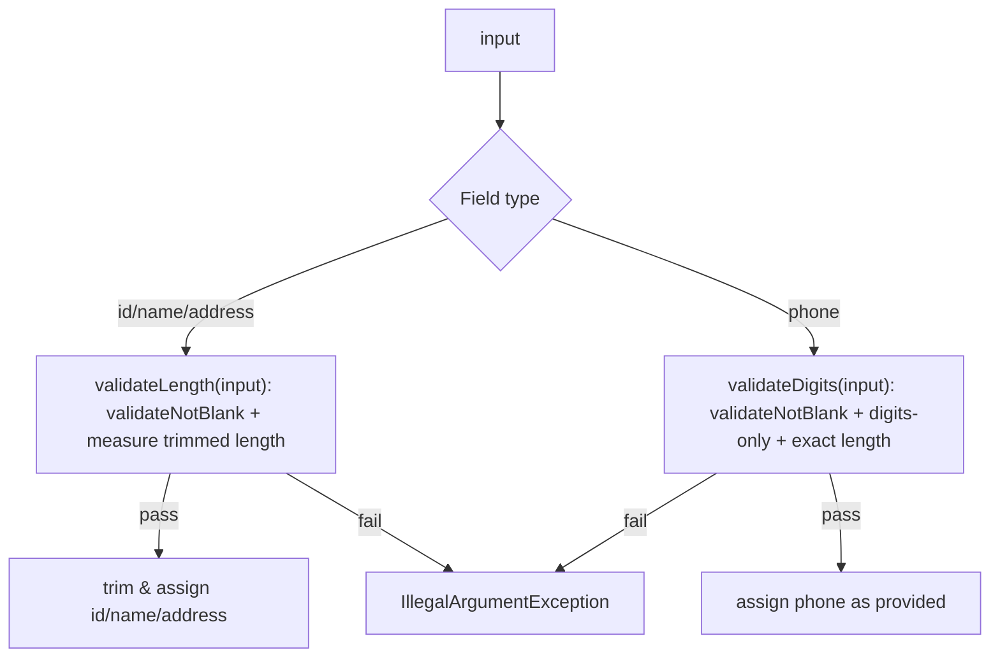
- Text fields (`contactId`, `firstName`, `lastName`, `address`): `validateLength` first calls `validateNotBlank` on the original input, then measures `input.trim().length()` against the bounds. If valid, the caller trims and stores.
- Phone numbers: `validateDigits` calls `validateNotBlank` on the original input, then checks for digits-only and exact length. No trimming; whitespace fails the digit check.
- Because the constructor routes through the setters, the exact same pipeline applies whether the object is being created or updated.

##### Error Message Philosophy
```java
// Bad
throw new IllegalArgumentException("Invalid input");

// Good
throw new IllegalArgumentException("firstName length must be between 1 and 10");
```
- Specific, label-driven messages make debugging easier and double as documentation. Tests assert on the message text so regressions are caught immediately.

##### Exception Strategy
| Exception Type | Use Case           | Recovery? | Our Choice |
|----------------|--------------------|-----------|------------|
| Checked        | Recoverable issues | Maybe     | ❌          |
| Unchecked      | Programming errors | Fix code  | ✅          | 

- We throw `IllegalArgumentException` (unchecked) because invalid input is a caller bug and should crash fast.

##### Propagation Flow
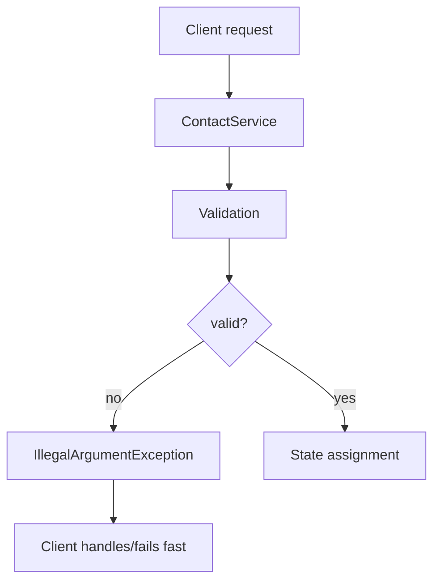
- Fail-fast means invalid state never reaches persistence/logs, and callers/tests can react immediately.

#### Testing Strategy

##### Approach & TDD
- Each validator rule started as a failing test, then the implementation was written until the suite passed.
- `ContactTest` serves as the living specification covering both the success path and every invalid scenario.
- `TaskTest` and `TaskServiceTest` mirror the same workflow for the Task domain/service, reusing the shared `Validation` helper and singleton patterns, and include invalid update cases to prove atomicity.

##### Parameterized Coverage
- `@ParameterizedTest` + `@CsvSource` enumerate the invalid IDs, names, phones, and addresses so we don’t duplicate boilerplate tests.
```java
@ParameterizedTest
@CsvSource({
    "'', 'contactId must not be null or blank'",
    "' ', 'contactId must not be null or blank'",
    "'12345678901', 'contactId length must be between 1 and 10'"
})
void testInvalidContactId(String id, String expectedMessage) {
    assertThatThrownBy(() -> new Contact(id, "first", "last", "1234567890", "123 Main St"))
        .isInstanceOf(IllegalArgumentException.class)
        .hasMessage(expectedMessage);
}
```

##### Assertion Patterns
- AssertJ’s `hasFieldOrPropertyWithValue` validates the happy path in one fluent statement.
- `assertThatThrownBy().isInstanceOf(...).hasMessage(...)` proves exactly which validation rule triggered.

##### Scenario Coverage
- `testSuccessfulCreation` validates the positive constructor path (all fields stored).
- `testValidSetters` ensures setters update fields when inputs pass validation.
- `testConstructorTrimsStoredValues` confirms IDs, names, and addresses are normalized via `trim()`.
- `testFailedCreation` (`@ParameterizedTest`) enumerates every invalid ID/name/phone/address combination and asserts the corresponding message.
- `testFailedSetFirstName` (`@ParameterizedTest`) exercises the setter's invalid inputs (blank/long/null).
- `testUpdateRejectsInvalidValuesAtomically` (`@MethodSource`) proves invalid updates throw and leave the existing Contact state unchanged.
- `testCopyRejectsNullInternalState` (`@ParameterizedTest`) uses reflection to corrupt each internal field (contactId, firstName, lastName, phone, address), proving the `validateCopySource()` guard triggers for all null branches.
- `ValidationTest.validateLengthAcceptsBoundaryValues` proves 1/10-char names and 30-char addresses remain valid.
- `ValidationTest.validateLengthRejectsBlankStrings` and `ValidationTest.validateLengthRejectsNull` ensure blanks/nulls fail before length math is evaluated.
- `ValidationTest.validateLengthRejectsTooLong` hits the max-length branch to keep upper-bound validation covered.
- `ValidationTest.validateLengthRejectsTooShort` covers the min-length branch so both ends of the range are exercised.
- `ValidationTest.validateDigitsRejectsBlankStrings` and `ValidationTest.validateDigitsRejectsNull` ensure the phone validator raises the expected messages before regex/length checks.
- `ValidationTest.validateDigitsAcceptsValidPhoneNumber` proves valid 10-digit inputs pass without exception.
- `ValidationTest.validateDigitsRejectsNonDigitCharacters` asserts non-digit input triggers the "must only contain digits 0-9" message.
- `ValidationTest.validateDigitsRejectsWrongLength` asserts wrong-length input triggers the "must be exactly 10 digits" message.
- `ValidationTest.validateDateNotPastAcceptsFutureDate`, `validateDateNotPastRejectsNull`, and `validateDateNotPastRejectsPastDate` assert the appointment date guard enforces the non-null/not-in-the-past contract before any Appointment state mutates.
- `ValidationTest.validateDateNotPastAcceptsDateExactlyEqualToNow` (added for PITest) uses `Clock.fixed()` to deterministically test the exact boundary where `date.getTime() == clock.millis()`, killing the boundary mutant (`<` vs `<=`).
- `ValidationTest.privateConstructorIsNotAccessible` (added for line coverage) exercises the private constructor via reflection to cover the utility class pattern.
- `RateLimitingFilterTest` asserts bucket invalidation, log sanitization, and `[unsafe-value]` placeholders for client IPs/usernames so inline guards (`logSafeValue`, `sanitizeForWarningLog`) can't be removed.
- `RequestLoggingFilterTest` now covers `sanitizeForLog`, `sanitizeLogValue`, query-string inclusion/exclusion, and duration math to stop PIT from flipping boundaries or stripping sanitizers.
- Spring Boot tests use Mockito's subclass mock-maker (`src/test/resources/mockito-extensions/org.mockito.plugins.MockMaker`) to avoid agent attach issues on newer JDKs while still enabling MockMvc/context testing.
- `ContactControllerUnitTest` and `ProjectControllerUnitTest` mock the service to prove the controller-level ADMIN guard (`?all=true`) blocks non-admin callers before falling back to the service guard, killing the surviving `isAdmin` mutants.
- `AuthControllerUnitTest` covers the cookie parsing helper used during logout/token refresh so PIT can't rewrite it to always return `null`.

> **Note (JDK 25+):** When running tests on JDK 25 or later, you may see a warning like `Mockito is currently self-attaching to enable the inline-mock-maker`. This is expected and harmless; Mockito's subclass mock-maker handles mocking without requiring the Java agent, so the warning does not affect test correctness.

> **Legacy singleton safety:** All service-layer suites that exercise the `ContactService`, `TaskService`, and `AppointmentService` singletons (including the legacy fallback and bridge tests) are annotated with JUnit’s `@Isolated`. Surefire otherwise executes those classes in parallel, which races the shared static `getInstance()` store and can trigger duplicate ID inserts. Keep the annotation on any new suites that mutate the singleton to avoid reintroducing the flaky DuplicateResourceException bursts.

#### Authenticated Test Utilities

Security hardening introduced specialized test utilities to simplify authenticated testing:

- **`@WithMockAppUser`** ([WithMockAppUser.java](src/test/java/contactapp/security/WithMockAppUser.java)) - Custom annotation that populates the SecurityContext with a real `User` entity (not just a generic Spring Security stub). Use `@WithMockAppUser` on test methods or classes to authenticate as a default c, or customize with `@WithMockAppUser(username = "admin", role = Role.ADMIN)` for role-specific tests. The factory creates a detached user instance so tests don't need database setup.

- **`TestUserSetup`** ([TestUserSetup.java](src/test/java/contactapp/security/TestUserSetup.java)) - Spring `@Component` that persists a test user to the database and configures the SecurityContext, satisfying foreign key constraints when creating contacts/tasks/appointments. Inject via `@Autowired` and call `setupTestUser()` in `@BeforeEach`. This utility is essential for integration tests that exercise full service-to-repository flows with real database persistence.

- **`@AutoConfigureObservability`** - Spring Boot Test annotation enabling actuator metrics endpoints in test contexts. Used in [ActuatorEndpointsTest.java](src/test/java/contactapp/ActuatorEndpointsTest.java) to verify Prometheus metrics exposure and endpoint security without starting a full production server.

<br>

### [ContactService.java](src/main/java/contactapp/service/ContactService.java) / [ContactServiceTest.java](src/test/java/contactapp/service/ContactServiceTest.java)

#### Service Snapshot
- **DomainDataStore abstraction** - `ContactService` depends on `ContactStore`, injected with the JPA-backed implementation during normal operation. The legacy singleton path lazily spins up an `InMemoryContactStore`, then migrates data into the JPA store when Spring finishes wiring beans.
- **Transactional guarantees** - Methods run inside Spring transactions so the `existsById` + `save` or `findById` + `update` sequences remain atomic. Read methods opt into `@Transactional(readOnly = true)` for SQL efficiency.
- **Validation + normalization** - Service methods validate/trims IDs via `Validation.validateNotBlank`, but all field-level rules still live inside `Contact` (`update()` and setters). That keeps controller/service logic shallow.
- **Defensive copies** - `getAllContacts()`, `getDatabase()`, and `getContactById()` return fresh `Contact.copy()` instances so external callers cannot mutate persistent state.
- **Package-private reset hooks** - `clearAllContacts()` sticks around exclusively for tests in the same package; production code never calls it directly.

#### Persistence Flow
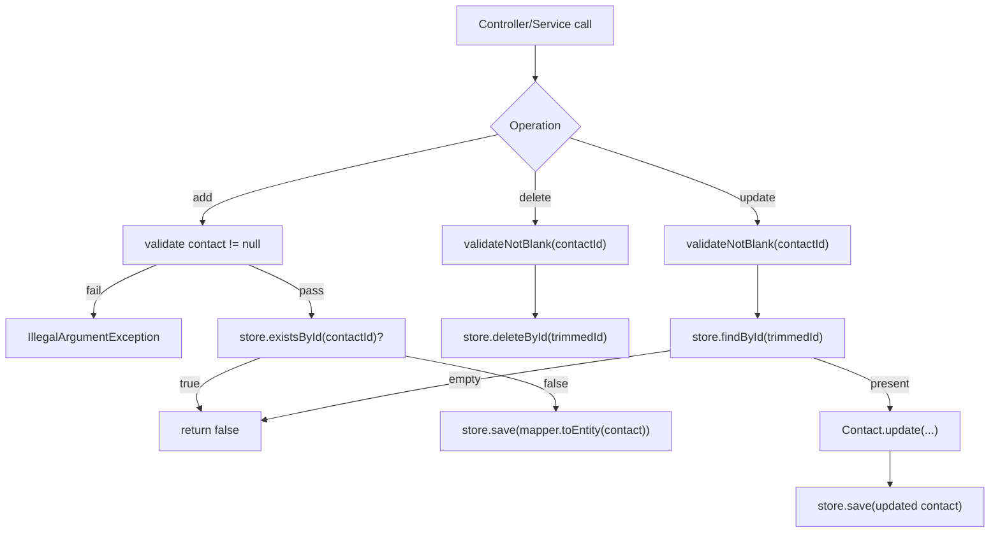
- `store.save` handles both inserts and updates; the mapper converts domain objects into JPA entities while preserving validation.
- Delete/update operations trim IDs before handing them to the store so whitespace inputs remain consistent.
- Duplicate IDs or missing rows return `false`, letting controllers return 409/404 without extra exception types.

#### Testing Strategy
- `ContactServiceTest` is now a `@SpringBootTest` running against the `integration` profile (Postgres + Flyway via Testcontainers) so every service method hits the real repositories/mappers.
- `ContactServiceLegacyTest` cold-starts the singleton without Spring, proving the fallback still works for older callers (and that state remains isolated between tests via reflection resets).
- Slice tests live next door for mappers (`ContactMapperTest`) and repositories (`ContactRepositoryTest`), catching schema or mapping regressions without booting the full application context.
- Boolean outcomes are asserted explicitly (`isTrue()/isFalse()`) so duplicate and missing-ID branches stay verified.


### Scenario Coverage
- `testGetInstance` ensures the singleton accessor always returns a concrete service before any CRUD logic runs.
- `testGetInstanceReturnsSameReference` proves repeated invocations return the same singleton instance.
- `testAddContact` proves the happy path and that the map contains the stored entry with correct field values.
- `testAddDuplicateContactFails` confirms the boolean contract for duplicates and that the original data remains untouched.
- `testAddContactNullThrows` hits the defensive null guard so callers see a clear `IllegalArgumentException` instead of an NPE.
- `testDeleteContact` exercises removal plus assertion that the key disappears.
- `testDeleteMissingContactReturnsFalse` covers the branch where no contact exists for the given id.
- `testDeleteContactBlankIdThrows` shows ID validation runs even on deletes, surfacing the standard "contactId must not be null or blank" message.
- `testUpdateContact` verifies every mutable field changes via setter delegation.
- `testUpdateContactTrimsId` confirms IDs are trimmed before lookups during updates.
- `testUpdateContactBlankIdThrows` ensures update throws when the ID is blank so validation mirrors delete().
- `testUpdateMissingContactReturnsFalse` covers the "not found" branch so callers can rely on the boolean result.
- `testGetDatabaseReturnsDefensiveCopies` proves callers cannot mutate internal state through the returned snapshot.
- `testGetInstanceColdStart` uses reflection to reset the static instance, then verifies `getInstance()` creates a new instance when none exists—ensuring full branch coverage of the lazy initialization pattern.
- `testGetContactByIdReturnsContact` verifies getContactById returns the contact when it exists.
- `testGetContactByIdReturnsEmptyWhenNotFound` verifies getContactById returns empty when contact doesn't exist.
- `testGetContactByIdBlankIdThrows` verifies getContactById throws when ID is blank.
- `testGetContactByIdTrimsId` verifies getContactById trims the ID before lookup.
- `testGetContactByIdReturnsDefensiveCopy` verifies getContactById returns a defensive copy.
- `testGetAllContactsReturnsEmptyList` verifies getAllContacts returns empty list when no contacts exist.
- `testGetAllContactsReturnsAllContacts` verifies getAllContacts returns all contacts.

##### Security Tests (Per-User Isolation)
- `getAllContactsAllUsers_requiresAdminRole` proves non-ADMIN users get `AccessDeniedException` when attempting to fetch all users' contacts.
- `getAllContactsAllUsers_returnsDataForAdmins` proves ADMIN users can fetch contacts from multiple users.
- `getContactById_onlyReturnsCurrentUsersRecords` proves users cannot see contacts owned by other users.
- `addContact_duplicateIdsReturnFalseForSameUser` proves duplicate ID detection scopes to the current user.
- `deleteContact_doesNotRemoveOtherUsersData` proves users cannot delete contacts owned by other users.
- `updateContact_doesNotAffectOtherUserRecords` proves users cannot update contacts owned by other users.

#### Persistence & Mapper Coverage
- Mapper tests (`ContactMapperTest`, `TaskMapperTest`, `AppointmentMapperTest`) now assert the null-input short-circuit paths so PIT can mutate those guards without leaving uncovered lines.
- New JPA entity tests (`ContactEntityTest`, `TaskEntityTest`, `AppointmentEntityTest`) exercise the protected constructors and setters to prove Hibernate proxies can hydrate every column even when instantiated via reflection.
- Legacy `InMemory*Store` suites assert the `Optional.empty` branch of `findById` so both success and miss paths copy data defensively.
- Combined with the existing controller/service suites and the security additions above, this brings the repo to **901 tests** on the full suite with **~83.1% mutation kills** and **~89.9% line coverage** (higher on stores/mappers; container-dependent coverage enforced on Linux only).

#### Mutation-Focused Test Additions (+71 Tests)

The following tests were added specifically to catch surviving mutants by targeting boundary conditions, comparison operators, and edge cases. Each test includes Javadoc explaining why it exists and what mutation it prevents:

| Test File | +Tests | Focus Areas |
|-----------|--------|-------------|
| `ValidationTest.java` | +14 | Length boundaries (`<` vs `<=`), digit validation (`!=` operator), date millisecond precision, email max length (100 vs 101 chars), blank vs empty string handling |
| `ContactTest.java` | +16 | ID max length (10 vs 11), name/address boundaries, phone digit count (9/10/11), copy independence verification, atomic update semantics |
| `TaskTest.java` | +13 | ID/name/description boundary values, min/max length validation, copy-doesn't-affect-original assertions |
| `ProjectTest.java` | +19 | Special `minLength=0` for description, empty string after trimming, all `ProjectStatus` enum values, whitespace trimming edge cases |
| `JwtServiceTest.java` | +9 | Token expiration at exact boundary (1ms), refresh window `<=` operator, case-sensitive username comparison, `equals()` vs `==` verification |

**Mutation patterns targeted:**
- Comparison operators: `<` ↔ `<=`, `>` ↔ `>=`, `==` ↔ `!=`
- Boundary off-by-one: testing at `max`, `max+1`, `min`, `min-1`
- Boolean inversions: null checks, empty string checks
- Return value mutations: ensuring correct object returns from `copy()`
- Conditional removals: verifying validation is actually called

See [ADR-0046](docs/adrs/ADR-0046-test-coverage-improvements.md) for the full rationale and methodology.

<br>

### [Task.java](src/main/java/contactapp/domain/Task.java) / [TaskTest.java](src/test/java/contactapp/domain/TaskTest.java)

#### Service Snapshot
- Task IDs are required, trimmed, and immutable after construction (length 1-10).
- Name (≤20 chars) and description (≤50 chars) share one helper so constructor, setters, and `update(...)` all enforce identical rules.
- `status` is a required `TaskStatus` enum (TODO, IN_PROGRESS, DONE) that defaults to TODO if null; validated via `Validation.validateNotNull`.
- Optional `dueDate` flows through `Validation.validateOptionalDateNotPast`, so null values remain allowed but past dates throw immediately.
- Optional `projectId` links tasks to projects (nullable, max 10 chars); setting it updates `updatedAt` timestamp.
- `createdAt` and `updatedAt` timestamps (Instant) are set automatically on construction and update.
- Three `update(...)` overloads support different update scenarios:
  1. `update(name, description)` - backward-compatible, preserves existing status/dueDate
  2. `update(name, description, status, dueDate)` - full mutable field update
  3. `update(name, description, status, dueDate, projectId)` - includes project linking
- All update methods validate atomically; invalid inputs leave the object untouched.
- `copy()` creates a defensive copy preserving timestamps and projectId.
- Tests mirror Contact coverage: constructor trimming, happy-path setters/update, status/dueDate validation, and every invalid-path exception message.

#### Validation & Error Handling

##### Validation Pipeline
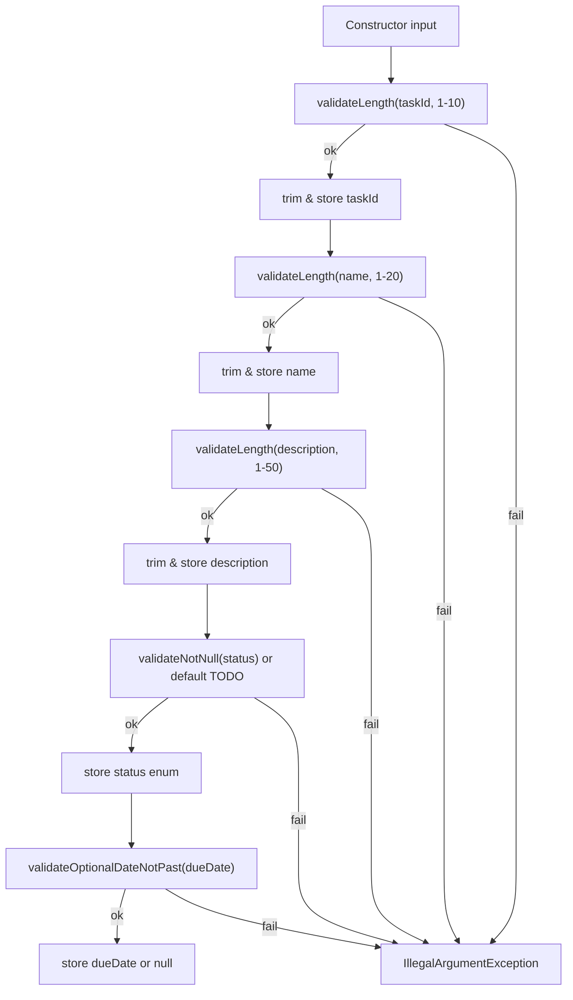
- Constructor validates taskId, then delegates to setters for name/description.
- `validateLength` measures `input.trim().length()` on the original input, then the caller trims before storing.
- Setters (`setName`, `setDescription`) use the same `validateLength` + trim pattern for updates.
- `update(...)` validates both fields first, then assigns both atomically if they pass.

##### Error Message Philosophy
- All strings come from `Validation.validateLength`, so failures always say `<label> must not be null or blank` or `<label> length must be between X and Y`.
- Tests assert the exact messages so a wording change immediately fails the suite.

##### Propagation Flow
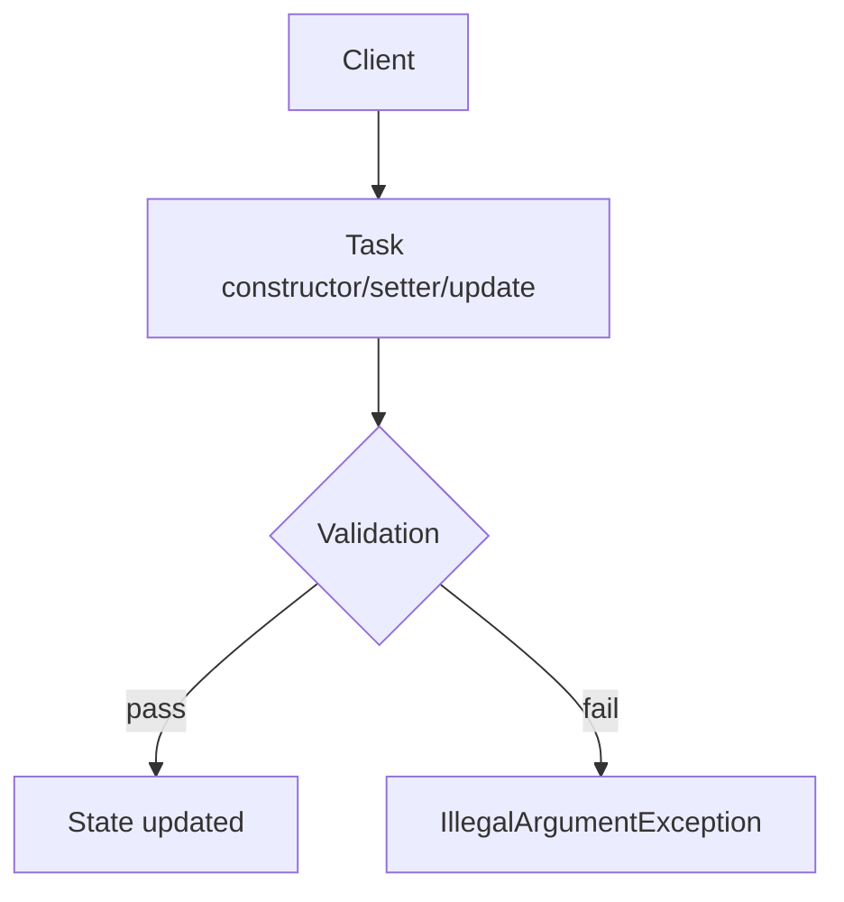
- No silent coercion; invalid data throws fast so tests/users fix the source input.

#### Testing Strategy

##### Approach & TDD
- Started with constructor trimming tests, then added invalid cases before writing setters/update so every branch had a failing test first.

##### Assertion Patterns
- AssertJ `hasFieldOrPropertyWithValue` keeps success assertions short.
- `assertThatThrownBy(...).hasMessage(...)` locks in the Validation wording for each failure mode.

##### Scenario Coverage
- Constructor stores trimmed values and rejects null/blank/too-long IDs, names, and descriptions.
- Setters accept valid updates and reject invalid ones with the same helper-generated messages.
- `update(...)` replaces both mutable fields atomically and never mutates on invalid input.
- `testUpdateRejectsInvalidValuesAtomically` (`@MethodSource`) enumerates invalid name/description pairs (blank/empty/null/over-length) and asserts the Task remains unchanged when validation fails.
- `testCopyRejectsNullInternalState` (`@ParameterizedTest`) uses reflection to corrupt each internal field (taskId, name, description), proving the `validateCopySource()` guard triggers for all null branches.
- `TaskServiceTest` mirrors the entity atomicity: invalid updates (blank name) throw and leave the stored task unchanged.

  <br>

### [TaskService.java](src/main/java/contactapp/service/TaskService.java) / [TaskServiceTest.java](src/test/java/contactapp/service/TaskServiceTest.java)

#### Service Snapshot
- Depends on `TaskStore`, which is implemented by `JpaTaskStore` (Spring Data repository + mapper) for normal operation and `InMemoryTaskStore` for legacy `getInstance()` callers. As soon as the Spring bean initializes it registers itself as the singleton instance.
- Transactions wrap add/delete/update operations; read-only queries opt into `@Transactional(readOnly = true)` for efficient SQL on H2/Postgres.
- Service-level guards cover null task inputs and blank IDs. `Task.update(...)` enforces field rules so error messages stay aligned with the domain tests.
- `getDatabase()` and `getAllTasks()` return defensive copies, and `clearAllTasks()` stays package-private for test resets.

#### Persistence Flow
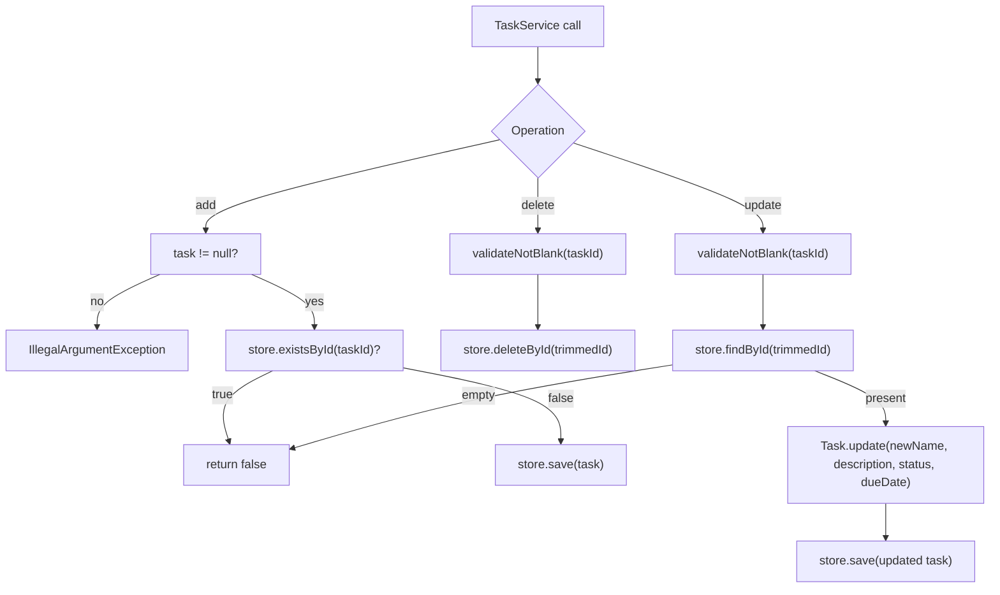
- Duplicate IDs or missing rows simply return `false` so controllers can produce 409/404 responses without inspecting exceptions.
- Mapper conversions ensure persisted data always flows back through the domain constructor/update path for validation.

#### Testing Strategy
- `TaskServiceTest` is a Spring Boot test running on the `integration` profile (Postgres + Flyway via Testcontainers), so every operation exercises the real repositories/mappers instead of in-memory maps.
- `TaskServiceLegacyTest` cold-starts `getInstance()` outside Spring, proving the fallback still works and that legacy callers stay isolated.
- `TaskService` exposes a package-private `setClock(Clock)` hook used exclusively by tests so overdue calculations can be validated deterministically without mutating the domain validation rules.
- Mapper/repository tests sit alongside the service tests for faster feedback on schema or conversion issues.

##### Security Tests (Per-User Isolation)
- `getAllTasksAllUsers_requiresAdminRole` proves non-ADMIN users get `AccessDeniedException` when attempting to fetch all users' tasks.
- `getAllTasksAllUsers_returnsDataForAdmins` proves ADMIN users can fetch tasks from multiple users.
- `getTaskById_onlyReturnsCurrentUsersTasks` proves users cannot see tasks owned by other users.
- `deleteTask_doesNotAllowOtherUsersToDelete` proves users cannot delete tasks owned by other users.
- `updateTask_doesNotAllowCrossUserModification` proves users cannot update tasks owned by other users.

  <br>

### [Appointment.java](src/main/java/contactapp/domain/Appointment.java) / [AppointmentTest.java](src/test/java/contactapp/domain/AppointmentTest.java)

#### Service Snapshot
- Appointment IDs are required, trimmed, and immutable after construction (length 1-10).
- `appointmentDate` uses `java.util.Date`, must not be null or in the past, is stored/returned via defensive copies, and is serialized/deserialized as ISO 8601 with millis + offset (`yyyy-MM-dd'T'HH:mm:ss.SSSXXX`, UTC).
- Descriptions are required, trimmed, and capped at 50 characters; constructor and update share the same validation path.

#### Validation & Error Handling

##### Validation Pipeline

- Constructor: `validateLength` validates/measures trimmed ID, then trim & store. Then delegates to setters for date + description.
- `validateLength` measures `input.trim().length()` on the original input, then the caller trims before storing (matches Contact/Task pattern).
- Dates are validated via `Validation.validateDateNotPast` and copied on set/get to prevent external mutation.
- `update(...)` validates both inputs before mutating, keeping updates atomic.

#### Testing Strategy
- `AppointmentTest` covers trimmed creation with defensive date copies, description setter happy path, invalid constructor cases (null/blank/over-length id/description, null/past dates), invalid description setters, invalid updates (null/past dates, bad descriptions) that leave state unchanged, and defensive getters.
- AssertJ getters/field checks verify stored values; future/past dates are relative to “now” to avoid flakiness.

##### Scenario Coverage
- `testSuccessfulCreationTrimsAndCopiesDate` validates trim/defensive copy on construction.
- `testUpdateReplacesValuesAtomically` confirms date/description updates and defensive date copy.
- `testSetDescriptionAcceptsValidValue` covers setter happy path.
- `testGetAppointmentDateReturnsDefensiveCopy` ensures callers can't mutate stored dates.
- `testConstructorValidation` enumerates invalid id/description/null/past date cases.
- `testSetDescriptionValidation` covers invalid description setter inputs.
- `testUpdateRejectsInvalidValuesAtomically` enumerates invalid update inputs and asserts state remains unchanged.
- `testCopyProducesIndependentInstance` verifies copy() produces an independent instance with identical values.
- `testCopyRejectsNullInternalState` (`@ParameterizedTest`) uses reflection to corrupt each internal field (appointmentId, appointmentDate, description), proving the `validateCopySource()` guard triggers for all null branches.

### [AppointmentService.java](src/main/java/contactapp/service/AppointmentService.java) / [AppointmentServiceTest.java](src/test/java/contactapp/service/AppointmentServiceTest.java)

#### Service Snapshot
- Uses `AppointmentStore` (JPA-backed) under Spring and `InMemoryAppointmentStore` when `getInstance()` is called before the context loads. As soon as the Spring bean initializes it registers itself as the canonical singleton.
- Transactions wrap add/delete/update operations; read-only queries use `@Transactional(readOnly = true)` like the other services.
- Service methods validate/trim IDs via `Validation.validateNotBlank`, but `Appointment.update(...)` enforces the date-not-past rule and description length so error messages match the domain layer.
- `getDatabase()`, `getAllAppointments()`, and `getAppointmentById()` return defensive copies so external code never mutates persistent state.

#### Persistence Flow
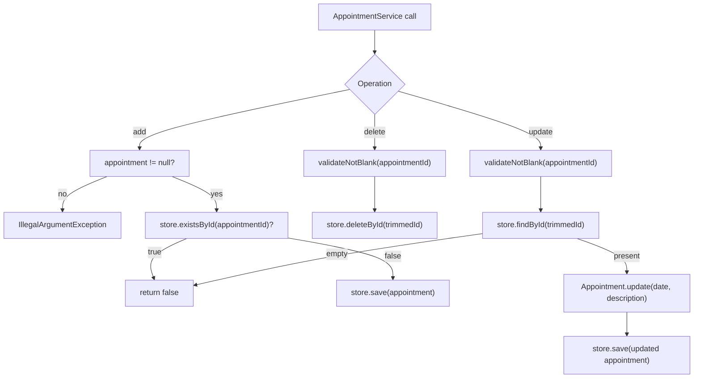
- Duplicate IDs/missing rows return `false`; invalid fields bubble up as `IllegalArgumentException`, keeping the fail-fast philosophy intact.
- Mapper conversions preserve the Instant/Date handling so persisted timestamps match domain expectations.

#### Testing Strategy
- `AppointmentServiceTest` runs against Postgres + Flyway (`integration` profile via Testcontainers) and covers add/delete/update/defensive-copy behaviors end-to-end.
- `AppointmentServiceLegacyTest` validates the non-Spring fallback and uses reflection resets to isolate state between runs.
- Mapper/repository tests verify Instant↔Date conversion plus schema-level guarantees (e.g., NOT NULL/length constraints).

##### Security Tests (Per-User Isolation)
- `getAllAppointmentsAllUsers_requiresAdminRole` proves non-ADMIN users get `AccessDeniedException` when attempting to fetch all users' appointments.
- `getAllAppointmentsAllUsers_returnsDataForAdmins` proves ADMIN users can fetch appointments from multiple users.
- `getAppointmentById_onlyReturnsCurrentUsersAppointments` proves users cannot see appointments owned by other users.
- `deleteAppointment_doesNotAllowCrossUserDeletion` proves users cannot delete appointments owned by other users.
- `updateAppointment_doesNotAllowCrossUserModification` proves users cannot update appointments owned by other users.

<br>

### [Project.java](src/main/java/contactapp/domain/Project.java) / [ProjectTest.java](src/test/java/contactapp/domain/ProjectTest.java)

#### Service Snapshot
- Project IDs are required, trimmed, and immutable after construction (length 1-10).
- Name (≤50 chars) is required and trimmed via `Validation.validateTrimmedLength`.
- Description (0-100 chars) allows blank values via `Validation.validateTrimmedLengthAllowBlank`.
- `status` is a required `ProjectStatus` enum (ACTIVE, ON_HOLD, COMPLETED, ARCHIVED); validated via `Validation.validateNotNull`.
- `update(name, description, status)` validates all fields atomically before mutation; invalid inputs leave the object untouched.
- `copy()` creates a defensive copy by validating source state and reusing the public constructor.

#### Validation & Error Handling

##### Validation Pipeline
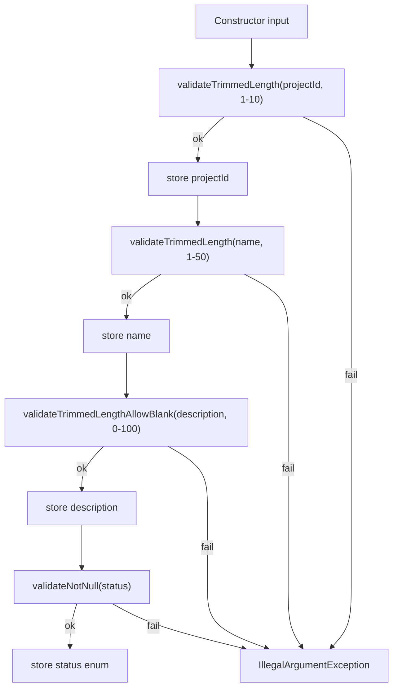
- Constructor validates projectId, then delegates to setters for name/description/status.
- `validateTrimmedLength` trims input before length check, returning the trimmed value.
- `validateTrimmedLengthAllowBlank` permits empty strings when minLength=0 (description only).
- `validateNotNull` ensures enum status is never null.

#### Testing Strategy
- `ProjectTest` (51 tests) covers constructor trimming, setter/update happy paths, invalid constructor/setter/update cases (null/blank/over-length), atomic update rejection, and defensive copy verification.
- `ProjectStatusTest` (12 tests) validates all enum values and their string representations.

##### Scenario Coverage
- Constructor stores trimmed values and rejects null/blank/too-long IDs and names.
- Description allows empty strings but rejects over-length values.
- Status rejects null with `IllegalArgumentException`.
- `update(...)` replaces all mutable fields atomically and never mutates on invalid input.
- `testCopyRejectsNullInternalState` uses reflection to corrupt each internal field, proving `validateCopySource()` guard triggers.

<br>

### [ProjectService.java](src/main/java/contactapp/service/ProjectService.java) / [ProjectServiceTest.java](src/test/java/contactapp/service/ProjectServiceTest.java)

#### Service Snapshot
- Depends on `ProjectStore`, which is implemented by `JpaProjectStore` (Spring Data repository + mapper) for normal operation and `InMemoryProjectStore` for legacy `getInstance()` callers.
- Transactions wrap add/delete/update operations; read-only queries use `@Transactional(readOnly = true)`.
- Per-user data isolation enforces that users only see their own projects.
- CRUD methods: `addProject()`, `deleteProject()`, `updateProject(id, name, description, status)`.
- Query methods: `getAllProjects()`, `getAllProjectsAllUsers()` (ADMIN only), `getProjectById()`, `getProjectsByStatus()`.
- Contact linking: `addContactToProject()`, `removeContactFromProject()`, `getProjectContacts()`, `getContactProjects()`.
- `getDatabase()` and `getAllProjects()` return defensive copies; `clearAllProjects()` stays package-private for test resets.

#### Persistence Flow
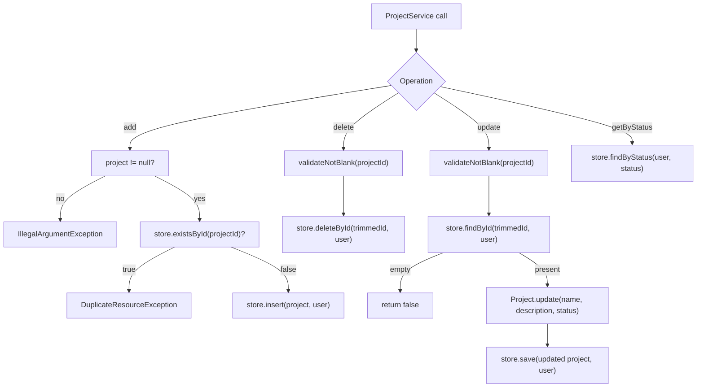
- Duplicate IDs throw `DuplicateResourceException` for 409 Conflict responses.
- Missing rows return `false` so controllers can produce 404 responses.
- All operations scope to the authenticated user via `getCurrentUser()`.

#### Testing Strategy
- `ProjectServiceTest` (28 tests) is a Spring Boot test running on the `integration` profile (Postgres + Flyway via Testcontainers).
- `InMemoryProjectStoreTest` validates the non-Spring fallback store.
- Mapper/repository tests sit alongside for faster feedback on schema or conversion issues.

##### Security Tests (Per-User Isolation)
- `getAllProjectsAllUsers_requiresAdminRole` proves non-ADMIN users get `AccessDeniedException`.
- `getAllProjectsAllUsers_returnsDataForAdmins` proves ADMIN users can fetch projects from all users.
- `getProjectById_onlyReturnsCurrentUsersProjects` proves users cannot see projects owned by others.
- `deleteProject_doesNotAllowCrossUserDeletion` proves users cannot delete projects owned by others.
- `updateProject_doesNotAllowCrossUserModification` proves users cannot update projects owned by others.

<br>

## Security Infrastructure

Phase 5 delivered the following foundational pieces and they remain the backbone of the security stack:

### [User.java](src/main/java/contactapp/security/User.java) / [UserTest.java](src/test/java/contactapp/security/UserTest.java)

#### Entity Snapshot
- User entity implements Spring Security's `UserDetails` interface for seamless authentication integration.
- Field constraints defined in `Validation.java`: username (1-50 chars), email (1-100 chars, valid format), password (1-255 chars, BCrypt hash required).
- Constructor validates all fields, trims username/email, and rejects raw passwords (must start with `$2a$`, `$2b$`, or `$2y$`).
- Role enum (`USER`, `ADMIN`) stored as string; default is `USER`.
- JPA lifecycle callbacks (`@PrePersist`, `@PreUpdate`) manage `createdAt` and `updatedAt` timestamps.

#### Validation Pipeline
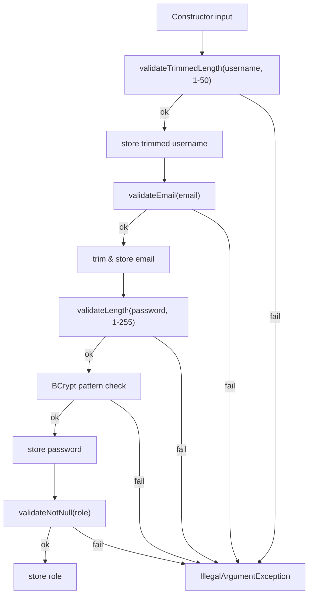
- `validateTrimmedLength()` validates and returns trimmed username in one call.
- `validateEmail()` checks both length (1-100) and format via regex pattern.
- `validateNotNull()` uses the new enum helper for consistent null checking.
- BCrypt pattern `^\\$2[aby]\\$.+` ensures passwords are pre-hashed; raw passwords rejected immediately.

#### Testing Strategy
- `UserTest` covers successful creation with valid BCrypt hash, trimming behavior, UserDetails interface methods (`getAuthorities`, account status), and all validation edge cases.
- Parameterized tests exercise null/blank/over-length inputs for username, email, and password.
- Invalid email format tests cover common malformed patterns (missing @, missing domain, double dots).
- BCrypt requirement test confirms plain-text passwords are rejected.

#### Scenario Coverage
- `testSuccessfulCreation` validates all fields stored correctly with valid BCrypt hash.
- `testConstructorTrimsUsernameAndEmail` proves normalization on both fields.
- `testGetAuthoritiesReturnsRoleWithPrefix` verifies Spring Security `ROLE_` prefix.
- `testEmailInvalidFormatThrows` enumerates malformed email patterns.
- `testPasswordMustBeBcryptHash` confirms raw password rejection.
- Boundary tests use `emailOfLength()` helper to generate valid emails at max length.

### [UserRepository.java](src/main/java/contactapp/security/UserRepository.java)
- Spring Data JPA repository with `findByUsername`, `findByEmail`, `existsByUsername`, `existsByEmail` methods.
- Used by `CustomUserDetailsService` for authentication lookups.

### [JwtService.java](src/main/java/contactapp/security/JwtService.java)
- JWT token generation and validation using HMAC-SHA256.
- Configurable via `jwt.secret` (Base64-encoded, UTF-8 fallback) and `jwt.expiration` (default 30 minutes).
- Methods: `generateToken()`, `extractUsername()`, `isTokenValid()`, `extractClaim()`.

### [JwtAuthenticationFilter.java](src/main/java/contactapp/security/JwtAuthenticationFilter.java)
- `OncePerRequestFilter` that extracts JWTs from the HttpOnly `auth_token` cookie (preferred) with `Authorization: Bearer <token>` header fallback for API clients.
- Extracts username from JWT, loads user via `UserDetailsService`, validates token, and sets `SecurityContextHolder`.
- Invalid/expired tokens silently continue without authentication (endpoints handle 401).

### [SecurityConfig.java](src/main/java/contactapp/security/SecurityConfig.java)
- Configures Spring Security filter chain with stateless session management (JWT).
- CSRF tokens issued via `CookieCsrfTokenRepository` for browser routes while `/api/**` relies on JWT; BCrypt password encoder bean.
- Public endpoints: `/api/auth/**`, `/actuator/health`, `/actuator/info`, `/swagger-ui/**`, `/error`, static SPA files.
- Protected endpoints: `/api/v1/**` require authenticated users with valid JWT.
- CORS configured via `cors.allowed-origins` property for SPA development (default: `localhost:5173,localhost:8080`).
- Security headers: `Content-Security-Policy` (script/style/img/font/connect/frame-ancestors/form-action/base-uri/object-src), `Permissions-Policy` (disables geolocation, camera, microphone, etc.), `X-Content-Type-Options`, `X-Frame-Options` (SAMEORIGIN), `Referrer-Policy` (strict-origin-when-cross-origin).

### [CustomUserDetailsService.java](src/main/java/contactapp/security/CustomUserDetailsService.java)
- Implements `UserDetailsService` for Spring Security authentication.
- Loads users from `UserRepository` by username; throws `UsernameNotFoundException` if not found.

### [AuthController.java](src/main/java/contactapp/api/AuthController.java)
- REST controller for authentication operations at `/api/auth` (see ADR-0038).
- **DTOs**: `LoginRequest` (username, password), `RegisterRequest` (username, email, password), `AuthResponse` (token, username, email, role, expiresIn).
- Uses `AuthenticationManager` for credential verification and `JwtService` for token generation.
- Duplicate username/email checks via `UserRepository` methods.
- Exposes `GET /api/auth/csrf-token` so the SPA can fetch the `XSRF-TOKEN` value for double-submit protection now that JWTs live in HttpOnly cookies.
- Uses a dedicated `app.auth.cookie.secure` configuration property (overridable via `APP_AUTH_COOKIE_SECURE`/`COOKIE_SECURE`) so the auth cookie can be forced to Secure=true in production without conflating it with the servlet session cookie settings.

### Auth Endpoint Summary
| Endpoint | Method | Description | Success | Errors |
|----------|--------|-------------|---------|--------|
| `/api/auth/login` | POST | Authenticate user | 200 + HttpOnly JWT cookie (token omitted from body) | 400 (validation), 401 (invalid credentials) |
| `/api/auth/register` | POST | Register new user | 201 + HttpOnly JWT cookie (token omitted from body) | 400 (validation), 409 (duplicate username/email) |
| `/api/auth/logout` | POST | Invalidate session | 204 No Content | - |

### Auth HTTP Status Codes
| Status | Meaning | When Used |
|--------|---------|-----------|
| 200 | OK | Login successful |
| 201 | Created | Registration successful |
| 204 | No Content | Logout successful |
| 400 | Bad Request | Validation error (blank/invalid fields) |
| 401 | Unauthorized | Invalid credentials (login only) |
| 409 | Conflict | Username or email already exists (register only) |

### Role-Based Access Control
- Controllers annotated with `@PreAuthorize("hasAnyRole('USER', 'ADMIN')")` require authenticated users.
- `@SecurityRequirement(name = "bearerAuth")` documents JWT requirement in OpenAPI spec.
- SPA relies on HttpOnly cookies for tokens while caching profile metadata in `sessionStorage` via `tokenStorage`/`useProfile`, so no JS-accessible token is stored (profile cache clears when the browser ends the session—subject to browser restore/bfcache behavior).

### Security Tests

#### Testing Strategy
- `JwtServiceTest` unit tests the JWT token lifecycle (generation, extraction, validation) using reflection to inject test secrets.
- `JwtAuthenticationFilterTest` mocks the filter chain and verifies SecurityContext population for valid/invalid tokens.
- `CustomUserDetailsServiceTest` mocks the repository to verify user lookup and exception handling.
- `AuthControllerTest` integration tests for login/register endpoints (validation, success, conflicts, auth failures).

#### [JwtServiceTest.java](src/test/java/contactapp/security/JwtServiceTest.java) Scenario Coverage
- `generateTokenContainsUsernameClaim` proves tokens include the subject claim with the username.
- `isTokenValidReturnsTrueForValidToken` verifies validation passes for freshly generated tokens.
- `isTokenValidReturnsFalseForDifferentUser` ensures tokens are rejected when the user doesn't match.
- `extractUsernameThrowsWhenTokenExpired` confirms `ExpiredJwtException` is thrown for expired tokens.
- `extractClaimReturnsCustomClaim` verifies custom claims (e.g., role) can be extracted from tokens.
- `fallbackToUtf8SecretWhenBase64DecodingFails` proves the UTF-8 fallback works when Base64 decoding fails.

#### [JwtAuthenticationFilterTest.java](src/test/java/contactapp/security/JwtAuthenticationFilterTest.java) Scenario Coverage
- `skipsFilterWhenAuthorizationHeaderMissing` ensures requests without a JWT cookie/header proceed without authentication.
- `proceedsWhenTokenInvalid` confirms invalid tokens don't block the filter chain and leave SecurityContext empty.
- `setsAuthenticationWhenTokenValid` verifies valid tokens populate SecurityContext with the authenticated user.

#### [CustomUserDetailsServiceTest.java](src/test/java/contactapp/security/CustomUserDetailsServiceTest.java) Scenario Coverage
- `loadUserReturnsUserDetailsWhenFound` proves successful user lookup returns the UserDetails.
- `loadUserThrowsWhenMissing` confirms `UsernameNotFoundException` is thrown when user doesn't exist.

#### [AuthControllerTest.java](src/test/java/contactapp/AuthControllerTest.java) Scenario Coverage
- `register_validRequest_returns201WithToken` proves successful registration returns JWT and user info.
- `register_validRequest_userPersistedInDatabase` verifies user is actually saved to repository.
- `login_validCredentials_returns200WithToken` proves successful login returns JWT with user details.
- `login_adminUser_returnsAdminRole` confirms admin users get ADMIN role in response.
- `login_wrongPassword_returns401` verifies invalid password returns 401 Unauthorized.
- `login_nonexistentUser_returns401` confirms missing user returns generic 401 (prevents enumeration).
- `register_duplicateUsername_returns409` proves duplicate username triggers 409 Conflict.
- `register_duplicateEmail_returns409` proves duplicate email triggers 409 Conflict.
- `register_invalidInput_returns400` (parameterized) covers blank/long username, invalid email format, short password.
- `login_invalidInput_returns400` (parameterized) covers blank username/password validation.
- `register_malformedJson_returns400` / `login_malformedJson_returns400` verify malformed JSON handling.
- `register_usernameAtMaxLength_accepted` / `register_passwordAtMinLength_accepted` boundary tests.

#### Multi-User Data Isolation Tests

Each service enforces per-user data isolation via `user_id` foreign keys. Tests use a `runAs(username, role, action)` helper to simulate different authenticated users and verify cross-user access is blocked:

| Service            | Test Class               | Key Scenarios                                                                                                                                                                                                      |
|--------------------|--------------------------|--------------------------------------------------------------------------------------------------------------------------------------------------------------------------------------------------------------------|
| ContactService     | `ContactServiceTest`     | `getAllContactsAllUsers_requiresAdminRole`, `getContactById_onlyReturnsCurrentUsersRecords`, `deleteContact_doesNotRemoveOtherUsersData`, `updateContact_doesNotAffectOtherUserRecords`                            |
| TaskService        | `TaskServiceTest`        | `getAllTasksAllUsers_requiresAdminRole`, `getTaskById_onlyReturnsCurrentUsersTasks`, `deleteTask_doesNotAllowOtherUsersToDelete`, `updateTask_doesNotAllowCrossUserModification`                                   |
| AppointmentService | `AppointmentServiceTest` | `getAllAppointmentsAllUsers_requiresAdminRole`, `getAppointmentById_onlyReturnsCurrentUsersAppointments`, `deleteAppointment_doesNotAllowCrossUserDeletion`, `updateAppointment_doesNotAllowCrossUserModification` |

See detailed scenario descriptions in each service's "Security Tests (Per-User Isolation)" subsection above.

### Mutation Tests (Service Layer)

#### Testing Strategy
- Mutation tests target specific PIT mutants that survive standard coverage.
- Each test exercises the `DataIntegrityViolationException` catch block in `add*()` methods.
- Mocks simulate race conditions where `existsById()` returns false but `save()` throws due to a concurrent insert.

#### Scenario Coverage
- `ContactServiceMutationTest.addContactReturnsFalseWhenStoreThrowsIntegrityViolation` kills the mutant that blindly returns `true` from `addContact()` by verifying the catch block returns `false`.
- `TaskServiceMutationTest.addTaskReturnsFalseWhenStoreThrowsIntegrityViolation` same pattern for TaskService.
- `AppointmentServiceMutationTest.addAppointmentReturnsFalseWhenStoreThrowsIntegrityViolation` same pattern for AppointmentService.

### Authentication Flow
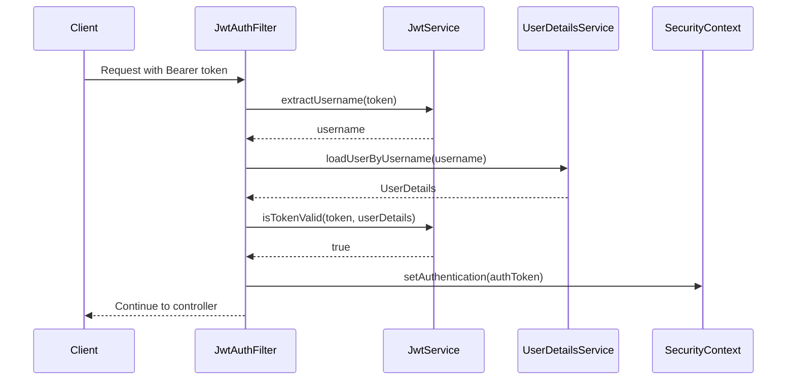

<br>

## Observability Infrastructure

The same security/observability pass introduced the following request tracing, logging, and rate-limiting building blocks. See [ADR-0040](docs/adrs/ADR-0040-request-tracing-and-logging.md), [ADR-0041](docs/adrs/ADR-0041-pii-masking-in-logs.md), and [ADR-0042](docs/adrs/ADR-0042-docker-containerization-strategy.md).

### Filter Chain Order
```
Request → CorrelationIdFilter(1) → RateLimitingFilter(5) → RequestLoggingFilter(10) → JwtAuthFilter → Controllers
```

### [CorrelationIdFilter.java](src/main/java/contactapp/config/CorrelationIdFilter.java)
- Extracts `X-Correlation-ID` header or generates UUID if missing/invalid.
- Stores in SLF4J MDC for automatic inclusion in all log entries.
- Sanitizes IDs: max 64 chars, alphanumeric + hyphens/underscores only (prevents log injection).

### [RequestLoggingFilter.java](src/main/java/contactapp/config/RequestLoggingFilter.java)
- Logs HTTP method, URI, sanitized query string, masked client IP, and user agent.
- Configurable via `logging.request.enabled` property.
- Sensitive query parameters masked: token, password, api_key, secret, auth.
- IPv4 last octet masked (e.g., `192.168.1.***`), IPv6 fully masked.

### [RateLimitingFilter.java](src/main/java/contactapp/config/RateLimitingFilter.java)
- Token bucket rate limiting via Bucket4j with Caffeine bounded caches.
- Login: 5 req/min per IP, Register: 3 req/min per IP, API: 100 req/min per user.
- Returns 429 with `Retry-After` header and JSON error body.

### [PiiMaskingConverter.java](src/main/java/contactapp/config/PiiMaskingConverter.java)
- Custom Logback converter that masks PII in log messages.
- Phone numbers: shows last 4 digits (`***-***-1234`).
- Addresses: preserves city/state, masks street/zip (`*** Cambridge, MA ***`).

### [RequestUtils.java](src/main/java/contactapp/config/RequestUtils.java)
- Utility for client IP extraction supporting reverse proxies.
- Header priority: `X-Forwarded-For` → `X-Real-IP` → `RemoteAddr`.

### Observability Tests

#### [CorrelationIdFilterTest.java](src/test/java/contactapp/config/CorrelationIdFilterTest.java) Scenario Coverage
- `doFilterInternal_preservesValidHeader` verifies existing correlation IDs are propagated.
- `doFilterInternal_generatesIdWhenHeaderMissing` confirms UUID generation for missing headers.
- `doFilterInternal_generatesIdWhenHeaderInvalid` proves invalid characters trigger regeneration.
- `doFilterInternal_rejectsOverlyLongIds` tests the max length boundary rejection.
- `doFilterInternal_acceptsIdAtMaxLength` confirms 64-char IDs are accepted.
- `doFilterInternal_rejectsIdJustOverMaxLength` confirms 65-char IDs are rejected (boundary test).
- `doFilterInternal_trimsValidHeaderBeforePropagating` verifies whitespace trimming.

#### [RequestLoggingFilterTest.java](src/test/java/contactapp/config/RequestLoggingFilterTest.java) Scenario Coverage
- `doFilterInternal_logsRequestAndResponseWhenEnabled` verifies logging output format.
- `doFilterInternal_skipsLoggingWhenDisabled` confirms disabled filter passes through silently.
- `doFilterInternal_includesQueryStringInLogWhenPresent` tests query string inclusion.
- `doFilterInternal_logsRequestWithoutQueryString` confirms clean output without query params.
- `doFilterInternal_logsDurationInResponse` verifies duration is captured in milliseconds.
- `maskClientIp_masksIpv4LastOctet` proves IPv4 masking preserves first 3 octets.
- `maskClientIp_masksIpv6Addresses` confirms IPv6 addresses are fully masked.
- `sanitizeQueryString_redactsSensitiveParameters` tests sensitive param masking (token, password, etc.).
- `sanitizeQueryString_returnsNullForBlankInput` confirms null handling.
- `sanitizeUserAgent_stripsControlCharacters` prevents log injection via user agent.

#### [RateLimitingFilterTest.java](src/test/java/contactapp/config/RateLimitingFilterTest.java) Scenario Coverage
- `testLoginEndpoint_allowsRequestsWithinLimit` verifies requests under limit pass.
- `testLoginEndpoint_blocksRequestsExceedingLimit` confirms 429 after limit exceeded.
- `testLoginEndpoint_separateLimitsPerIp` proves each IP has independent bucket.
- `testRegisterEndpoint_enforcesRateLimit` tests registration endpoint limits.
- `testApiEndpoint_enforcesRateLimitPerUser` verifies per-user API limiting.
- `testApiEndpoint_separateLimitsPerUser` proves user isolation.
- `testApiEndpoint_passesThoughWhenNotAuthenticated` confirms unauthenticated passthrough.
- `testNonRateLimitedPath_alwaysPassesThrough` tests excluded paths.
- `testXForwardedForHeader_usedForIpExtraction` verifies proxy header support.
- `testXForwardedForHeader_handlesMultipleIps` tests comma-separated IP handling.
- `testRetryAfterHeader_setCorrectly` confirms Retry-After header format.
- `testClearBuckets_resetsAllLimits` tests bucket reset functionality.
- `testJsonResponseFormat` verifies 429 response body structure.
- `calculateWaitTimeUsesProbeEstimate` tests wait time calculation.
- `calculateWaitTime_returnsAtLeastOneSecond` confirms minimum 1s retry window.
- `clearBuckets_resetsBucketsAndAllowsNewRequests` verifies reset allows new requests.
- `calculateWaitTimeReturnsOneWhenTokensAvailable` edge case coverage.
- `testBucketCounting` verifies bucket token consumption.

#### [PiiMaskingConverterTest.java](src/test/java/contactapp/config/PiiMaskingConverterTest.java) Scenario Coverage
- `convert_masksPhonesAndAddresses` tests combined phone + address masking.
- `convert_masksSevenDigitPhoneFallback` verifies non-10-digit phone handling.
- `convert_handlesNullMessagesGracefully` confirms null safety.

#### [RequestUtilsTest.java](src/test/java/contactapp/config/RequestUtilsTest.java) Scenario Coverage
- `getClientIp_prefersFirstXForwardedForEntry` tests header priority.
- `getClientIp_usesXRealIpWhenForwardedForMissing` confirms fallback chain.
- `getClientIp_fallsBackToRemoteAddress` tests final fallback.
- `getClientIp_returnsUnknownWhenNoSourcesPresent` confirms default handling.

#### [JacksonConfigTest.java](src/test/java/contactapp/config/JacksonConfigTest.java) Scenario Coverage
- `objectMapperRejectsBooleanCoercion` confirms strict schema compliance.
- `objectMapperRejectsNumericCoercion` verifies string field type enforcement.

<br>

## REST API Layer (Phase 2)

### API Snapshot
- **Three REST controllers** expose CRUD endpoints under `/api/v1/{contacts,tasks,appointments}`.
- **Service-level lookup methods** - Controllers use `getAllXxx()` and `getXxxById(id)` service methods for better encapsulation instead of accessing `getDatabase()` directly.
- **DTOs with Bean Validation** (`ContactRequest`, `TaskRequest`, `AppointmentRequest`) validate input at the HTTP boundary before reaching domain logic.
- **Global exception handling** via `@RestControllerAdvice` maps exceptions to consistent JSON error responses.
- **Custom error controller** ensures ALL errors return JSON, including container-level errors (malformed requests, invalid paths) that bypass Spring MVC exception handling.
- **OpenAPI/Swagger UI** available at `/swagger-ui.html` and `/v3/api-docs` (powered by springdoc-openapi).
- **Enhanced OpenAPI spec**: Controllers use `@Tag`, `@Operation`, and `@ApiResponses` annotations to produce a production-quality spec with `application/json` content types and documented error responses (400/404/409).

### Endpoint Summary
| Resource     | Create (POST)          | Read (GET)                                          | Update (PUT)                | Delete (DELETE)             |
|--------------|------------------------|-----------------------------------------------------|-----------------------------|-----------------------------|
| Contacts     | `/api/v1/contacts`     | `/api/v1/contacts`, `/api/v1/contacts/{id}`         | `/api/v1/contacts/{id}`     | `/api/v1/contacts/{id}`     |
| Tasks        | `/api/v1/tasks`        | `/api/v1/tasks`, `/api/v1/tasks/{id}`               | `/api/v1/tasks/{id}`        | `/api/v1/tasks/{id}`        |
| Appointments | `/api/v1/appointments` | `/api/v1/appointments`, `/api/v1/appointments/{id}` | `/api/v1/appointments/{id}` | `/api/v1/appointments/{id}` |
| Projects     | `/api/v1/projects`     | `/api/v1/projects`, `/api/v1/projects/{id}`         | `/api/v1/projects/{id}`     | `/api/v1/projects/{id}`     |

### Query Parameters (Filtering)
| Endpoint | Parameter | Description | Example |
|----------|-----------|-------------|---------|
| `GET /api/v1/tasks` | `?projectId={id}` | Filter tasks by project | `/api/v1/tasks?projectId=PROJ001` |
| `GET /api/v1/tasks` | `?projectId=none` | Get unassigned tasks | `/api/v1/tasks?projectId=none` |
| `GET /api/v1/tasks` | `?assigneeId={userId}` | Filter tasks by assignee | `/api/v1/tasks?assigneeId=123` |
| `GET /api/v1/tasks` | `?status={status}` | Filter tasks by status | `/api/v1/tasks?status=TODO` |
| `GET /api/v1/appointments` | `?taskId={id}` | Filter appointments by task | `/api/v1/appointments?taskId=TASK001` |
| `GET /api/v1/appointments` | `?projectId={id}` | Filter appointments by project | `/api/v1/appointments?projectId=PROJ001` |
| `GET /api/v1/projects` | `?status={status}` | Filter projects by status | `/api/v1/projects?status=ACTIVE` |

### HTTP Status Codes
| Status | Meaning      | When Used                                                                                                                      |
|--------|--------------|--------------------------------------------------------------------------------------------------------------------------------|
| 200    | OK           | GET by ID, PUT update success                                                                                                  |
| 201    | Created      | POST create success                                                                                                            |
| 204    | No Content   | DELETE success                                                                                                                 |
| 400    | Bad Request  | Validation failure, malformed JSON                                                                                             |
| 401    | Unauthorized | Missing/expired JWT or no `auth_token` cookie                                                                                  |
| 403    | Forbidden    | Authenticated user lacks access (per-user isolation, admin override checks on `POST /api/v1/admin/query` / legacy `?all=true`) |
| 404    | Not Found    | Resource with given ID does not exist                                                                                          |
| 409    | Conflict     | Duplicate ID on create or optimistic locking version mismatch                                                                  |

GlobalExceptionHandler and the Spring Security filter chain surface the `401`/`403` rows even for controller methods that do not reference them directly, so API clients always see consistent JSON errors for authentication failures and per-user access violations.

### Validation Strategy (Two Layers)
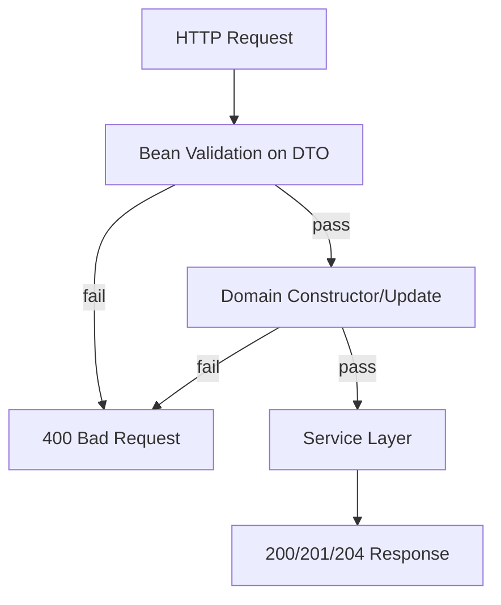
- **Bean Validation** (`@NotBlank`, `@Size`, `@Pattern`, `@FutureOrPresent`) catches invalid input early with user-friendly error messages. DTOs use `@Schema(pattern = ".*\\S.*")` to document non-whitespace requirement in OpenAPI.
- **Path variable validation**: `@NotBlank @Size(min=1, max=10)` on `{id}` path parameters enforces ID constraints (no whitespace-only, max 10 chars). Controllers are annotated with `@Validated` (required for Spring to enforce method-level constraints on `@PathVariable`). OpenAPI spec documents this via `@Parameter(schema=@Schema(minLength=1, maxLength=10, pattern=".*\\S.*"))`.
- **Domain validation** (`Validation.validateLength`, `validateDigits`, `validateDateNotPast`) acts as a backup layer—same rules, same constants.
- DTO constraints use static imports from `Validation.MAX_*` constants to stay in sync with domain rules.

### Controller Tests (MockMvc)
- **ContactControllerTest** (32 tests): 21 @Test + 11-case @ParameterizedTest covering CRUD, validation errors, boundary tests, 404/409 scenarios.
- **TaskControllerTest** (41 tests): 35 @Test + 6-case @ParameterizedTest covering CRUD, validation errors, status/dueDate/projectId fields, boundary tests, 404/409 scenarios.
- **AppointmentControllerTest** (22 tests): 18 @Test + 4-case @ParameterizedTest covering date validation, past-date rejection, ISO 8601 format handling.
- **GlobalExceptionHandlerTest** (6 tests): Direct unit tests for exception handler methods (`handleIllegalArgument`, `handleNotFound`, `handleDuplicate`, `handleConstraintViolation`, `handleAccessDenied`).
- **CustomErrorControllerTest** (17 tests): 12 @Test + 5-row CSV @ParameterizedTest for container-level error handling (status codes, JSON content type, message mapping).
- **JsonErrorReportValveTest** (17 tests): Unit tests for Tomcat valve JSON error handling (Content-Length, buffer reset, committed response guards).

### Test Isolation Pattern
Controller tests use reflection to access package-private `clearAll*()` methods on the autowired service:
```java
@BeforeEach
void setUp() throws Exception {
    final Method clearMethod = ContactService.class.getDeclaredMethod("clearAllContacts");
    clearMethod.setAccessible(true);
    clearMethod.invoke(contactService);  // Use autowired service, not getInstance()
}
```

### JsonErrorReportValveTest Scenario Coverage
- `report_successfulResponse_doesNotWriteBody` - Verifies successful responses (status < 400) are not processed.
- `report_committedResponse_doesNotWriteBody` - Verifies already-committed responses are skipped to avoid corruption.
- `report_badRequest_writesJsonBody` - Verifies 400 errors write JSON with correct Content-Type, Content-Length, and message.
- `report_notFound_writesCorrectMessage` - Verifies 404 errors return "Resource not found" message.
- `report_resetBufferThrowsException_returnsEarly` - Verifies valve handles `IllegalStateException` gracefully.
- `report_ioException_handledGracefully` - Verifies IOException during write doesn't throw.
- `report_statusCodeMapping` (parameterized) - Verifies all HTTP status codes map to correct error messages (400→Bad request, 401→Unauthorized, 403→Forbidden, 404→Resource not found, 405→Method not allowed, 415→Unsupported media type, 500→Internal server error, unknown→Error).
- `report_withThrowable_stillWritesJson` - Verifies throwable parameter doesn't affect JSON output.
- `report_statusBelowThreshold_doesNotWriteBody` - Verifies 399 status (below threshold) is not processed.
- `report_exactlyAtThreshold_writesBody` - Verifies 400 status (exactly at threshold) is processed.

<br>

## React UI Layer (Phase 4)

### UI Snapshot
- **React 19 + Vite + TypeScript** powers the frontend with fast HMR and type safety.
- **Tailwind CSS v4** provides utility-first styling via the `@theme` directive for CSS-native design tokens.
- **shadcn/ui** components (Button, Card, Table, Sheet, Dialog, etc.) offer accessible, copy-paste primitives built on Radix UI.
- **TanStack Query** handles server state with automatic caching, refetching, and error handling.
- **React Router v7** manages client-side navigation with a nested route structure.
- **Zod schemas** mirror backend `Validation.java` constants for consistent client-side validation.

### Stack Architecture
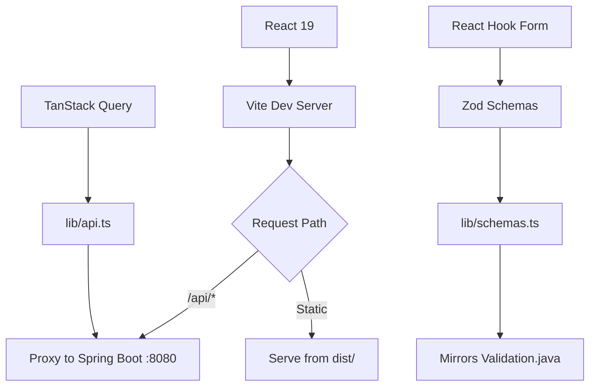

### Local Dev Script
- Use `python scripts/dev_stack.py` to launch Spring Boot (`mvn spring-boot:run`) and the Vite UI (`npm run dev -- --port 5173`) in one terminal; add `--database postgres` to have it start Docker Compose (auto-detects `docker compose` vs `docker-compose`), enable the `dev` profile, and wire datasource env vars automatically.
- The helper polls `http://localhost:8080/actuator/health` before starting the frontend, installs `ui/contact-app` dependencies if `node_modules` is missing, and shuts everything down on Ctrl+C.
- Flags: `--frontend-port 4000`, `--backend-goal "spring-boot:run -Dspring-boot.run.profiles=dev"`, `--skip-frontend-install`, `--database postgres`, `--docker-compose-file ./docker-compose.dev.yml`, `--postgres-url jdbc:postgresql://localhost:5432/contactapp`, `--postgres-username contactapp`, `--postgres-password contactapp`, and `--postgres-profile dev` keep it flexible for custom setups.


### App Shell Layout
```
┌─────────────────────────────────────────────────────────────────┐
│ ┌──────────┐ ┌─────────────────────────────────────────────────┐│
│ │  Logo    │ │ TopBar: [Title]              [🔍] [🌙] [👤]    ││
│ ├──────────┤ └─────────────────────────────────────────────────┘│
│ │ Overview │ ┌──────────────────────────────────┬──────────────┐│
│ │ Contacts │ │                                  │              ││
│ │ Tasks    │ │   Content Area                   │   Sheet      ││
│ │ Appts    │ │   (list/table/cards)             │   (details)  ││
│ │          │ │                                  │              ││
│ ├──────────┤ │                                  │              ││
│ │ Settings │ │                                  │              ││
│ │ Help     │ │                                  │              ││
│ └──────────┘ └──────────────────────────────────┴──────────────┘│
└─────────────────────────────────────────────────────────────────┘
```
- **Sidebar** (desktop/tablet): Navigation with icons and labels, collapsible on tablet.
- **TopBar**: Page title, search trigger (Ctrl+K), dark mode toggle, theme switcher, user avatar.
- **Content**: Route-specific views (Overview dashboard, entity tables).
- **Sheet**: Right-hand drawer for viewing/editing entity details without losing list context.

### Responsive Breakpoints
| Breakpoint | Sidebar | Navigation | Drawer |
|------------|---------|------------|--------|
| Desktop (≥1024px) | Full width with labels | Left sidebar | Right sheet |
| Tablet (768-1023px) | Icons only | Left sidebar (narrow) | Right sheet |
| Mobile (<768px) | Hidden | Bottom nav (future) | Full-screen sheet |

### Theme System
- **5 professional themes**: Slate (default), Ocean (fintech), Forest (productivity), Violet (startup), Zinc (developer tools).
- **Light/dark variants** controlled via `.dark` class on `<html>`.
- **CSS variable architecture** with Tailwind v4 `@theme` directive for semantic tokens.
- **WCAG 2.1 AA compliant** contrast ratios verified for all theme combinations.

### Theme Switching Flow
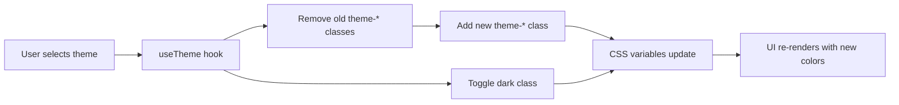

### File Structure
```
ui/contact-app/
├── src/
│   ├── components/
│   │   ├── layout/           # AppShell, Sidebar, TopBar
│   │   └── ui/               # shadcn/ui components
│   ├── hooks/                # useTheme, useMediaQuery
│   ├── lib/                  # api.ts, schemas.ts, utils.ts
│   ├── pages/                # OverviewPage, ContactsPage, etc.
│   ├── App.tsx               # Router + QueryClient setup
│   ├── index.css             # Tailwind + theme CSS variables
│   └── main.tsx              # React DOM entry
├── components.json           # shadcn/ui configuration
├── package.json              # Dependencies (React 19, Tailwind v4)
├── tsconfig.app.json         # TypeScript config with @/* alias
└── vite.config.ts            # Vite + Tailwind plugin + API proxy
```

### API Integration
```typescript
const METHODS_REQUIRING_CSRF = new Set(['POST', 'PUT', 'PATCH', 'DELETE']);

async function ensureCsrfToken(): Promise<string | null> {
  // Reads XSRF-TOKEN cookie or hits /api/auth/csrf-token if missing
}

async function fetchWithCsrf(input: RequestInfo | URL, init: RequestInit = {}): Promise<Response> {
  const headers = new Headers(init.headers ?? {});
  const method = (init.method ?? 'GET').toUpperCase();
  if (METHODS_REQUIRING_CSRF.has(method)) {
    const token = await ensureCsrfToken();
    if (token) headers.set('X-XSRF-TOKEN', token);
  }
  return fetch(input, { credentials: 'include', ...init, headers });
}

export const contactsApi = {
  create: (data: ContactRequest) =>
    fetchWithCsrf('/api/v1/contacts', {
      method: 'POST',
      headers: { 'Content-Type': 'application/json' },
      body: JSON.stringify(data),
    }).then(handleResponse<Contact>),
  // ... get/update/delete re-use fetchWithCsrf
};
```

> **CORS reminder:** Every environment needs explicit origins (no `*`) plus `Access-Control-Allow-Credentials: true`, `Access-Control-Allow-Origin: https://your-spa.example`, `Access-Control-Allow-Headers: Authorization, Content-Type, X-XSRF-TOKEN, X-Request-ID`, and `Access-Control-Expose-Headers: X-Request-ID, X-Trace-ID`. Keep the origin list in source control (nginx/ingress + Spring `CorsRegistry`) so UI deployments and backend configs stay synchronized.

### Validation Alignment
```typescript
// lib/schemas.ts - Zod schemas matching Validation.java constants
export const ValidationLimits = {
  MAX_ID_LENGTH: 10,        // Validation.MAX_ID_LENGTH
  MAX_NAME_LENGTH: 10,      // Validation.MAX_NAME_LENGTH
  MAX_ADDRESS_LENGTH: 30,   // Validation.MAX_ADDRESS_LENGTH
  MAX_TASK_NAME_LENGTH: 20, // Validation.MAX_TASK_NAME_LENGTH
  MAX_DESCRIPTION_LENGTH: 50, // Validation.MAX_DESCRIPTION_LENGTH
  PHONE_LENGTH: 10,         // Validation.PHONE_LENGTH
} as const;

export const contactSchema = z.object({
  id: z.string().min(1).max(ValidationLimits.MAX_ID_LENGTH),
  firstName: z.string().min(1).max(ValidationLimits.MAX_NAME_LENGTH),
  // ...
});
```

### Build Integration
- **Development**: `npm run dev` starts Vite with API proxy to `localhost:8080`.
- **Production**: Maven's `frontend-maven-plugin` runs `npm ci && npm run build` during `prepare-package` phase.
- **Single JAR**: Built UI assets copy to `target/classes/static/` so Spring Boot serves them at `/`.
- **Fast feedback**: `mvn test` runs backend tests only; `mvn package` includes full UI build.
- **Docker required for backend tests**: SpringBootTest/MockMvc/service suites now use Postgres via Testcontainers (`integration` profile). Start Docker before running `mvn test`; without Docker, limit to unit/slice suites or use `-DskipITs=true -Dspring.profiles.active=test` for H2-only slices.

### Frontend Testing ✅
- [x] **Vitest + React Testing Library** - 22 component tests (schemas, forms, pages)
- [x] **Playwright E2E** - 5 tests covering CRUD happy path (list/create/edit/delete)

```bash
cd ui/contact-app
npm run test:run       # Vitest unit/component tests (22 tests)
npm run test:e2e       # Playwright E2E tests (5 tests, starts dev server automatically)
npm run test:coverage  # Vitest with coverage report
```

### Related ADRs
| ADR                                                                  | Title                | Summary                                                  |
|----------------------------------------------------------------------|----------------------|----------------------------------------------------------|
| [ADR-0025](docs/adrs/ADR-0025-ui-component-library.md)               | UI Component Library | shadcn/ui + Tailwind v4 selection rationale              |
| [ADR-0026](docs/adrs/ADR-0026-theme-system-and-design-tokens.md)     | Theme System         | CSS variable architecture, 5 themes, WCAG compliance     |
| [ADR-0027](docs/adrs/ADR-0027-application-shell-layout.md)           | App Shell Layout     | Sidebar + TopBar + Sheet pattern, responsive breakpoints |
| [ADR-0028](docs/adrs/ADR-0028-frontend-backend-build-integration.md) | Build Integration    | Maven plugin config, phase binding, single JAR output    |

<br>

## [Application.java](src/main/java/contactapp/Application.java) / Spring Boot Infrastructure

### Application Snapshot
- **Spring Boot 4.0.0** provides the runtime foundation with embedded Tomcat, auto-configuration, and actuator endpoints.
- `@SpringBootApplication` combines `@Configuration`, `@EnableAutoConfiguration`, and `@ComponentScan` to wire everything together.
- Component scanning discovers `@Service` beans in `contactapp.service` package automatically.
- Services retain their singleton `getInstance()` pattern for backward compatibility while also supporting Spring DI via `@Autowired`.

### Package Structure
```
contactapp/
├── Application.java              # Spring Boot entrypoint
├── domain/                       # Domain entities (Contact, Task, Appointment, Validation)
├── service/                      # @Service beans (ContactService, TaskService, AppointmentService)
├── api/                          # REST controllers + DTOs + error handling
│   ├── ContactController.java    # Contact CRUD endpoints
│   ├── TaskController.java       # Task CRUD endpoints
│   ├── AppointmentController.java # Appointment CRUD endpoints
│   ├── GlobalExceptionHandler.java # @RestControllerAdvice error mapping
│   ├── CustomErrorController.java # JSON error responses for container-level errors
│   ├── dto/                      # Request/Response DTOs with Bean Validation
│   └── exception/                # ResourceNotFoundException, DuplicateResourceException
├── config/                       # Tomcat/Spring configuration
│   ├── JsonErrorReportValve.java # Tomcat valve for JSON error responses (ADR-0022)
│   └── TomcatConfig.java         # Registers JsonErrorReportValve with embedded Tomcat
└── persistence/                  # Repository interfaces (Phase 3 - empty)
```

### Configuration
- **Profile-based settings** in `application.yml`:
  - `dev`: Debug logging, health details always shown
  - `test`: Minimal logging for fast CI runs
  - `prod`: Restricted health details, warn-level logging
- **Actuator lockdown**: Only `/actuator/health` and `/actuator/info` are exposed; all other endpoints (env, beans, metrics) return 404 per OWASP guidelines.

## [application.yml](src/main/resources/application.yml)

### Configuration Highlights
```yaml
management:
  endpoints:
    web:
      exposure:
        include: health,info    # Only health and info exposed
  endpoint:
    health:
      show-details: when-authorized
      probes:
        enabled: true           # Kubernetes liveness/readiness support
```

### Why These Defaults?
- **Security**: Actuator endpoints can expose sensitive information (environment variables, bean definitions, metrics). Locking them down by default follows defense-in-depth.
- **Observability**: Health and info endpoints are essential for orchestrators (Kubernetes probes, load balancer health checks) and operational dashboards.
- **Profiles**: Environment-specific behavior without code changes; `spring.profiles.active=dev` unlocks more verbose settings locally.

#### Security Property Snapshot
- `jwt.secret` is mandatory in production and pairs with `jwt.expiration=1800000` (30 minutes) to keep cookie-backed sessions short-lived by default.
- `app.auth.cookie.secure` (env: `APP_AUTH_COOKIE_SECURE`) governs the custom `auth_token` cookie separately from the servlet session cookie; dev/test default to `false`, but the prod profile requires `COOKIE_SECURE`/`APP_AUTH_COOKIE_SECURE` with no fallback so insecure cookies never ship accidentally.
- Reverse proxies and Spring CORS config must define explicit origins + `Access-Control-Allow-Credentials: true` to satisfy the SPA’s `credentials: 'include'` fetch calls.

## [ApplicationTest.java](src/test/java/contactapp/ApplicationTest.java)

### Test Snapshot
- Smoke test verifying the Spring application context loads without errors.
- Empty test body is intentional: `@SpringBootTest` triggers context loading before any test runs. If wiring fails, the test fails with detailed error messages.

### Scenario Coverage
- `contextLoads` - Verifies the application context loads without exceptions.
- `mainMethodCoverage` - Calls `Application.main()` directly to ensure the entrypoint is exercised for JaCoCo line coverage.

### Why This Test Matters
- Catches configuration errors early: missing beans, circular dependencies, invalid property bindings, component scanning failures.
- Fast feedback loop: fails in seconds rather than waiting for full integration tests to discover wiring issues.

## [ActuatorEndpointsTest.java](src/test/java/contactapp/ActuatorEndpointsTest.java)

### Test Snapshot
- Integration tests verifying actuator endpoint security configuration using MockMvc.
- Confirms security posture matches `application.yml` settings.

### Scenario Coverage
- `healthEndpointReturnsUp` - Verifies `/actuator/health` returns 200 OK with `{"status":"UP"}`. Critical for Kubernetes probes and load balancer health checks.
- `infoEndpointReturnsOk` - Verifies `/actuator/info` returns 200 OK. Provides build metadata for operational dashboards.
- `envEndpointIsNotExposed` - Verifies `/actuator/env` returns 404. Prevents exposure of environment variables that may contain secrets.
- `beansEndpointIsNotExposed` - Verifies `/actuator/beans` returns 404. Prevents exposure of internal architecture details.
- `metricsEndpointRequiresAuth` - Verifies `/actuator/metrics` requires authentication. Exposes JVM/application metrics for monitoring.
- `prometheusEndpointRequiresAuth` - Verifies `/actuator/prometheus` requires authentication. Prometheus-format metrics for scraping.

### Security Rationale
| Endpoint               | Status    | Reason                              |
|------------------------|-----------|-------------------------------------|
| `/actuator/health`     | ✅ Exposed | Required for orchestrator probes    |
| `/actuator/info`       | ✅ Exposed | Build metadata for ops              |
| `/actuator/metrics`    | ✅ Exposed | JVM/app metrics (auth required)     |
| `/actuator/prometheus` | ✅ Exposed | Prometheus scraping (auth required) |
| `/actuator/env`        | ❌ Blocked | May contain secrets                 |
| `/actuator/beans`      | ❌ Blocked | Reveals architecture                |

## [ServiceBeanTest.java](src/test/java/contactapp/ServiceBeanTest.java)

### Test Snapshot
- Integration tests verifying service beans are properly registered and injectable.
- Proves component scanning discovers all `@Service` classes.

### Scenario Coverage
- `contactServiceBeanExists` - Verifies `ContactService` is injectable via `@Autowired` and retrievable from `ApplicationContext`.
- `taskServiceBeanExists` - Verifies `TaskService` is injectable and present in context.
- `appointmentServiceBeanExists` - Verifies `AppointmentService` is injectable and present in context.
- `serviceBeansAreSingletons` - Verifies all three services are singletons (same instance across injection points), matching the expected behavior for stateful in-memory services.

### Why These Tests Matter
- Catches `NoSuchBeanDefinitionException` errors before they surface in controller tests (Phase 2).
- Documents the expected wiring behavior: services should be singletons.
- Verifies backward compatibility: Spring-managed beans should behave identically to `getInstance()` pattern.

<br>

## Static Analysis & Quality Gates

| Layer               | Tool                       | Focus                                                                                |
|---------------------|----------------------------|--------------------------------------------------------------------------------------|
| Coverage            | **JaCoCo**                 | Line/branch coverage enforcement during `mvn verify`.                                |
| Mutation            | **PITest**                 | Ensures assertions catch injected faults; threshold currently 70%.                   |
| Style & complexity  | **Checkstyle**             | Formatting, naming, indentation, import ordering, and boolean simplification.        |
| Bug patterns        | **SpotBugs**               | Bytecode bug-pattern scanning via `spotbugs-maven-plugin` (fails build on findings). |
| Dependency security | **OWASP Dependency-Check** | CVE scanning backed by `NVD_API_KEY` with optional skip fallback.                    |
| Semantic security   | **CodeQL**                 | Detects SQLi/XSS/path-traversal patterns in a separate workflow.                     |

Each layer runs automatically in CI, so local `mvn verify` mirrors the hosted pipelines.
- Dependabot runs every Monday at 15:30 ET against the Maven ecosystem and automatically opens PRs for available dependency upgrades.

## Mutation Testing & Quality Gates
- PITest runs inside `mvn verify`, so the new service tests contribute directly to the enforced mutation score.
- The GitHub Actions matrix uses the same suite, ensuring duplicate/add/delete/update scenarios stay green across OS/JDK combinations.
- GitHub Actions still executes `{ubuntu-latest, windows-latest} × {Java 17, Java 21}` with `MAVEN_OPTS="--enable-native-access=ALL-UNNAMED -Djdk.attach.allowAttachSelf=true"`, so mutation coverage is enforced everywhere.
- The optional self-hosted lane remains available for long mutation sessions or extra capacity; see the dedicated section below.

## Testing Pyramid
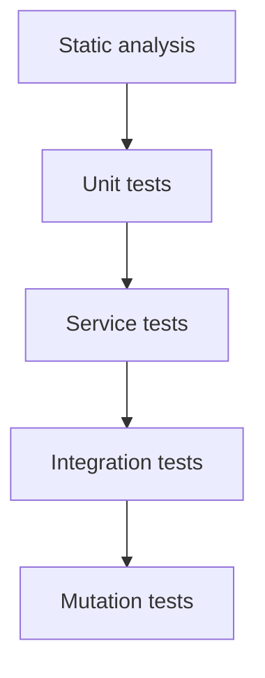

## Checkstyle Rule Set
| Check Group                                                                                                          | Focus                                                                              |
|----------------------------------------------------------------------------------------------------------------------|------------------------------------------------------------------------------------|
| `ImportOrder`, `AvoidStarImport`, `RedundantImport`                                                                  | Enforce ordered/separated imports, no wildcards, and no duplicates.                |
| `NeedBraces`, `LeftCurly`, `RightCurly`, `EmptyBlock`                                                                | Require braces and consistent brace placement; flag empty blocks.                  |
| `WhitespaceAround`, `WhitespaceAfter`, `NoWhitespaceBefore`, `NoWhitespaceAfter`, `SingleSpaceSeparator`, `ParenPad` | Enforce consistent spacing around tokens and parentheses.                          |
| `Indentation`, `LineLength`, `FileTabCharacter`, `NewlineAtEndOfFile`                                                | Align indentation, cap lines at 120 chars, disallow tabs, ensure trailing newline. |
| `ModifierOrder`, `RedundantModifier`                                                                                 | Keep modifier order canonical and drop redundant keywords.                         |
| `MethodLength`, `MethodParamPad`, `MethodName`, `ParameterName`, `LocalVariableName`, `MemberName`                   | Bound method size and enforce naming/padding conventions.                          |
| `HiddenField`                                                                                                        | Prevent locals/parameters from shadowing fields (except constructors/setters).     |
| `MagicNumber`                                                                                                        | Flags unwanted literals (excluding -1, 0, 1) to encourage constants.               |
| `SimplifyBooleanExpression`, `SimplifyBooleanReturn`, `OneStatementPerLine`                                          | Reduce complex boolean logic and keep one statement per line.                      |
| `FinalParameters`, `FinalLocalVariable`                                                                              | Encourage immutability for parameters and locals when possible.                    |


## SpotBugs


## SpotBugs Commands
```bash
# Run SpotBugs as part of the normal build
mvn -Ddependency.check.skip=true verify

# Fail fast on SpotBugs findings during local iterations
mvn spotbugs:check

# Generate the HTML report at target/spotbugs.html
mvn spotbugs:spotbugs

# Open the SpotBugs GUI to inspect findings interactively
mvn spotbugs:gui
```
> CI already runs SpotBugs inside `mvn verify`; these commands help when iterating locally.

## Sonatype OSS Index (optional)
Dependency-Check also pings the Sonatype OSS Index service. When requests are anonymous the analyzer often rate-limits, which is why CI prints warnings like “An error occurred while analyzing … (Sonatype OSS Index Analyzer)”. To receive full results:
1. Create a free account at [ossindex.sonatype.org](https://ossindex.sonatype.org/) and generate an API token.
2. Add the credentials to your Maven `settings.xml`:
   ```xml
   <settings>
     <servers>
       <server>
         <id>ossindex</id>
         <username>YOUR_OSS_INDEX_USERNAME</username>
         <password>YOUR_OSS_INDEX_API_TOKEN</password>
       </server>
     </servers>
   </settings>
   ```
3. Run Maven with `-DossIndexServerId=ossindex` (or set the property permanently with `export MAVEN_OPTS="$MAVEN_OPTS -DossIndexServerId=ossindex"`). GitHub Actions can do the same by storing the username/token as repository secrets and writing the snippet above before `mvn verify`.

If you skip these steps, the OSS Index analyzer simply logs warnings while the rest of Dependency-Check continues to rely on the NVD feed.

## Backlog
- Full backlog lives in [`docs/logs/backlog.md`](docs/logs/backlog.md) so the README stays concise, and includes future ideas for reporting, observability, and domain enhancements.

## CI/CD Pipeline

### Jobs at a Glance
| Job                 | Trigger                                                                             | What it does                                                                                                                                                                                                 | Notes                                                                                                      |
|---------------------|-------------------------------------------------------------------------------------|--------------------------------------------------------------------------------------------------------------------------------------------------------------------------------------------------------------|------------------------------------------------------------------------------------------------------------|
| `build-test`        | Push/PR to main/master, release, manual dispatch                                    | Matrix `{ubuntu, windows} × {JDK 17, 21}` running `mvn verify` (tests + Checkstyle + SpotBugs + JaCoCo + PITest + Dependency-Check), builds QA dashboard, posts QA summary, uploads reports, Codecov upload. **Note:** Ubuntu runners explicitly run `-DskipITs=false` while Windows runners skip Testcontainers integration tests (`-DskipITs=true`) because GitHub-hosted Windows runners cannot run Linux containers. | Retries `mvn verify` with Dependency-Check/PITest skipped if the first attempt fails due to feed/timeouts. |
| `api-fuzz`          | Push/PR to main/master, manual dispatch                                             | Starts Spring Boot app, runs Schemathesis against `/v3/api-docs`, exports OpenAPI spec, publishes JUnit XML results. Fails on 5xx errors or schema violations.                                               | 20-minute timeout; exports spec as artifact for ZAP.                                                       |
| `container-test`    | Always (needs `build-test`)                                                         | Re-runs `mvn verify` inside `maven:3.9.9-eclipse-temurin-17` using the H2/`-DskipTestcontainersTests=true` profile (no Docker socket available); retries with Dependency-Check/PITest skipped on failure.     | Uses same MAVEN_OPTS for PIT attach; skips Testcontainers suites by design.                                |
| `mutation-test`     | Only when repo var `RUN_SELF_HOSTED == 'true'` and a `self-hosted` runner is online | Runs `mvn verify` on the self-hosted runner with PITest enabled; retries with Dependency-Check/PITest skipped on failure.                                                                                    | Optional lane; skipped otherwise.                                                                          |
| `release-artifacts` | Release event (`published`)                                                         | Packages the JAR and uploads it as an artifact; generates release notes.                                                                                                                                     | Not run on normal pushes/PRs.                                                                              |

### Local Command Cheat Sheet
| Command                                                                 | Purpose                                                                                  |
|-------------------------------------------------------------------------|------------------------------------------------------------------------------------------|
| `mvn verify`                                                            | Full build: compile, unit tests, Checkstyle, SpotBugs, JaCoCo, PITest, Dependency-Check. |
| `mvn -Ddependency.check.skip=true -Dpit.skip=true verify`               | Fast local build when Dependency-Check feed is slow/unavailable.                         |
| `mvn spotbugs:check`                                                    | Run only SpotBugs and fail on findings.                                                  |
| `mvn -DossIndexServerId=ossindex verify`                                | Opt-in authenticated OSS Index for Dependency-Check (see Sonatype section).              |
| `cd ui/qa-dashboard && npm ci && npm run build`                         | Build the React QA dashboard locally (already built in CI).                              |
| `pip install schemathesis && python scripts/api_fuzzing.py --start-app` | Run API fuzzing locally (starts app, fuzzes, exports spec).                              |

### Matrix Verification
- `.github/workflows/java-ci.yml` runs `mvn -B verify` across `{ubuntu-latest, windows-latest} × {Java 17, Java 21}` to surface OS and JDK differences early.
- **Ubuntu runners** execute the full test suite including Testcontainers integration tests (Postgres via Docker).
- **Windows runners** skip integration tests (`-DskipITs=true`) because GitHub-hosted Windows runners only support Windows containers, not the Linux containers required by Testcontainers/Postgres. Unit tests, MockMvc tests, and all quality gates still run.
- **Local developers** also skip the Testcontainers suite by default (Maven property `skipITs=true`). Opt in with `mvn verify -DskipITs=false` once Docker Desktop/Colima is running to mirror the CI configuration.
- `container-test` reruns `mvn verify` inside `maven:3.9.9-eclipse-temurin-17` **with `-DskipTestcontainersTests=true -Pskip-testcontainers`** (H2 only; no Docker socket); if quality gates fail, it retries with Dependency-Check and PITest skipped.

### Quality Gate Behavior
- Each matrix job executes the quality gate suite (unit tests, JaCoCo, Checkstyle, SpotBugs, Dependency-Check, PITest). Integration tests run only on Ubuntu (see Matrix Verification above).
- Checkstyle enforces formatting/import/indentation rules while SpotBugs scans bytecode for bug patterns and fails the build on findings.
- SpotBugs runs as part of every `mvn verify` run on the supported JDKs (currently 17 and 21 in CI) and fails the build on findings.
- Dependency-Check throttling is tuned via `nvdApiDelay` (defaults to 3500ms when an NVD API key is configured, 8000ms without a key) and honors `-Ddependency.check.skip=true` if the NVD feed is unreachable; PITest has a similar `-Dpit.skip=true` retry path so contributors stay unblocked but warnings remain visible.
- Python 3.12 is provisioned via `actions/setup-python@v5` so `scripts/ci_metrics_summary.py` runs consistently on both Ubuntu and Windows runners.
- Node.js 22 is provisioned via `actions/setup-node@v4` and the React dashboard under `ui/qa-dashboard/` is built every run so the artifacts contain the interactive QA console.
- Mutation coverage now relies on GitHub-hosted runners by default; the self-hosted lane is opt-in and only fires when the repository variable `RUN_SELF_HOSTED` is set.
- Dependabot checks run every Monday at 15:30 ET so Maven updates appear as automated PRs without waiting for the rest of the week.
- After every matrix job, `scripts/ci_metrics_summary.py` posts a table to the GitHub Actions run summary showing tests, JaCoCo coverage, PITest mutation score, and Dependency-Check counts (with ASCII bars for quick scanning).
- The same summary script emits a dark-mode HTML dashboard (`target/site/qa-dashboard/index.html`) with quick stats and links to the JaCoCo, SpotBugs, Dependency-Check, and PITest HTML reports (packaged inside the `quality-reports-*` artifact for download) and drops `serve_quality_dashboard.py` next to the reports for easy local previewing.

### Caching Strategy
- Maven artifacts are cached via `actions/cache@v4` (`~/.m2/repository`) to keep builds fast.
- Dependency-Check data is intentionally purged every run (see the “Purge Dependency-Check database cache” step) to avoid stale or corrupted NVD downloads. If feed reliability improves we can re-enable caching in the workflow, but for now the clean slate proved more stable.

### Mutation Lane (Optional Self-Hosted Fallback)
- The standard matrix already executes PITest, but some contributors keep a self-hosted runner handy for long mutation sessions, experiments, or when GitHub-hosted capacity is saturated.
- Toggling the repository variable `RUN_SELF_HOSTED` to `true` enables the `mutation-test` job, which mirrors the hosted command line but runs on your own hardware with `MAVEN_OPTS="--enable-native-access=ALL-UNNAMED -Djdk.attach.allowAttachSelf=true"`.

### Release Automation
- Successful workflows publish build artifacts, and the release workflow packages release notes so we can trace which commit delivered which binary.
- The `release-artifacts` job is intentionally gated with `if: github.event_name == 'release' && github.event.action == 'published'`, so you will see it marked as “skipped” on normal pushes or pull requests. It only runs when a GitHub release/tag is published.

### Coverage Publishing (Codecov)
- After JaCoCo generates `target/site/jacoco/jacoco.xml`, the workflow uploads it to [Codecov](https://codecov.io/gh/jguida941/contact-suite-spring-react) so the coverage badge stays current.
- Setup steps (once per repository):
  1. Sign in to Codecov with GitHub and add this repo.
  2. Generate a repository token in Codecov and save it as the GitHub secret `CODECOV_TOKEN`.
  3. Re-run the workflow; each matrix job uploads coverage with a `flags` label (`os-jdk`).
- The badge at the top of this README pulls from the default `master` branch; adjust the URL if you maintain long-lived release branches.

### CodeQL Security Analysis
- `.github/workflows/codeql.yml` runs independently of the matrix job to keep static analysis focused.
- The workflow pins Temurin JDK 17 via `actions/setup-java@v4`, caches Maven dependencies, and enables the `+security-and-quality` query pack for broader coverage.
- GitHub's CodeQL `autobuild` runs the Maven build automatically; a commented `mvn` fallback is available if the repo ever needs a custom command.
- Concurrency guards prevent overlapping scans on the same ref, and `paths-ignore` ensures doc-only/image-only changes do not queue CodeQL unnecessarily.
- Triggers: pushes/PRs to `main` or `master` (respecting the filters), a weekly scheduled scan (`cron: 0 3 * * 0`), and optional manual dispatch.

#### Log Injection Prevention
Log injection vulnerabilities (CWE-117) are prevented through inline validation in logging methods. Both `RateLimitingFilter` and `RequestLoggingFilter` use dedicated sanitization methods that:
- Strip CR/LF and control characters before logging
- Validate against safe character patterns (`^[A-Za-z0-9 .:@/_-]+$`)
- Truncate overly long values (max 120 chars)
- Return safe placeholder values (`[null]`, `[empty]`, `[unsafe-value]`) for invalid input

This inline validation approach ensures CodeQL can trace data flow and verify that only sanitized values reach log statements.

### API Fuzzing (Schemathesis)
- `.github/workflows/api-fuzzing.yml` runs Schemathesis against the live OpenAPI spec to detect 5xx errors, schema violations, and edge cases.
- **Schemathesis v4+ compatibility**: The workflow uses updated options after v4 removed `--base-url`, `--hypothesis-*`, and `--junit-xml` flags.
- **Two-layer JSON error handling**: `JsonErrorReportValve` intercepts errors at the Tomcat container level, while `CustomErrorController` handles Spring-level errors. This ensures most error responses return `application/json`. Note: Extremely malformed URLs (invalid Unicode) fail at Tomcat's connector level before the valve, so `content_type_conformance` check is not used (see ADR-0022).
- **Content-Length fix for chunked encoding**: `JsonErrorReportValve` now sets explicit `Content-Length` to avoid "invalid chunk" errors during fuzzing. The valve implements five safeguards: `isCommitted()` check, buffer reset, `IllegalStateException` bailout, explicit `Content-Length`, and binary write via `OutputStream`. This is the standard Tomcat pattern: guard → reset → set headers → write bytes → flush.
- **All Schemathesis phases pass**: Coverage, Fuzzing, and Stateful phases all pass (30,668 test cases generated, 0 failures).
- **Workflow steps**:
  1. Build the JAR with `mvn -DskipTests package`.
  2. Start Spring Boot app in background, wait for `/actuator/health` to return `UP` (uses `jq` for robust JSON parsing).
  3. Export OpenAPI spec to `target/openapi/openapi.json` (artifact for ZAP/other tools).
  4. Run `schemathesis run` with `--checks not_a_server_error --checks response_schema_conformance` (all phases enabled).
  5. Stop app, publish summary to GitHub Actions.
- **Artifacts produced**:
  - `openapi-spec`: JSON/YAML OpenAPI specification for ZAP and other security tools.
  - `api-fuzzing-results`: Schemathesis output for debugging.
- **Local testing**: `pip install schemathesis && python scripts/api_fuzzing.py --start-app` runs the same fuzzing locally.
- **Failure criteria**: Any 5xx response or response schema violation fails the workflow. Expected 400s from validation (e.g., past dates) are not flagged.

## CI/CD Flow Diagram
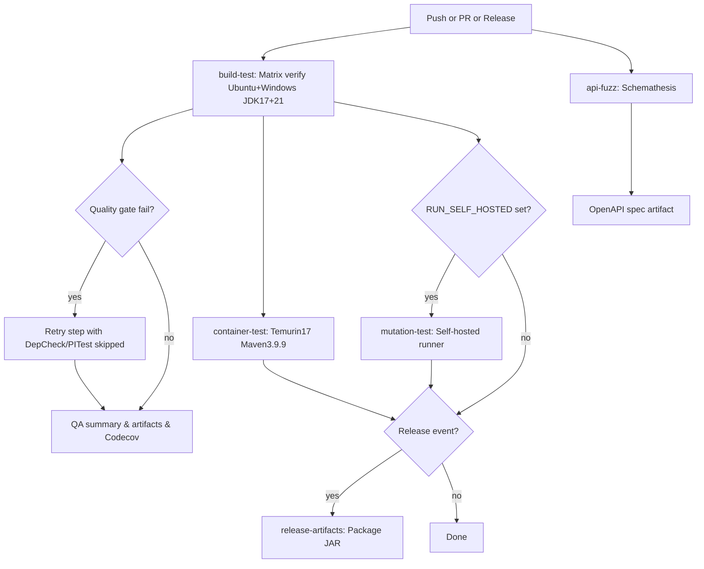

## QA Summary
Each GitHub Actions matrix job writes a QA table (tests, coverage, mutation score, Dependency-Check status) to the run summary. The table now includes colored icons, ASCII bars, and severity breakdowns so drift stands out immediately. Open any workflow's "Summary" tab and look for the "QA Metrics" section for the latest numbers.

**Current Test Metrics (full Linux matrix):**
- 901 test executions (parameterized) with +44 TaskService tests covering query methods, user isolation, and defensive copies
- +71 mutation-focused tests targeting boundary conditions and comparison operators
- ~83.1% mutation kill rate (PIT) and ~89.9% line coverage overall (higher on stores/mappers)
- All domain entities have comprehensive boundary testing
- Test fixtures use centralized `TestCleanupUtility` to reset the SecurityContext, reseed test users, and reset singleton instances via reflection, ensuring complete test isolation and eliminating DuplicateResource exceptions
- Windows matrix executes 700 tests under `-DskipTestcontainersTests=true` (H2), with a reduced JaCoCo gate that excludes container-only code paths; full coverage/mutation gates are enforced on the Linux Testcontainers lanes.
- **Note:** Full test suite requires Docker for Testcontainers-based integration tests; the H2 lane is for portability and sanity checks.

Recent PIT survivors in the rate-limiting/logging filters and the TaskService legacy fallback are now covered with dedicated unit tests (log capturing + legacy-store spies), so sanitization helpers and legacy data migration can't be removed without failing tests.

## GitHub Actions QA Metrics Table


## QA Console React Dashboard

Need richer visuals?<br>
Download the `quality-reports-<os>-jdk<ver>` artifact from the workflow run, unzip it, and from the artifact root run:

```bash
cd ~/Downloads/quality-reports-<os>-jdk<ver>
python serve_quality_dashboard.py --path site
```

(If the artifact retains the `target/site` structure, change `--path site` to `--path target/site`.) <br>
Modern browsers block ES modules when loaded directly from `file://` URLs <br>
So the helper launches a tiny HTTP server, opens `http://localhost:<port>/qa-dashboard/index.html`, and serves the React dashboard with the correct `metrics.json`. <br> 
You’ll see the same KPIs, inline progress bars, and quick links over to the JaCoCo, SpotBugs, Dependency-Check, and PITest HTML reports, all sourced from the exact results of that build.


<br>

## CodeCov Coverage Sunburst

<table>
  <tr>
    <td width="300" valign="middle">
      <a href="https://app.codecov.io/gh/jguida941/contact-suite-spring-react">
        
      </a>
    </td>
    <td valign="middle">
      The sunburst shows which packages and classes are covered by tests.<br/>
      <a href="https://app.codecov.io/gh/jguida941/contact-suite-spring-react">
        Open the full-screen interactive sunburst on Codecov »
      </a>
    </td>
  </tr>
</table>

<br/>

## Self-Hosted Mutation Runner Setup
- Register a runner per GitHub's instructions (Settings -> Actions -> Runners -> New self-hosted runner). Choose macOS/Linux + architecture.
- Install + configure:
  - Go to your repository on GitHub
  - Navigate to Settings -> Actions -> Runners -> New self-hosted runner
  - Select your OS (macOS for Mac, Linux for Linux) and architecture (x64 for Intel, arm64 for Apple Silicon)
  - Follow GitHub's provided commands to download and configure the runner.

  **For macOS**:
  ```bash
  # Create runner directory
  mkdir actions-runner && cd actions-runner

  # Download the latest runner package (check GitHub for exact URL as it includes version)
  # For Intel Mac:
  curl -o actions-runner-osx-x64-2.321.0.tar.gz -L https://github.com/actions/runner/releases/download/v2.321.0/actions-runner-osx-x64-2.321.0.tar.gz
  # For Apple Silicon Mac:
  # curl -o actions-runner-osx-arm64-2.321.0.tar.gz -L https://github.com/actions/runner/releases/download/v2.321.0/actions-runner-osx-arm64-2.321.0.tar.gz

  # Extract the installer
  tar xzf ./actions-runner-osx-*.tar.gz

  # Configure the runner (get token from GitHub UI)
  ./config.sh --url https://github.com/jguida941/contact-suite-spring-react --token YOUR_TOKEN_FROM_GITHUB

  # Set MAVEN_OPTS permanently (choose based on your shell)
  # For zsh (default on modern macOS):
  echo 'export MAVEN_OPTS="--enable-native-access=ALL-UNNAMED -Djdk.attach.allowAttachSelf=true"' >> ~/.zshrc
  source ~/.zshrc
  # For bash:
  # echo 'export MAVEN_OPTS="--enable-native-access=ALL-UNNAMED -Djdk.attach.allowAttachSelf=true"' >> ~/.bash_profile
  # source ~/.bash_profile

  # Start the runner
  ./run.sh
  ```
Leave `./run.sh` running so the `mutation-test` job can execute on your machine.<br>
When you're done, press Ctrl+C to stop the runner.

**Workflow toggle** - the `mutation-test` job only runs when the repository variable `RUN_SELF_HOSTED` is set to `true`.
- Default (variable unset/false): the job is skipped so GitHub-hosted runners finish cleanly even if your machine is offline.
- When you want to run mutation tests: start the runner and set `Settings → Secrets and variables → Actions → Variables → RUN_SELF_HOSTED = true`, then re-run the workflow.
- Turn the variable back to `false` (or delete it) when you shut down the runner, so future workflows don’t wait for a machine that isn’t listening.

## How to Use This Repository
If you're working through CS320 (or just exploring the project), the recommended flow is:
1. Read the requirements in `docs/requirements/contact-requirements/` so you understand the contact rules and service behavior.
2. Study `Contact.java`, `ContactService.java`, and `Validation.java`, then jump into the paired tests (`ContactTest.java` and `ContactServiceTest.java`) to see every rule exercised.
3. Run `mvn verify` and inspect the JUnit (Contact + service suites), JaCoCo, PITest, and dependency reports in `target/` to understand how the quality gates evaluate the project.
4. Experiment by breaking a rule on purpose, rerunning the build, and seeing which tests/gates fail, then fix the tests or code (and add/update assertions in both test classes) as needed.

## Resources & References
| Item                                                                               | Purpose                                                                  |
|------------------------------------------------------------------------------------|--------------------------------------------------------------------------|
| [docs/requirements/contact-requirements/](docs/requirements/contact-requirements/) | Contact assignment requirements and acceptance criteria.                 |
| [docs/requirements/task-requirements/](docs/requirements/task-requirements/)       | Task assignment requirements and acceptance criteria.                    |
| [docs/REQUIREMENTS.md](docs/REQUIREMENTS.md)                                       | Master document with scope, phases, checklist, and code examples.        |
| [docs/INDEX.md](docs/INDEX.md)                                                     | Full file/folder navigation for the repository.                          |
| [GitHub Actions workflows](.github/workflows)                                      | CI/CD definitions described above.                                       |
| [config/checkstyle](config/checkstyle)                                             | Checkstyle rules enforced in CI.                                         |
| [Java 17 (Temurin)](https://adoptium.net/temurin/releases/)                        | JDK used locally and in CI.                                              |
| [Apache Maven](https://maven.apache.org/)                                          | Build tool powering the project.                                         |
| [JUnit 5](https://junit.org/junit5/)                                               | Test framework leveraged in `ContactTest` and `ContactServiceTest`.      |
| [AssertJ](https://assertj.github.io/doc/)                                          | Fluent assertion library used across the test suites.                    |
| [PITest](https://pitest.org/)                                                      | Mutation testing engine enforced in CI.                                  |
| [OWASP Dependency-Check](https://jeremylong.github.io/DependencyCheck/)            | CVE scanning tool wired into Maven/CI.                                   |
| [Checkstyle](https://checkstyle.sourceforge.io/)                                   | Style/complexity checks.                                                 |
| [SpotBugs](https://spotbugs.github.io/)                                            | Bug pattern detector.                                                    |
| [CodeQL](https://codeql.github.com/docs/)                                          | Semantic security analysis.                                              |

## License
Distributed under the MIT License. See [LICENSE](LICENSE) for details.
