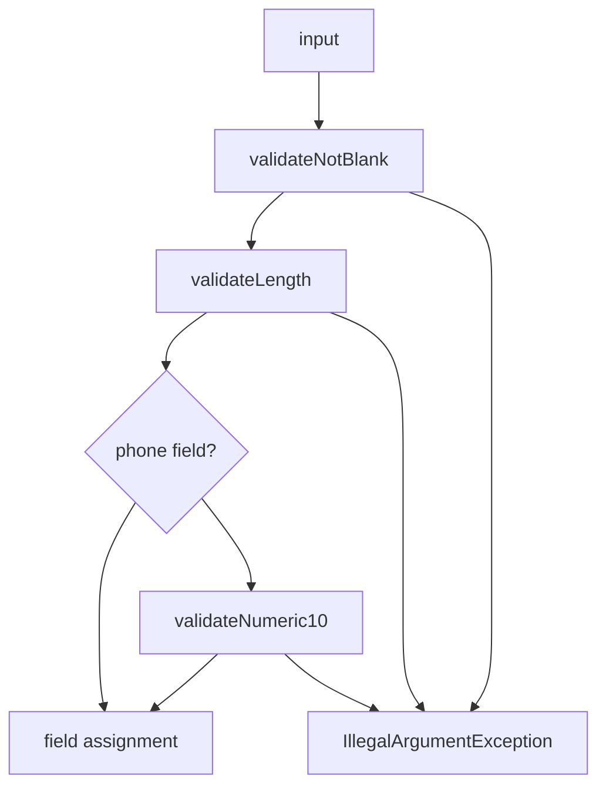
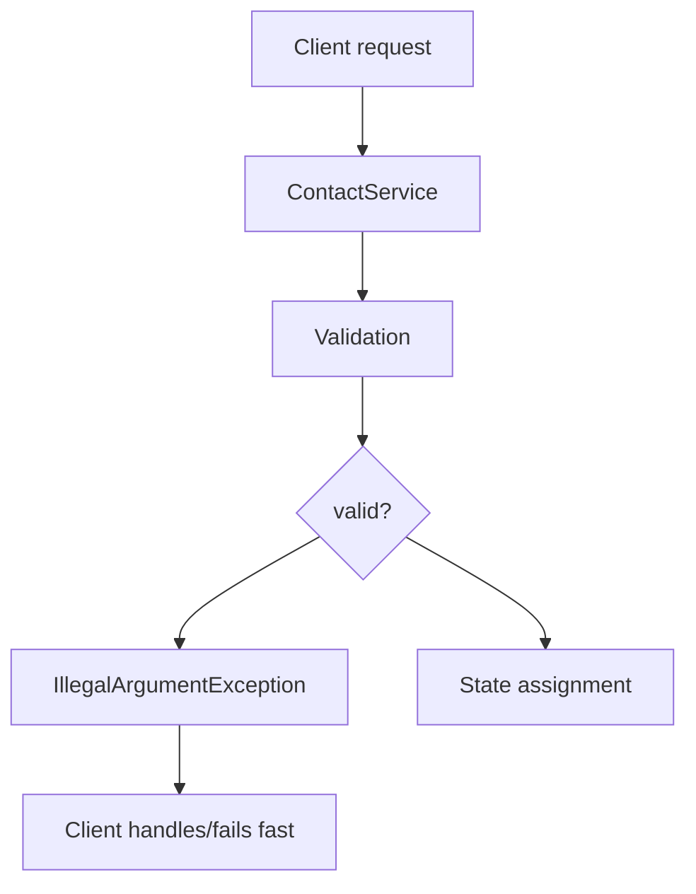
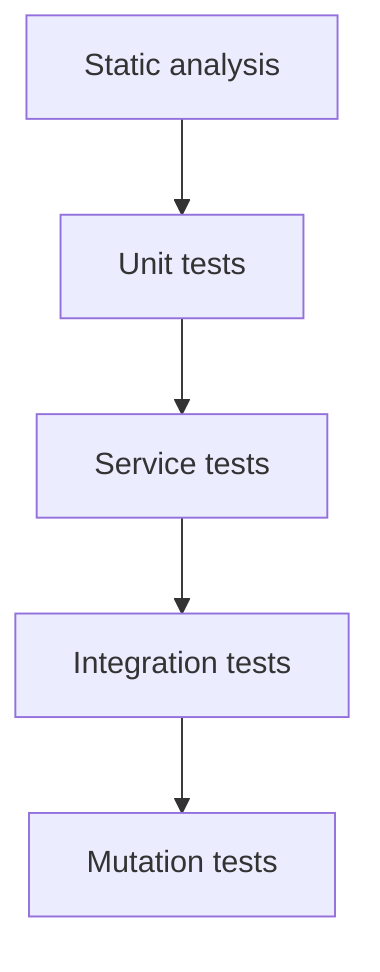
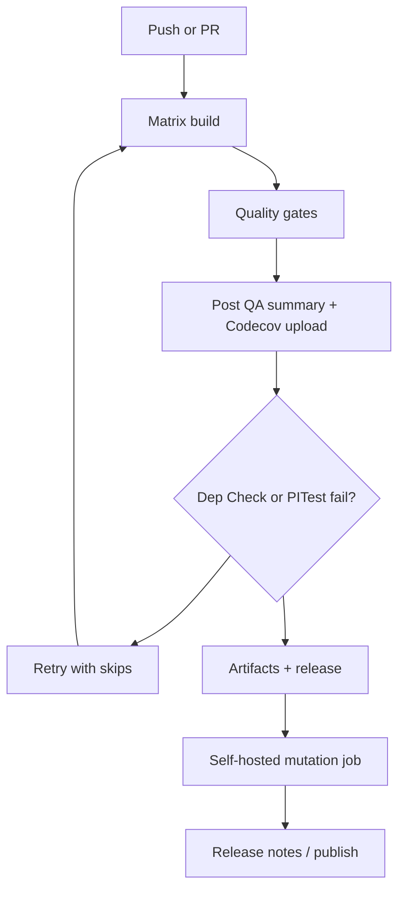

# CS320 Milestone 1 - Contact Service
[](https://github.com/jguida941/cs320-contact-service-junit/actions/workflows/java-ci.yml)
[](https://github.com/jguida941/cs320-contact-service-junit/actions/workflows/codeql.yml)
[](https://codecov.io/gh/jguida941/cs320-contact-service-junit)

Small Java project for the CS320 Contact Service milestone. The work breaks down into two pieces:
1. Build the `Contact` and `ContactService` classes exactly as described in the requirements.
2. Prove every rule with unit tests (length limits, null checks, unique IDs, and add/update/delete behavior) using the shared `Validation` helper so exceptions surface clear messages.

Everything is packaged under `contactapp`; production classes live in `src/main/java` and the JUnit tests in `src/test/java`.

## Table of Contents
- [Getting Started](#getting-started)
- [Folder Highlights](#folder-highlights)
- [Design Decisions & Highlights](#design-decisions--highlights)
- [Architecture Overview](#architecture-overview)
- [Validation & Error Handling](#validation--error-handling)
- [Testing Strategy](#testing-strategy)
- [Static Analysis & Quality Gates](#static-analysis--quality-gates)
- [Backlog](#backlog)
- [CI/CD Pipeline](#cicd-pipeline)
- [Sample QA Summary](#sample-qa-summary)
- [Self-Hosted Mutation Runner Setup](#self-hosted-mutation-runner-setup)

## Getting Started
1. Install Java 17 and Apache Maven (3.9+).
2. Run `mvn verify` from the project root to compile everything, execute the JUnit suite, and run Checkstyle/SpotBugs/JaCoCo quality gates.
3. Open the folder in IntelliJ/VS Code if you want IDE assistance—the Maven project model is auto-detected.

## Folder Highlights
| Path                                                                                           | Description                                                         |
|------------------------------------------------------------------------------------------------|---------------------------------------------------------------------|
| [`src/main/java/contactapp/Contact.java`](src/main/java/contactapp/Contact.java)               | Contact entity enforcing the ID/name/phone/address constraints.     |
| [`src/main/java/contactapp/ContactService.java`](src/main/java/contactapp/ContactService.java) | Service shell for add/update/delete logic (to be implemented).      |
| [`src/main/java/contactapp/Validation.java`](src/main/java/contactapp/Validation.java)         | Centralized validation helpers (not blank, length, numeric checks). |
| [`src/test/java/contactapp/ContactTest.java`](src/test/java/contactapp/ContactTest.java)       | Unit tests for the `Contact` class (valid + invalid scenarios).     |
| [`docs/requirements/contact-requirements/`](docs/requirements/contact-requirements/)            | Assignment write-up and checklist from the instructor (now under `docs/`). |
| [`docs/index.md`](docs/index.md)                                                               | Quick reference guide for the repo layout.                          |
| [`pom.xml`](pom.xml)                                                                           | Maven build file (dependencies, plugins, compiler config).          |
| [`config/checkstyle`](config/checkstyle)                                                       | Checkstyle configuration used by Maven/CI quality gates.            |
| [`config/owasp-suppressions.xml`](config/owasp-suppressions.xml)                               | Placeholder suppression list for OWASP Dependency-Check.            |
| [`scripts/ci_metrics_summary.py`](scripts/ci_metrics_summary.py)                               | Helper that parses JaCoCo/PITest/Dependency-Check reports and posts the QA summary table in CI. |
| [`.github/workflows`](.github/workflows)                                                       | CI/CD pipelines (tests, quality gates, release packaging, CodeQL).  |

## Design Decisions & Highlights
- **Immutable identifiers** - `contactId` is set once in the constructor and never mutates, which keeps HashMap keys stable and mirrors real-world record identifiers.
- **Centralized validation** - Every constructor/setter call funnels through `Validation.validateNotBlank`, `validateLength`, and (for phones) `validateNumeric10`, so IDs, names, phones, and addresses all share one enforcement pipeline.
- **Fail-fast IllegalArgumentException** - Invalid input is a caller bug, so we throw standard JDK exceptions with precise messages and assert on them in tests.
- **HashMap-first storage strategy** - Milestone 1 sticks to an in-memory `HashMap<String, Contact>` (living inside the singleton `ContactService`) for predictable O(1) CRUD while leaving that service class as the seam for future persistence layers.
- **Boolean service API** - The service’s `add/delete/update` methods return `boolean` so callers know immediately whether the operation succeeded (`true`) or why it failed (`false` for duplicate IDs, missing IDs, etc.). That keeps the milestone interface lightweight while still letting JUnit assertions check the outcome without extra exception types.
- **Security posture** - Input validation acts as the first defense layer; nothing touches storage/logs unless it passes the guards.
- **Testing depth** - Parameterized JUnit 5 tests, AssertJ assertions, JaCoCo coverage, and PITest mutation scores combine to prove the validation logic rather than just executing it.

## Architecture Overview
### Domain Layer (`Contact`)
- Minimal state (ID, first/last name, phone, address) with the `contactId` locked after construction.
- Constructor delegates to setters so validation logic fires in one place.
- Address validation uses the same length helper as IDs/names, ensuring the 30-character maximum cannot drift.

### Validation Layer (`Validation.java`)
- `validateNotBlank(input, label)` - rejects null, empty, and whitespace-only fields with label-specific messages.
- `validateLength(input, label, min, max)` - enforces 1-10 char IDs/names and 1-30 char addresses (bounds are parameters, so future changes touch one file).
- `validateNumeric10(input, label)` - requires digits-only phone numbers with exact length.
- These helpers double as both correctness logic and security filtering.

### Service Layer (`ContactService`)
- Currently a scaffold to keep milestone scope manageable. It will host in-memory storage via a `HashMap<String, Contact>`, add/update/delete orchestration, and uniqueness checks.
- By keeping this layer separate from the domain model, we can slot in persistence or caching without rewriting the entity/tests. The singleton wrapper ensures every caller sees the same map instance.

### Storage & Extension Points
**HashMap<String, Contact> (planned backing store)**
| Operation | Average | Worst | Space |
|-----------|---------|-------|-------|
| add/get   | O(1)    | O(n)  | O(1)  |
| update    | O(1)    | O(n)  | O(1)  |
| delete    | O(1)    | O(n)  | O(1)  |
- This strategy meets the course requirements while documenting the upgrade path (DAO, repository pattern, etc.).

## Validation & Error Handling

### Validation Pipeline

- IDs and names take the first two steps, addresses stop after `validateLength` (1-30 chars), and phones add the numeric guard so they remain digits-only at ten characters.
- Because the constructor routes through the setters, the exact same pipeline applies whether the object is being created or updated.

### Error Message Philosophy
```java
// Bad
throw new IllegalArgumentException("Invalid input");

// Good
throw new IllegalArgumentException("firstName length must be between 1 and 10");
```
- Specific, label-driven messages make debugging easier and double as documentation. Tests assert on the message text so regressions are caught immediately.

### Exception Strategy
| Exception Type | Use Case           | Recovery? | Our Choice  |
|----------------|--------------------|-----------|-------------|
| Checked        | Recoverable issues | Maybe     | ❌          |
| Unchecked      | Programming errors | Fix code  | ✅          | 

- We throw `IllegalArgumentException` (unchecked) because invalid input is a caller bug and should crash fast.

### Propagation Flow

- Fail-fast means invalid state never reaches persistence/logs, and callers/tests can react immediately.

## Testing Strategy

### Approach & TDD
- Each validator rule started as a failing test, then the implementation was written until the suite passed.
- `ContactTest` serves as the living specification covering both the success path and every invalid scenario.

### Parameterized Coverage
- `@ParameterizedTest` + `@CsvSource` enumerate the invalid IDs, names, phones, and addresses so we don’t duplicate boilerplate tests.
```java
@ParameterizedTest
@CsvSource({
    "'', 'contactId must not be null or blank'",
    "' ', 'contactId must not be null or blank'",
    "'12345678901', 'contactId length must be between 1 and 10'"
})
void testInvalidContactId(String id, String expectedMessage) {
    assertThatThrownBy(() -> new Contact(id, "first", "last", "1234567890", "123 Main St"))
        .isInstanceOf(IllegalArgumentException.class)
        .hasMessage(expectedMessage);
}
```

### Assertion Patterns
- AssertJ’s `hasFieldOrPropertyWithValue` validates the happy path in one fluent statement.
- `assertThatThrownBy().isInstanceOf(...).hasMessage(...)` proves exactly which validation rule triggered.

### Testing Pyramid

- Today the emphasis is on the base of the pyramid; upper layers (service/integration) will sit on top once persistence is added.

### Mutation Testing & Quality Gates
- PITest now runs inside the regular GitHub-hosted matrix (Ubuntu + Windows, Java 17/21) using `MAVEN_OPTS="--enable-native-access=ALL-UNNAMED -Djdk.attach.allowAttachSelf=true"`. A red mutation run means the unit tests failed to catch a deliberate fault.
- A separate self-hosted lane remains available as a fallback when extra capacity or debugging is required; see the optional lane below.

## Static Analysis & Quality Gates

| Layer               | Tool                       | Focus                                                              |
|---------------------|----------------------------|--------------------------------------------------------------------|
| Coverage            | **JaCoCo**                 | Line/branch coverage enforcement during `mvn verify`.              |
| Mutation            | **PITest**                 | Ensures assertions catch injected faults; threshold currently 70%. |
| Style & complexity  | **Checkstyle**             | Formatting, naming, and `CyclomaticComplexity` caps.               |
| Bug patterns        | **SpotBugs**               | Null dereferences, resource leaks, concurrency/perf issues.        |
| Dependency security | **OWASP Dependency-Check** | CVE scanning backed by `NVD_API_KEY` with optional skip fallback.  |
| Semantic security   | **CodeQL**                 | Detects SQLi/XSS/path-traversal patterns in a separate workflow.   |

Each layer runs automatically in CI, so local `mvn verify` mirrors the hosted pipelines.

### Sonatype OSS Index (optional)
Dependency-Check also pings the Sonatype OSS Index service. When requests are anonymous the analyzer often rate-limits, which is why CI prints warnings like “An error occurred while analyzing … (Sonatype OSS Index Analyzer)”. To receive full results:
1. Create a free account at [ossindex.sonatype.org](https://ossindex.sonatype.org/) and generate an API token.
2. Add the credentials to your Maven `settings.xml`:
   ```xml
   <settings>
     <servers>
       <server>
         <id>ossindex</id>
         <username>YOUR_OSS_INDEX_USERNAME</username>
         <password>YOUR_OSS_INDEX_API_TOKEN</password>
       </server>
     </servers>
   </settings>
   ```
3. Run Maven with `-DossIndexServerId=ossindex` (or set the property permanently with `export MAVEN_OPTS="$MAVEN_OPTS -DossIndexServerId=ossindex"`). GitHub Actions can do the same by storing the username/token as repository secrets and writing the snippet above before `mvn verify`.

If you skip these steps, the OSS Index analyzer simply logs warnings while the rest of Dependency-Check continues to rely on the NVD feed.

## Backlog
- Full backlog lives in [`docs/backlog.md`](docs/backlog.md) so the README stays concise. It includes future reporting ideas (charts, dashboards) and domain enhancements (e.g., richer JavaDoc/toString/equals/hashCode on `Contact`).

## CI/CD Pipeline

### Matrix Verification
- `.github/workflows/java-ci.yml` runs `mvn -B verify` across `{ubuntu-latest, windows-latest} × {Java 17, Java 21}` to surface OS and JDK differences early.

### Quality Gate Behavior
- Each matrix job executes the full suite (tests, JaCoCo, Checkstyle, SpotBugs, Dependency-Check, PITest).
- If Dependency-Check or PITest flakes because of environment constraints, the workflow retries with `-Ddependency-check.skip=true` or `-Dpit.skip=true` so contributors stay unblocked but warnings remain visible.
- Mutation coverage now relies on GitHub-hosted runners by default; the self-hosted lane is opt-in and only fires when the repository variable `RUN_SELF_HOSTED` is set.
- After every matrix job, `scripts/ci_metrics_summary.py` posts a table to the GitHub Actions run summary showing tests, JaCoCo coverage, PITest mutation score, and Dependency-Check counts (with ASCII bars for quick scanning).

### Caching Strategy
- Maven artifacts are cached via `actions/cache@v4` (`~/.m2/repository`) to keep builds fast.
- Dependency-Check data is intentionally purged every run (see the “Purge Dependency-Check database cache” step) to avoid stale or corrupted NVD downloads. If feed reliability improves we can re-enable caching in the workflow, but for now the clean slate proved more stable.

### Mutation Lane (Optional Self-Hosted Fallback)
- The standard matrix already executes PITest, but some contributors keep a self-hosted runner handy for long mutation sessions, experiments, or when GitHub-hosted capacity is saturated.
- Toggling the repository variable `RUN_SELF_HOSTED` to `true` enables the `mutation-test` job, which mirrors the hosted command line but runs on your own hardware with `MAVEN_OPTS="--enable-native-access=ALL-UNNAMED -Djdk.attach.allowAttachSelf=true"`.

### Release Automation
- Successful workflows publish build artifacts, and the release workflow packages release notes so we can trace which commit delivered which binary.
- The `release-artifacts` job is intentionally gated with `if: github.event_name == 'release' && github.event.action == 'published'`, so you will see it marked as “skipped” on normal pushes or pull requests. It only runs when a GitHub release/tag is published.

### Coverage Publishing (Codecov)
- After JaCoCo generates `target/site/jacoco/jacoco.xml`, the workflow uploads it to [Codecov](https://codecov.io/gh/jguida941/cs320-contact-service-junit) so the coverage badge stays current.
- Setup steps (once per repository):
  1. Sign in to Codecov with GitHub and add this repo.
  2. Generate a repository token in Codecov and save it as the GitHub secret `CODECOV_TOKEN`.
  3. Re-run the workflow; each matrix job uploads coverage with a `flags` label (`os-jdk`).
- The badge at the top of this README pulls from the default `master` branch; adjust the URL if you maintain long-lived release branches.

## QA Summary
Each GitHub Actions matrix job writes a QA table (tests, coverage, mutation score, Dependency-Check status) to the run summary. Open any workflow’s “Summary” tab and look for the “QA Metrics” table for the latest numbers.


### CI/CD Flow Diagram


## Self-Hosted Mutation Runner Setup
- Register a runner per GitHub's instructions (Settings -> Actions -> Runners -> New self-hosted runner). Choose macOS/Linux + architecture.
- Install + configure:
  - Go to your repository on GitHub
  - Navigate to Settings -> Actions -> Runners -> New self-hosted runner
  - Select your OS (macOS for Mac, Linux for Linux) and architecture (x64 for Intel, arm64 for Apple Silicon)
  - Follow GitHub's provided commands to download and configure the runner. 
  
  For macOS:
  ```bash
  # Create runner directory
  mkdir actions-runner && cd actions-runner

  # Download the latest runner package (check GitHub for exact URL as it includes version)
  # For Intel Mac:
  curl -o actions-runner-osx-x64-2.321.0.tar.gz -L https://github.com/actions/runner/releases/download/v2.321.0/actions-runner-osx-x64-2.321.0.tar.gz
  # For Apple Silicon Mac:
  # curl -o actions-runner-osx-arm64-2.321.0.tar.gz -L https://github.com/actions/runner/releases/download/v2.321.0/actions-runner-osx-arm64-2.321.0.tar.gz

  # Extract the installer
  tar xzf ./actions-runner-osx-*.tar.gz

  # Configure the runner (get token from GitHub UI)
  ./config.sh --url https://github.com/jguida941/cs320-contact-service-junit --token YOUR_TOKEN_FROM_GITHUB

  # Set MAVEN_OPTS permanently (choose based on your shell)
  # For zsh (default on modern macOS):
  echo 'export MAVEN_OPTS="--enable-native-access=ALL-UNNAMED -Djdk.attach.allowAttachSelf=true"' >> ~/.zshrc
  source ~/.zshrc
  # For bash:
  # echo 'export MAVEN_OPTS="--enable-native-access=ALL-UNNAMED -Djdk.attach.allowAttachSelf=true"' >> ~/.bash_profile
  # source ~/.bash_profile

  # Start the runner
  ./run.sh
  ```
Leave `./run.sh` running so the `mutation-test` job can execute on your machine. When you're done, press Ctrl+C to stop the runner.

> **Workflow toggle:** the `mutation-test` job only runs when the repository variable `RUN_SELF_HOSTED` is set to `true`.  
> - Default (variable unset/false): the job is skipped so GitHub-hosted runners finish cleanly even if your machine is offline.  
> - When you want to run mutation tests: start the runner and set `Settings → Secrets and variables → Actions → Variables → RUN_SELF_HOSTED = true`, then re-run the workflow.  
> - Turn the variable back to `false` (or delete it) when you shut down the runner, so future workflows don’t wait for a machine that isn’t listening.

## How to Use This Repository
If you're working through CS320 (or just exploring the project), the recommended flow is:
1. Read the requirements in `docs/requirements/contact-requirements/` so you understand the contact rules and service behavior.
2. Study `Contact.java`, `ContactService.java`, and `Validation.java` to see how the rules are enforced in code.
3. Run `mvn verify` and inspect the JUnit, JaCoCo, PITest, and dependency reports in `target/` to understand how the quality gates evaluate the project.
4. Experiment by breaking a rule on purpose, rerunning the build, and seeing which tests/gates fail, then fix the tests or code as needed.

## Resources & References
| Item                                                                               | Purpose                                                                  |
|------------------------------------------------------------------------------------|--------------------------------------------------------------------------|
| [docs/requirements/contact-requirements/](docs/requirements/contact-requirements/) | Instructor brief and acceptance criteria.                                |
| [docs/index.md](docs/index.md)                                                     | Repo structure reference (future `docs/design.md` will hold deep dives). |
| [GitHub Actions workflows](.github/workflows)                                      | CI/CD definitions described above.                                       |
| [config/checkstyle](config/checkstyle)                                             | Checkstyle rules enforced in CI.                                         |
| [Java 17 (Temurin)](https://adoptium.net/temurin/releases/)                        | JDK used locally and in CI.                                              |
| [Apache Maven](https://maven.apache.org/)                                          | Build tool powering the project.                                         |
| [JUnit 5](https://junit.org/junit5/)                                               | Test framework leveraged in `ContactTest`.                               |
| [AssertJ](https://assertj.github.io/doc/)                                          | Fluent assertion library.                                                |
| [PITest](https://pitest.org/)                                                      | Mutation testing engine enforced in CI.                                  |
| [OWASP Dependency-Check](https://jeremylong.github.io/DependencyCheck/)            | CVE scanning tool wired into Maven/CI.                                   |
| [Checkstyle](https://checkstyle.sourceforge.io/)                                   | Style/complexity checks.                                                 |
| [SpotBugs](https://spotbugs.github.io/)                                            | Bug pattern detector.                                                    |
| [CodeQL](https://codeql.github.com/docs/)                                          | Semantic security analysis.                                              |

## License
Distributed under the MIT License. See [LICENSE](LICENSE) for details.
