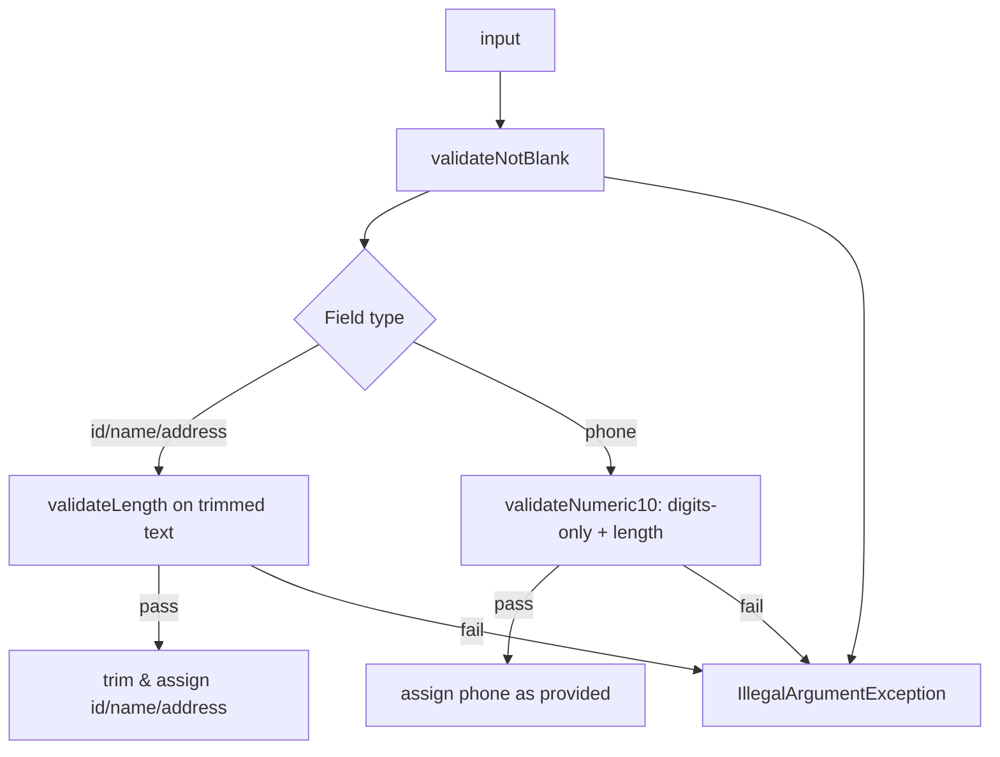
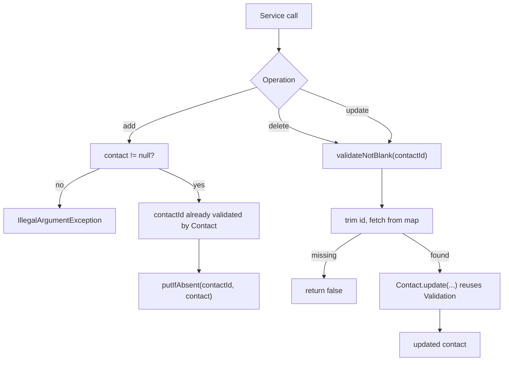
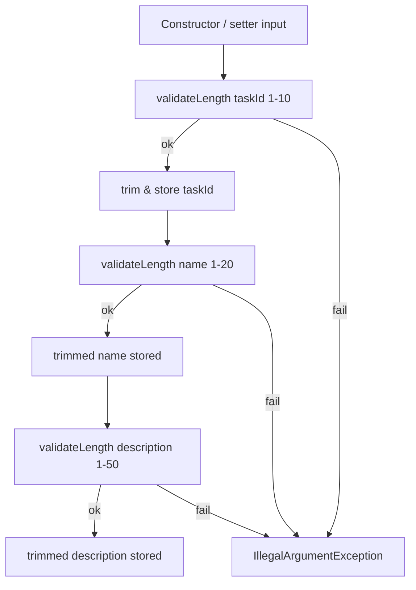
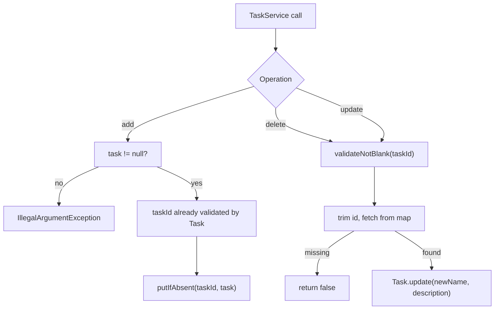

# CS320 Milestone 1 - Contact Service
[](https://github.com/jguida941/contact-service-junit/actions/workflows/java-ci.yml)
[](https://github.com/jguida941/contact-service-junit/actions/workflows/codeql.yml)
[](https://codecov.io/gh/jguida941/contact-service-junit)
[](#qa-summary)
[](#qa-summary)
[](#static-analysis--quality-gates)
[](#static-analysis--quality-gates)
[](LICENSE)

Small Java project for the CS320 Contact Service milestone. The work breaks down into three pieces:
1. Build the `Contact` and `ContactService` classes exactly as described in the requirements.
2. Prove every rule with unit tests (length limits, null checks, unique IDs, and add/update/delete behavior) using the shared `Validation` helper so exceptions surface clear messages.
3. Mirror the same patterns for the `Task` entity/service (ID/name/description) so both domains share validation, atomic updates, and singleton storage.

Everything is packaged under `contactapp`; production classes live in `src/main/java` and the JUnit tests in `src/test/java`.

## Table of Contents
- [Getting Started](#getting-started)
- [Folder Highlights](#folder-highlights)
- [Design Decisions & Highlights](#design-decisions--highlights)
- [Architecture Overview](#architecture-overview)
- [Validation & Error Handling](#validation--error-handling)
- [Testing Strategy](#testing-strategy)
- [Static Analysis & Quality Gates](#static-analysis--quality-gates)
- [Backlog](#backlog)
- [CI/CD Pipeline](#cicd-pipeline)
- [QA Summary](#qa-summary)
- [Self-Hosted Mutation Runner Setup](#self-hosted-mutation-runner-setup)

## Getting Started
1. Install Java 17 and Apache Maven (3.9+).
2. Run `mvn verify` from the project root to compile everything, execute the JUnit suite, and run Checkstyle/SpotBugs/JaCoCo quality gates.
3. Open the folder in IntelliJ/VS Code if you want IDE assistance—the Maven project model is auto-detected.

## Folder Highlights
| Path                                                                                                                 | Description                                                                                     |
|----------------------------------------------------------------------------------------------------------------------|-------------------------------------------------------------------------------------------------|
| [`src/main/java/contactapp/Contact.java`](src/main/java/contactapp/Contact.java)                                     | Contact entity enforcing the ID/name/phone/address constraints.                                 |
| [`src/main/java/contactapp/ContactService.java`](src/main/java/contactapp/ContactService.java)                       | Singleton service with in-memory CRUD, uniqueness checks, and validation reuse.                 |
| [`src/main/java/contactapp/Task.java`](src/main/java/contactapp/Task.java)                                           | Task entity (ID/name/description) mirroring the requirements document.                          |
| [`src/main/java/contactapp/TaskService.java`](src/main/java/contactapp/TaskService.java)                             | Task service API (add/delete/update) mirroring the `ContactService` patterns.                   |
| [`src/main/java/contactapp/Validation.java`](src/main/java/contactapp/Validation.java)                               | Centralized validation helpers (not blank, length, numeric checks).                             |
| [`src/test/java/contactapp/ContactTest.java`](src/test/java/contactapp/ContactTest.java)                             | Unit tests for the `Contact` class (valid + invalid scenarios).                                 |
| [`src/test/java/contactapp/TaskTest.java`](src/test/java/contactapp/TaskTest.java)                                   | Unit tests for the `Task` class (trimming, invalid inputs, and atomic update validation).       |
| [`src/test/java/contactapp/TaskServiceTest.java`](src/test/java/contactapp/TaskServiceTest.java)                     | Unit tests for `TaskService` (singleton behavior and CRUD).                                     |
| [`src/test/java/contactapp/ValidationTest.java`](src/test/java/contactapp/ValidationTest.java)                       | Boundary/blank/null coverage for the shared validation helpers.                                 |
| [`docs/requirements/contact-requirements/`](docs/requirements/contact-requirements/)                                 | Contact assignment requirements and checklist.                                                  |
| [`docs/requirements/task-requirements/`](docs/requirements/task-requirements/)                                       | Task assignment requirements and checklist (same format as Contact).                            |
| [`docs/architecture/2025-11-19-task-entity-and-service.md`](docs/architecture/2025-11-19-task-entity-and-service.md) | Task entity/service design plan with Definition of Done and phased approach.                    |
| [`docs/adrs/README.md`](docs/adrs/README.md)                                                                         | Architecture Decision Record index with links to ADR-0001…ADR-0009.                             |
| [`docs/ci-cd/`](docs/ci-cd/)                                                                                         | CI/CD design notes (pipeline plan + badge automation).                                          |
| [`docs/design-notes/`](docs/design-notes/)                                                                           | Informal design notes hub; individual write-ups live under `docs/design-notes/notes/`.          |
| [`index.md`](index.md)                                                                                               | Quick reference guide for the repo layout.                                                      |
| [`pom.xml`](pom.xml)                                                                                                 | Maven build file (dependencies, plugins, compiler config).                                      |
| [`config/checkstyle`](config/checkstyle)                                                                             | Checkstyle configuration used by Maven/CI quality gates.                                        |
| [`config/owasp-suppressions.xml`](config/owasp-suppressions.xml)                                                     | Placeholder suppression list for OWASP Dependency-Check.                                        |
| [`scripts/ci_metrics_summary.py`](scripts/ci_metrics_summary.py)                                                     | Helper that parses JaCoCo/PITest/Dependency-Check reports and posts the QA summary table in CI. |
| [`scripts/serve_quality_dashboard.py`](scripts/serve_quality_dashboard.py)                                           | Tiny HTTP server that opens `target/site/qa-dashboard` locally after downloading CI artifacts.  |
| [`.github/workflows`](.github/workflows)                                                                             | CI/CD pipelines (tests, quality gates, release packaging, CodeQL).                              |

## Design Decisions & Highlights
- **Immutable identifiers** - `contactId` is set once in the constructor and never mutates, which keeps map keys stable and mirrors real-world record identifiers.
- **Centralized validation** - Every constructor/setter call funnels through `Validation.validateNotBlank`, `validateLength`, and (for phones) `validateNumeric10`, so IDs, names, phones, and addresses all share one enforcement pipeline.
- **Fail-fast IllegalArgumentException** - Invalid input is a caller bug, so we throw standard JDK exceptions with precise messages and assert on them in tests.
- **ConcurrentHashMap storage strategy** - Milestone 1 uses an in-memory `ConcurrentHashMap<String, Contact>` (inside the singleton `ContactService`) for predictable average O(1) CRUD plus thread-safe access, while still treating the service class as the seam for future persistence layers.
- **Boolean service API** - The service’s `add/delete/update` methods return `boolean` so callers know immediately whether the operation succeeded (`true`) or why it failed (`false` for duplicate IDs, missing IDs, etc.). That keeps the milestone interface lightweight while still letting JUnit assertions check the outcome without extra exception types.
- **Security posture** - Input validation in the domain + service layers acts as the first defense layer; nothing reaches the in-memory store unless it passes the guards.
- **Testing depth** - Parameterized JUnit 5 tests, AssertJ assertions, JaCoCo coverage, and PITest mutation scores combine to prove the validation logic rather than just executing it.

## Architecture Overview
### Domain Layer (`Contact`)
- Minimal state (ID, first/last name, phone, address) with the `contactId` locked after construction.
- Constructor delegates to setters so validation logic fires in one place.
- Address validation uses the same length helper as IDs/names, ensuring the 30-character maximum cannot drift.

### Validation Layer (`Validation.java`)
- `validateNotBlank(input, label)` - rejects null, empty, and whitespace-only fields with label-specific messages.
- `validateLength(input, label, min, max)` - enforces 1-10 char IDs/names and 1-30 char addresses (bounds are parameters, so future changes touch one file).
- `validateNumeric10(input, label, requiredLength)` - requires digits-only phone numbers with exact length (10 in this project).
- These helpers double as both correctness logic and security filtering.

### Service Layer (`ContactService`)
- Singleton that owns an in-memory `ConcurrentHashMap<String, Contact>` keyed by `contactId`.
- Provides add/update/delete orchestration, validates/normalizes IDs before touching the map, and delegates all field rules to `Contact` (constructor + `update(...)`) and `Validation`.
- Because state lives on the instance (not static), this class remains the seam for swapping in persistence or caching later without touching the entity/tests.

### Storage & Extension Points
**ConcurrentHashMap<String, Contact> (current backing store)**
| Operation | Average | Worst | Space |
|-----------|---------|-------|-------|
| add/get   | O(1)    | O(n)  | O(1)  |
| update    | O(1)    | O(n)  | O(1)  |
| delete    | O(1)    | O(n)  | O(1)  |
- This strategy meets the course requirements while documenting the upgrade path (DAO, repository pattern, etc.).

  <br>

## [Contact.java](src/main/java/contactapp/Contact.java) / [ContactTest.java](src/test/java/contactapp/ContactTest.java)

### Service Snapshot
- `Contact` acts as the immutable ID holder with mutable first/last name, phone, and address fields.
- Constructor delegates to setters so validation stays centralized and consistent for both creation and updates.
- Validation trims IDs/names/addresses before storing them; phone numbers are stored as provided and must already be 10 digits (whitespace fails the digit check instead of being silently removed).

## Validation & Error Handling

### Validation Pipeline

- Text fields (`contactId`, `firstName`, `lastName`, `address`) measure trimmed length, then store the trimmed value; phone numbers must already be ten digits with no spaces, so whitespace fails the digit check instead of getting trimmed implicitly.
- Because the constructor routes through the setters, the exact same pipeline applies whether the object is being created or updated.

### Error Message Philosophy
```java
// Bad
throw new IllegalArgumentException("Invalid input");

// Good
throw new IllegalArgumentException("firstName length must be between 1 and 10");
```
- Specific, label-driven messages make debugging easier and double as documentation. Tests assert on the message text so regressions are caught immediately.

### Exception Strategy
| Exception Type | Use Case           | Recovery? | Our Choice |
|----------------|--------------------|-----------|------------|
| Checked        | Recoverable issues | Maybe     | ❌          |
| Unchecked      | Programming errors | Fix code  | ✅          | 

- We throw `IllegalArgumentException` (unchecked) because invalid input is a caller bug and should crash fast.

### Propagation Flow

- Fail-fast means invalid state never reaches persistence/logs, and callers/tests can react immediately.

## Testing Strategy

### Approach & TDD
- Each validator rule started as a failing test, then the implementation was written until the suite passed.
- `ContactTest` serves as the living specification covering both the success path and every invalid scenario.
- `TaskTest` and `TaskServiceTest` mirror the same workflow for the Task domain/service, reusing the shared `Validation` helper and singleton patterns, and include invalid update cases to prove atomicity.

### Parameterized Coverage
- `@ParameterizedTest` + `@CsvSource` enumerate the invalid IDs, names, phones, and addresses so we don’t duplicate boilerplate tests.
```java
@ParameterizedTest
@CsvSource({
    "'', 'contactId must not be null or blank'",
    "' ', 'contactId must not be null or blank'",
    "'12345678901', 'contactId length must be between 1 and 10'"
})
void testInvalidContactId(String id, String expectedMessage) {
    assertThatThrownBy(() -> new Contact(id, "first", "last", "1234567890", "123 Main St"))
        .isInstanceOf(IllegalArgumentException.class)
        .hasMessage(expectedMessage);
}
```

### Assertion Patterns
- AssertJ’s `hasFieldOrPropertyWithValue` validates the happy path in one fluent statement.
- `assertThatThrownBy().isInstanceOf(...).hasMessage(...)` proves exactly which validation rule triggered.

### Scenario Coverage
- `testSuccessfulCreation` validates the positive constructor path (all fields stored).
- `testValidSetters` ensures setters update fields when inputs pass validation.
- `testConstructorTrimsStoredValues` confirms IDs, names, and addresses are normalized via `trim()`.
- `testFailedCreation` (`@ParameterizedTest`) enumerates every invalid ID/name/phone/address combination and asserts the corresponding message.
- `testFailedSetFirstName` (`@ParameterizedTest`) exercises the setter’s invalid inputs (blank/long/null).
- `testUpdateRejectsInvalidValuesAtomically` (`@MethodSource`) proves invalid updates throw and leave the existing Contact state unchanged.
- `ValidationTest.validateLengthAcceptsBoundaryValues` proves 1/10-char names and 30-char addresses remain valid.
- `ValidationTest.validateLengthRejectsBlankStrings` and `ValidationTest.validateLengthRejectsNull` ensure blanks/nulls fail before length math is evaluated.
- `ValidationTest.validateLengthRejectsTooLong` hits the max-length branch to keep upper-bound validation covered.
- `ValidationTest.validateLengthRejectsTooShort` covers the min-length branch so both ends of the range are exercised.
- `ValidationTest.validateNumeric10RejectsBlankStrings` and `ValidationTest.validateNumeric10RejectsNull` ensure the phone validator raises the expected messages before regex/length checks.

<br>

## [ContactService.java](src/main/java/contactapp/ContactService.java) / [ContactServiceTest.java](src/test/java/contactapp/ContactServiceTest.java)

### Service Snapshot
- **Singleton access** - `getInstance()` exposes one shared service so every caller sees the same `ConcurrentHashMap` backing store.
- **Atomic uniqueness guard** - `addContact` rejects null inputs up front and calls `ConcurrentHashMap.putIfAbsent(...)` directly so duplicate IDs never overwrite state even under concurrent access.
- **Shared validation** - `deleteContact` uses `Validation.validateNotBlank` for IDs and `updateContact` delegates to `Contact.update(...)`, guaranteeing the constructor’s length/null/phone rules apply to updates too.
- **Defensive views** - `getDatabase()` returns an unmodifiable snapshot (tests now use `clearAllContacts()` to reset state) so callers can’t mutate the internal map accidentally.

## Validation & Error Handling

### Validation Pipeline

- Delete/update paths validate and trim IDs before map access; add relies on the Contact constructor’s validation and stores the already-normalized `contactId`.
- IDs are trimmed before delete/update map access so callers with surrounding whitespace behave consistently.
- Setter delegation ensures errors surface with the same messages as the constructor (e.g., “phone must be exactly 10 digits”).

### Error Message Philosophy
- Null service inputs raise `IllegalArgumentException` with explicit labels (e.g., “contact must not be null”).
- ID validation errors come from the shared `Validation` helper so delete/update use the exact strings already asserted in `ContactTest`.
- Field-level issues rely on the `Contact` setters, so callers receive consistent messaging whether the data was supplied in the constructor or during an update.

### Propagation Flow

- Successful operations mutate the in-memory map; duplicate IDs or missing contacts simply return `false` so clients can branch without exceptions.
- Validation failures bubble up as unchecked exceptions, which keeps the fail-fast stance consistent with the domain model.
## Testing Strategy

### Approach & TDD
- The service initially shipped as a stub; once CRUD code landed, targeted JUnit tests captured the scenarios before refactoring anything else.
- `@BeforeEach` clears the singleton’s backing map so tests remain isolated even though the service is shared.

### Assertion Patterns
- AssertJ collections helpers (`containsEntry`, `doesNotContainEntry`) keep the CRUD expectations concise.
- Field assertions after update reuse `hasFieldOrPropertyWithValue` so the tests read like a change log.
- Boolean outcomes are asserted explicitly (`isTrue()/isFalse()`) so duplicate and missing-ID branches stay verified.


### Scenario Coverage
- `testGetInstance` ensures the singleton accessor always returns a concrete service before any CRUD logic runs.
- `testGetInstanceReturnsSameReference` proves repeated invocations return the same singleton instance.
- `testAddContact` proves the happy path and that the map contains the stored entry.
- `testAddDuplicateContactFails` confirms the boolean contract for duplicates and that the original object remains untouched.
- `testAddContactNullThrows` hits the defensive null guard so callers see a clear `IllegalArgumentException` instead of an NPE.
- `testDeleteContact` exercises removal plus assertion that the key disappears.
- `testDeleteMissingContactReturnsFalse` covers the branch where no contact exists for the given id.
- `testDeleteContactBlankIdThrows` shows ID validation runs even on deletes, surfacing the standard “contactId must not be null or blank” message.
- `testUpdateContact` verifies every mutable field changes via setter delegation.
- `testUpdateMissingContactReturnsFalse` covers the “not found” branch so callers can rely on the boolean result.

<br>

## [Task.java](src/main/java/contactapp/Task.java) / [TaskTest.java](src/test/java/contactapp/TaskTest.java)

### Service Snapshot
- Task IDs are required, trimmed, and immutable after construction (length 1-10).
- Name (≤20 chars) and description (≤50 chars) share one helper so constructor, setters, and `update(...)` all enforce identical rules.
- `Task#update` validates both values first, then swaps them in one shot; invalid inputs leave the object untouched.
- Tests mirror Contact coverage: constructor trimming, happy-path setters/update, and every invalid-path exception message.

## Validation & Error Handling

### Validation Pipeline

- Constructor and setters call the same helper, so trimming + length checks stay in sync.
- Inputs are trimmed before length checks and before storing, so normalization matches validation.
- `update(...)` repeats the same validations, caches the trimmed values, then assigns both if they pass.

### Error Message Philosophy
- All strings come from `Validation.validateLength`, so failures always say `<label> must not be null or blank` or `<label> length must be between X and Y`.
- Tests assert the exact messages so a wording change immediately fails the suite.

### Propagation Flow

- No silent coercion; invalid data throws fast so tests/users fix the source input.

## Testing Strategy

### Approach & TDD
- Started with constructor trimming tests, then added invalid cases before writing setters/update so every branch had a failing test first.

### Assertion Patterns
- AssertJ `hasFieldOrPropertyWithValue` keeps success assertions short.
- `assertThatThrownBy(...).hasMessage(...)` locks in the Validation wording for each failure mode.

### Scenario Coverage
- Constructor stores trimmed values and rejects null/blank/too-long IDs, names, and descriptions.
- Setters accept valid updates and reject invalid ones with the same helper-generated messages.
- `update(...)` replaces both mutable fields atomically and never mutates on invalid input.
- `testUpdateRejectsInvalidValuesAtomically` (`@MethodSource`) enumerates invalid name/description pairs (blank/empty/null/over-length) and asserts the Task remains unchanged when validation fails.

  <br>

## [TaskService.java](src/main/java/contactapp/TaskService.java) / [TaskServiceTest.java](src/test/java/contactapp/TaskServiceTest.java)

### Service Snapshot
- Singleton `TaskService` owns a `ConcurrentHashMap<String, Task>` plus a `clearAllTasks()` helper for tests.
- `addTask` rejects null tasks and uses `putIfAbsent` so uniqueness checks and inserts are atomic.
- `deleteTask` and `updateTask` validate + trim ids before touching the map, mirroring the Task entity’s trimming behavior.
- `getDatabase()` returns `Map.copyOf(database)` so callers get a read-only snapshot.

## Validation & Error Handling

### Validation Pipeline

- Delete/update paths validate and trim IDs before map access; add relies on the Task constructor’s validation and stores the normalized `taskId`.
- Updates delegate to `Task.update(...)`, keeping atomicity centralized; `putIfAbsent` returns `false` on duplicate IDs just like the Contact service.

### Error Message Philosophy
- Service-level guards emit just two strings (`"task must not be null"` and `"taskId must not be null or blank"`); everything else flows from the Task entity.

### Propagation Flow

- Boolean return mirrors ContactService: duplicates/missing IDs report `false`, invalid inputs throw.

## Testing Strategy

### Approach & TDD
- `@BeforeEach` clears the singleton to keep tests isolated.
- Tests were written alongside each service method so duplicates/missing/blank cases were covered before implementation settled.

### Assertion Patterns
- AssertJ checks (`containsEntry`, `doesNotContainKey`, `isTrue/isFalse`) keep map expectations concise.
- `assertThatThrownBy` verifies the null-task guard and blank-id validation messages.

- Singleton identity tests (instance returns same reference) match what is enforced for the contact service.
- Happy-path add/delete/update plus duplicate and missing branches confirm boolean results and map state.
- Tests prove trimmed IDs succeed on update and blank IDs throw before accessing the map.

  <br>

## Static Analysis & Quality Gates

| Layer               | Tool                       | Focus                                                                                |
|---------------------|----------------------------|--------------------------------------------------------------------------------------|
| Coverage            | **JaCoCo**                 | Line/branch coverage enforcement during `mvn verify`.                                |
| Mutation            | **PITest**                 | Ensures assertions catch injected faults; threshold currently 70%.                   |
| Style & complexity  | **Checkstyle**             | Formatting, naming, indentation, import ordering, and boolean simplification.        |
| Bug patterns        | **SpotBugs**               | Bytecode bug-pattern scanning via `spotbugs-maven-plugin` (fails build on findings). |
| Dependency security | **OWASP Dependency-Check** | CVE scanning backed by `NVD_API_KEY` with optional skip fallback.                    |
| Semantic security   | **CodeQL**                 | Detects SQLi/XSS/path-traversal patterns in a separate workflow.                     |

Each layer runs automatically in CI, so local `mvn verify` mirrors the hosted pipelines.
- Dependabot runs daily against the Maven ecosystem and automatically opens PRs for available dependency upgrades.

## Mutation Testing & Quality Gates
- PITest runs inside `mvn verify`, so the new service tests contribute directly to the enforced mutation score.
- The GitHub Actions matrix uses the same suite, ensuring duplicate/add/delete/update scenarios stay green across OS/JDK combinations.
- GitHub Actions still executes `{ubuntu-latest, windows-latest} × {Java 17, Java 21}` with `MAVEN_OPTS="--enable-native-access=ALL-UNNAMED -Djdk.attach.allowAttachSelf=true"`, so mutation coverage is enforced everywhere.
- The optional self-hosted lane remains available for long mutation sessions or extra capacity; see the dedicated section below.

## Testing Pyramid


## Checkstyle Rule Set
| Check Group                                                                                                          | Focus                                                                              |
|----------------------------------------------------------------------------------------------------------------------|------------------------------------------------------------------------------------|
| `ImportOrder`, `AvoidStarImport`, `RedundantImport`                                                                  | Enforce ordered/separated imports, no wildcards, and no duplicates.                |
| `NeedBraces`, `LeftCurly`, `RightCurly`, `EmptyBlock`                                                                | Require braces and consistent brace placement; flag empty blocks.                  |
| `WhitespaceAround`, `WhitespaceAfter`, `NoWhitespaceBefore`, `NoWhitespaceAfter`, `SingleSpaceSeparator`, `ParenPad` | Enforce consistent spacing around tokens and parentheses.                          |
| `Indentation`, `LineLength`, `FileTabCharacter`, `NewlineAtEndOfFile`                                                | Align indentation, cap lines at 120 chars, disallow tabs, ensure trailing newline. |
| `ModifierOrder`, `RedundantModifier`                                                                                 | Keep modifier order canonical and drop redundant keywords.                         |
| `MethodLength`, `MethodParamPad`, `MethodName`, `ParameterName`, `LocalVariableName`, `MemberName`                   | Bound method size and enforce naming/padding conventions.                          |
| `HiddenField`                                                                                                        | Prevent locals/parameters from shadowing fields (except constructors/setters).     |
| `MagicNumber`                                                                                                        | Flags unwanted literals (excluding -1, 0, 1) to encourage constants.               |
| `SimplifyBooleanExpression`, `SimplifyBooleanReturn`, `OneStatementPerLine`                                          | Reduce complex boolean logic and keep one statement per line.                      |
| `FinalParameters`, `FinalLocalVariable`                                                                              | Encourage immutability for parameters and locals when possible.                    |


## SpotBugs


## SpotBugs Commands
```bash
# Run SpotBugs as part of the normal build
mvn -Ddependency.check.skip=true verify

# Fail fast on SpotBugs findings during local iterations
mvn spotbugs:check

# Generate the HTML report at target/spotbugs.html
mvn spotbugs:spotbugs

# Open the SpotBugs GUI to inspect findings interactively
mvn spotbugs:gui
```
> CI already runs SpotBugs inside `mvn verify`; these commands help when iterating locally.

## Sonatype OSS Index (optional)
Dependency-Check also pings the Sonatype OSS Index service. When requests are anonymous the analyzer often rate-limits, which is why CI prints warnings like “An error occurred while analyzing … (Sonatype OSS Index Analyzer)”. To receive full results:
1. Create a free account at [ossindex.sonatype.org](https://ossindex.sonatype.org/) and generate an API token.
2. Add the credentials to your Maven `settings.xml`:
   ```xml
   <settings>
     <servers>
       <server>
         <id>ossindex</id>
         <username>YOUR_OSS_INDEX_USERNAME</username>
         <password>YOUR_OSS_INDEX_API_TOKEN</password>
       </server>
     </servers>
   </settings>
   ```
3. Run Maven with `-DossIndexServerId=ossindex` (or set the property permanently with `export MAVEN_OPTS="$MAVEN_OPTS -DossIndexServerId=ossindex"`). GitHub Actions can do the same by storing the username/token as repository secrets and writing the snippet above before `mvn verify`.

If you skip these steps, the OSS Index analyzer simply logs warnings while the rest of Dependency-Check continues to rely on the NVD feed.

## Backlog
- Full backlog lives in [`docs/logs/backlog.md`](docs/logs/backlog.md) so the README stays concise, and includes future ideas for reporting, observability, and domain enhancements.

## CI/CD Pipeline

### Jobs at a Glance
| Job                 | Trigger                                                                             | What it does                                                                                                                                                                                                 | Notes                                                                                                      |
|---------------------|-------------------------------------------------------------------------------------|--------------------------------------------------------------------------------------------------------------------------------------------------------------------------------------------------------------|------------------------------------------------------------------------------------------------------------|
| `build-test`        | Push/PR to main/master, release, manual dispatch                                    | Matrix `{ubuntu, windows} × {JDK 17, 21}` running `mvn verify` (tests + Checkstyle + SpotBugs + JaCoCo + PITest + Dependency-Check), builds QA dashboard, posts QA summary, uploads reports, Codecov upload. | Retries `mvn verify` with Dependency-Check/PITest skipped if the first attempt fails due to feed/timeouts. |
| `container-test`    | Always (needs `build-test`)                                                         | Re-runs `mvn verify` inside `maven:3.9.9-eclipse-temurin-17` to prove a clean container build; retries with Dependency-Check/PITest skipped on failure.                                                      | Uses same MAVEN_OPTS for PIT attach.                                                                       |
| `mutation-test`     | Only when repo var `RUN_SELF_HOSTED == 'true'` and a `self-hosted` runner is online | Runs `mvn verify` on the self-hosted runner with PITest enabled; retries with Dependency-Check/PITest skipped on failure.                                                                                    | Optional lane; skipped otherwise.                                                                          |
| `release-artifacts` | Release event (`published`)                                                         | Packages the JAR and uploads it as an artifact; generates release notes.                                                                                                                                     | Not run on normal pushes/PRs.                                                                              |

### Local Command Cheat Sheet
| Command                                                   | Purpose                                                                                  |
|-----------------------------------------------------------|------------------------------------------------------------------------------------------|
| `mvn verify`                                              | Full build: compile, unit tests, Checkstyle, SpotBugs, JaCoCo, PITest, Dependency-Check. |
| `mvn -Ddependency.check.skip=true -Dpit.skip=true verify` | Fast local build when Dependency-Check feed is slow/unavailable.                         |
| `mvn spotbugs:check`                                      | Run only SpotBugs and fail on findings.                                                  |
| `mvn -DossIndexServerId=ossindex verify`                  | Opt-in authenticated OSS Index for Dependency-Check (see Sonatype section).              |
| `cd ui/qa-dashboard && npm ci && npm run build`           | Build the React QA dashboard locally (already built in CI).                              |

### Matrix Verification
- `.github/workflows/java-ci.yml` runs `mvn -B verify` across `{ubuntu-latest, windows-latest} × {Java 17, Java 21}` to surface OS and JDK differences early.
- `container-test` reruns the same `mvn verify` flow inside `maven:3.9.9-eclipse-temurin-17` to prove the build works in a clean, reproducible environment; if quality gates fail, it retries with Dependency-Check and PITest skipped.

### Quality Gate Behavior
- Each matrix job executes the full suite (tests, JaCoCo, Checkstyle, SpotBugs, Dependency-Check, PITest).
- Checkstyle enforces formatting/import/indentation rules while SpotBugs scans bytecode for bug patterns and fails the build on findings.
- SpotBugs runs as part of every `mvn verify` run on the supported JDKs (currently 17 and 21 in CI) and fails the build on findings.
- Dependency-Check throttling is tuned via `nvdApiDelay` (defaults to 3500ms when an NVD API key is configured, 8000ms without a key) and honors `-Ddependency.check.skip=true` if the NVD feed is unreachable; PITest has a similar `-Dpit.skip=true` retry path so contributors stay unblocked but warnings remain visible.
- Python 3.12 is provisioned via `actions/setup-python@v5` so `scripts/ci_metrics_summary.py` runs consistently on both Ubuntu and Windows runners.
- Node.js 20 is provisioned via `actions/setup-node@v4` and the React dashboard under `ui/qa-dashboard/` is built every run so the artifacts contain the interactive QA console.
- Mutation coverage now relies on GitHub-hosted runners by default; the self-hosted lane is opt-in and only fires when the repository variable `RUN_SELF_HOSTED` is set.
- Dependabot checks run daily so Maven updates appear as automated PRs without waiting for the weekly window.
- After every matrix job, `scripts/ci_metrics_summary.py` posts a table to the GitHub Actions run summary showing tests, JaCoCo coverage, PITest mutation score, and Dependency-Check counts (with ASCII bars for quick scanning).
- The same summary script emits a dark-mode HTML dashboard (`target/site/qa-dashboard/index.html`) with quick stats and links to the JaCoCo, SpotBugs, Dependency-Check, and PITest HTML reports (packaged inside the `quality-reports-*` artifact for download) and drops `serve_quality_dashboard.py` next to the reports for easy local previewing.

### Caching Strategy
- Maven artifacts are cached via `actions/cache@v4` (`~/.m2/repository`) to keep builds fast.
- Dependency-Check data is intentionally purged every run (see the “Purge Dependency-Check database cache” step) to avoid stale or corrupted NVD downloads. If feed reliability improves we can re-enable caching in the workflow, but for now the clean slate proved more stable.

### Mutation Lane (Optional Self-Hosted Fallback)
- The standard matrix already executes PITest, but some contributors keep a self-hosted runner handy for long mutation sessions, experiments, or when GitHub-hosted capacity is saturated.
- Toggling the repository variable `RUN_SELF_HOSTED` to `true` enables the `mutation-test` job, which mirrors the hosted command line but runs on your own hardware with `MAVEN_OPTS="--enable-native-access=ALL-UNNAMED -Djdk.attach.allowAttachSelf=true"`.

### Release Automation
- Successful workflows publish build artifacts, and the release workflow packages release notes so we can trace which commit delivered which binary.
- The `release-artifacts` job is intentionally gated with `if: github.event_name == 'release' && github.event.action == 'published'`, so you will see it marked as “skipped” on normal pushes or pull requests. It only runs when a GitHub release/tag is published.

### Coverage Publishing (Codecov)
- After JaCoCo generates `target/site/jacoco/jacoco.xml`, the workflow uploads it to [Codecov](https://codecov.io/gh/jguida941/cs320-contact-service-junit) so the coverage badge stays current.
- Setup steps (once per repository):
  1. Sign in to Codecov with GitHub and add this repo.
  2. Generate a repository token in Codecov and save it as the GitHub secret `CODECOV_TOKEN`.
  3. Re-run the workflow; each matrix job uploads coverage with a `flags` label (`os-jdk`).
- The badge at the top of this README pulls from the default `master` branch; adjust the URL if you maintain long-lived release branches.

### CodeQL Security Analysis
- `.github/workflows/codeql.yml` runs independently of the matrix job to keep static analysis focused.
- The workflow pins Temurin JDK 17 via `actions/setup-java@v4`, caches Maven dependencies, and enables the `+security-and-quality` query pack for broader coverage.
- GitHub’s CodeQL `autobuild` runs the Maven build automatically; a commented `mvn` fallback is available if the repo ever needs a custom command.
- Concurrency guards prevent overlapping scans on the same ref, and `paths-ignore` ensures doc-only/image-only changes do not queue CodeQL unnecessarily.
- Triggers: pushes/PRs to `main` or `master` (respecting the filters), a weekly scheduled scan (`cron: 0 3 * * 0`), and optional manual dispatch.


## CI/CD Flow Diagram


## QA Summary
Each GitHub Actions matrix job writes a QA table (tests, coverage, mutation score, Dependency-Check status) to the run summary. The table now includes colored icons, ASCII bars, and severity breakdowns so drift stands out immediately. Open any workflow’s “Summary” tab and look for the “QA Metrics” section for the latest numbers.

## GitHub Actions QA Metrics Table


## QA Console React Dashboard

Need richer visuals?<br>
Download the `quality-reports-<os>-jdk<ver>` artifact from the workflow run, unzip it, and from the artifact root run:

```bash
cd ~/Downloads/quality-reports-<os>-jdk<ver>
python serve_quality_dashboard.py --path site
```

(If the artifact retains the `target/site` structure, change `--path site` to `--path target/site`.) <br>
Modern browsers block ES modules when loaded directly from `file://` URLs <br>
So the helper launches a tiny HTTP server, opens `http://localhost:<port>/qa-dashboard/index.html`, and serves the React dashboard with the correct `metrics.json`. <br> 
You’ll see the same KPIs, inline progress bars, and quick links over to the JaCoCo, SpotBugs, Dependency-Check, and PITest HTML reports, all sourced from the exact results of that build.


<br>

## CodeCov Coverage Sunburst

<table>
  <tr>
    <td width="300" valign="middle">
      <a href="https://app.codecov.io/gh/jguida941/contact-service-junit">
        
      </a>
    </td>
    <td valign="middle">
      The sunburst shows which packages and classes are covered by tests.<br/>
      <a href="https://app.codecov.io/gh/jguida941/contact-service-junit">
        Open the full-screen interactive sunburst on Codecov »
      </a>
    </td>
  </tr>
</table>

<br/>

## Self-Hosted Mutation Runner Setup
- Register a runner per GitHub's instructions (Settings -> Actions -> Runners -> New self-hosted runner). Choose macOS/Linux + architecture.
- Install + configure:
  - Go to your repository on GitHub
  - Navigate to Settings -> Actions -> Runners -> New self-hosted runner
  - Select your OS (macOS for Mac, Linux for Linux) and architecture (x64 for Intel, arm64 for Apple Silicon)
  - Follow GitHub's provided commands to download and configure the runner.

  **For macOS**:
  ```bash
  # Create runner directory
  mkdir actions-runner && cd actions-runner

  # Download the latest runner package (check GitHub for exact URL as it includes version)
  # For Intel Mac:
  curl -o actions-runner-osx-x64-2.321.0.tar.gz -L https://github.com/actions/runner/releases/download/v2.321.0/actions-runner-osx-x64-2.321.0.tar.gz
  # For Apple Silicon Mac:
  # curl -o actions-runner-osx-arm64-2.321.0.tar.gz -L https://github.com/actions/runner/releases/download/v2.321.0/actions-runner-osx-arm64-2.321.0.tar.gz

  # Extract the installer
  tar xzf ./actions-runner-osx-*.tar.gz

  # Configure the runner (get token from GitHub UI)
  ./config.sh --url https://github.com/jguida941/cs320-contact-service-junit --token YOUR_TOKEN_FROM_GITHUB

  # Set MAVEN_OPTS permanently (choose based on your shell)
  # For zsh (default on modern macOS):
  echo 'export MAVEN_OPTS="--enable-native-access=ALL-UNNAMED -Djdk.attach.allowAttachSelf=true"' >> ~/.zshrc
  source ~/.zshrc
  # For bash:
  # echo 'export MAVEN_OPTS="--enable-native-access=ALL-UNNAMED -Djdk.attach.allowAttachSelf=true"' >> ~/.bash_profile
  # source ~/.bash_profile

  # Start the runner
  ./run.sh
  ```
Leave `./run.sh` running so the `mutation-test` job can execute on your machine.<br>
When you're done, press Ctrl+C to stop the runner.

**Workflow toggle** - the `mutation-test` job only runs when the repository variable `RUN_SELF_HOSTED` is set to `true`.
- Default (variable unset/false): the job is skipped so GitHub-hosted runners finish cleanly even if your machine is offline.
- When you want to run mutation tests: start the runner and set `Settings → Secrets and variables → Actions → Variables → RUN_SELF_HOSTED = true`, then re-run the workflow.
- Turn the variable back to `false` (or delete it) when you shut down the runner, so future workflows don’t wait for a machine that isn’t listening.

## How to Use This Repository
If you're working through CS320 (or just exploring the project), the recommended flow is:
1. Read the requirements in `docs/requirements/contact-requirements/` so you understand the contact rules and service behavior.
2. Study `Contact.java`, `ContactService.java`, and `Validation.java`, then jump into the paired tests (`ContactTest.java` and `ContactServiceTest.java`) to see every rule exercised.
3. Run `mvn verify` and inspect the JUnit (Contact + service suites), JaCoCo, PITest, and dependency reports in `target/` to understand how the quality gates evaluate the project.
4. Experiment by breaking a rule on purpose, rerunning the build, and seeing which tests/gates fail, then fix the tests or code (and add/update assertions in both test classes) as needed.

## Resources & References
| Item                                                                               | Purpose                                                                  |
|------------------------------------------------------------------------------------|--------------------------------------------------------------------------|
| [docs/requirements/contact-requirements/](docs/requirements/contact-requirements/) | Instructor brief and acceptance criteria.                                |
| [docs/index.md](docs/index.md)                                                     | Repo structure reference (future `docs/design.md` will hold deep dives). |
| [GitHub Actions workflows](.github/workflows)                                      | CI/CD definitions described above.                                       |
| [config/checkstyle](config/checkstyle)                                             | Checkstyle rules enforced in CI.                                         |
| [Java 17 (Temurin)](https://adoptium.net/temurin/releases/)                        | JDK used locally and in CI.                                              |
| [Apache Maven](https://maven.apache.org/)                                          | Build tool powering the project.                                         |
| [JUnit 5](https://junit.org/junit5/)                                               | Test framework leveraged in `ContactTest` and `ContactServiceTest`.      |
| [AssertJ](https://assertj.github.io/doc/)                                          | Fluent assertion library used across the test suites.                    |
| [PITest](https://pitest.org/)                                                      | Mutation testing engine enforced in CI.                                  |
| [OWASP Dependency-Check](https://jeremylong.github.io/DependencyCheck/)            | CVE scanning tool wired into Maven/CI.                                   |
| [Checkstyle](https://checkstyle.sourceforge.io/)                                   | Style/complexity checks.                                                 |
| [SpotBugs](https://spotbugs.github.io/)                                            | Bug pattern detector.                                                    |
| [CodeQL](https://codeql.github.com/docs/)                                          | Semantic security analysis.                                              |

## License
Distributed under the MIT License. See [LICENSE](LICENSE) for details.
