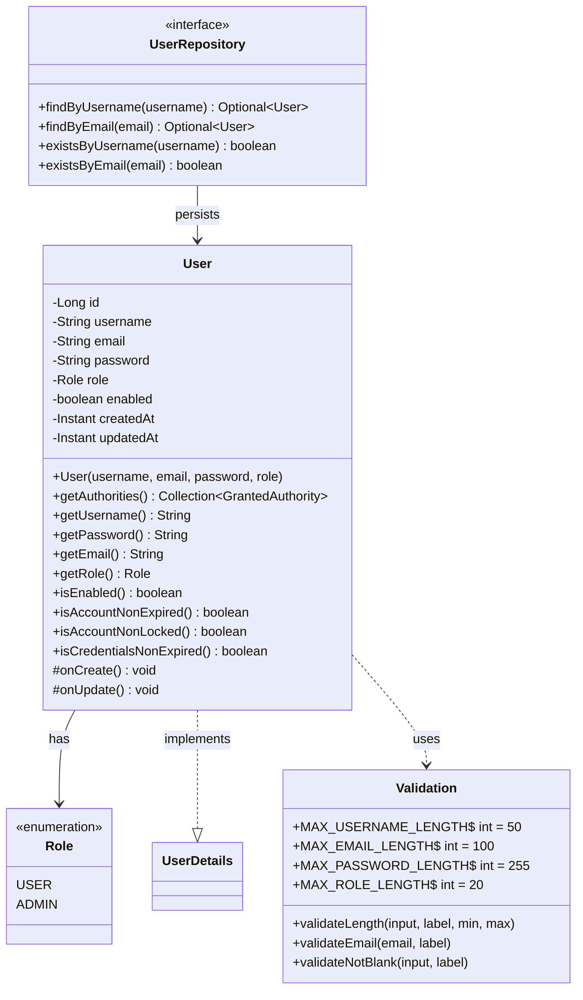

# ADR-0037: User Entity Validation and Test Coverage

**Status**: Accepted
**Date**: 2025-12-01
**Owners**: Justin Guida

**Related**: [User.java](../../src/main/java/contactapp/security/User.java),
[UserTest.java](../../src/test/java/contactapp/security/UserTest.java),
[Validation.java](../../src/main/java/contactapp/domain/Validation.java),
[ADR-0018](ADR-0018-authentication-and-authorization-model.md),
[V4__create_users_table.sql](../../src/main/resources/db/migration/V4__create_users_table.sql)

## Context
- Phase 5 (Security + Observability) requires user authentication per ADR-0018.
- The existing codebase uses `Validation.java` as the single source of truth for
  field constraints; the User entity should follow the same pattern.
- Field sizes must be practical for SSO-style usernames and long email addresses
  while leaving headroom for future password hashing algorithms.
- Flyway migrations must mirror the Java constraints to maintain schema/domain parity.
- Timestamps (`created_at`, `updated_at`) should work with both H2 (tests) and PostgreSQL (prod).

## Decision
- Add constants and methods to `Validation.java`:
  - `MAX_USERNAME_LENGTH = 50` (SSO-friendly, fits UI layouts)
  - `MAX_EMAIL_LENGTH = 100` (covers corporate aliases)
  - `MAX_PASSWORD_LENGTH = 255` (bcrypt = 60 chars; headroom for Argon2/PBKDF2)
  - `MAX_ROLE_LENGTH = 20` (covers USER/ADMIN and future roles)
  - `validateEmail(email, label)` method validates both length and format via regex.
- Create `User` entity implementing Spring Security's `UserDetails` interface:
  - Constructor validates all fields using `Validation.validateLength`, `validateEmail`,
    and a BCrypt pattern check, matching Contact/Task/Appointment patterns.
  - Password must be a BCrypt hash (starts with `$2a$`, `$2b$`, or `$2y$`); raw passwords rejected.
  - Username and email are trimmed before storage for normalization consistency.
  - JPA `@Column` annotations reference the validation constants for length.
  - Role enum (`USER`, `ADMIN`) stored as a string; default is `USER`.
  - JPA lifecycle callbacks (`@PrePersist`, `@PreUpdate`) manage timestamps for H2/PostgreSQL compatibility.
- Create `UserRepository` extending `JpaRepository` with lookup methods:
  - `findByUsername`, `findByEmail`, `existsByUsername`, `existsByEmail`.
- Cover the contract with `UserTest`:
  - `testSuccessfulCreation` proves valid data is stored correctly with BCrypt hash.
  - `testConstructorTrimsUsernameAndEmail` proves normalization.
  - Parameterized tests exercise null/blank/over-length inputs with exact messages.
  - `testEmailInvalidFormatThrows` covers malformed email patterns.
  - `testPasswordMustBeBcryptHash` confirms raw passwords are rejected.
  - `testGetAuthoritiesReturnsRoleWithPrefix` verifies Spring Security integration.
  - Boundary tests at min (1) and max lengths for username, email, password.
- Create Flyway migration `V4__create_users_table.sql` with:
  - Column sizes matching Validation constants (documented in SQL comments).
  - Unique constraints on username and email.
  - Indexes for authentication and registration lookups.
  - Timestamp columns managed by JPA (not database triggers) for H2 compatibility.

## Class Diagram

## Test Coverage

## Consequences
- Centralized validation via `Validation.java` ensures field limits stay in sync
  between domain constructors, DTOs, and Flyway migrations.
- The User entity follows established patterns (Contact, Task, Appointment), making
  the codebase consistent and predictable for future contributors.
- `UserDetails` implementation enables seamless Spring Security integration without
  adapter classes.
- Password field stores hashes only; BCrypt pattern validation rejects raw passwords.
- Email format validation catches invalid addresses early (before database round-trip).
- JPA lifecycle callbacks for timestamps ensure H2 and PostgreSQL compatibility.

## Alternatives Considered
- **Separate UserValidation class** - rejected; centralizing in Validation.java
  maintains the existing single-source-of-truth pattern.
- **Longer username limits** - 50 chars balances SSO needs with UI constraints;
  can be increased via migration if requirements change.
- **Password length = 60 (bcrypt only)** - rejected; 255 provides headroom for
  future algorithm changes without schema migrations.
- **Database triggers for updated_at** - rejected; PostgreSQL plpgsql triggers
  don't work with H2 in tests. JPA lifecycle callbacks work across both databases.
