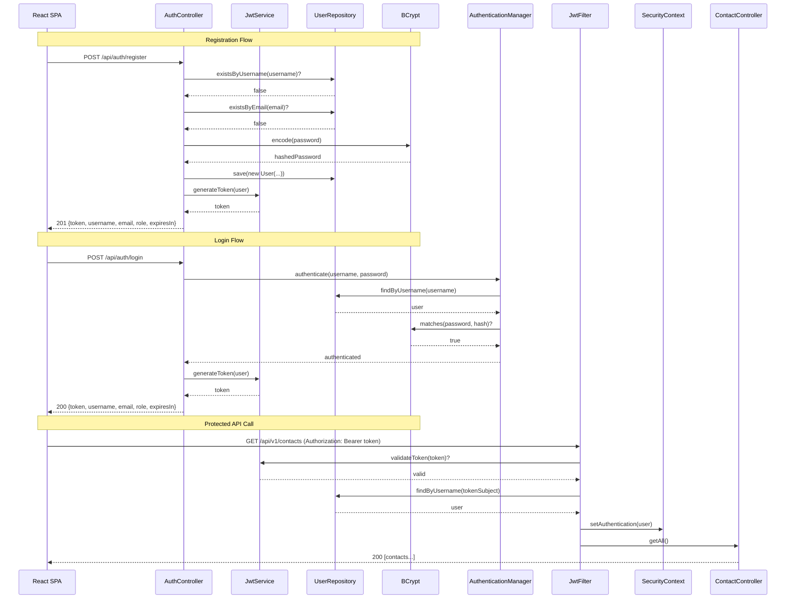
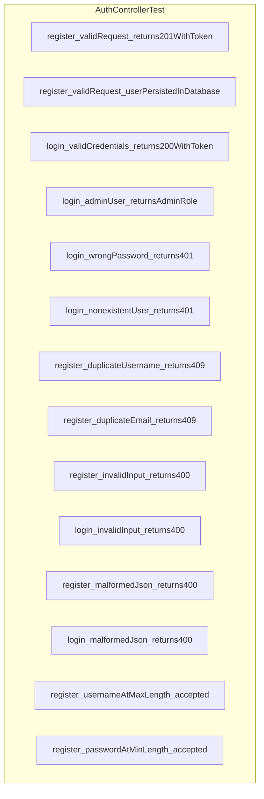

# ADR-0038: Authentication Implementation (Phase 5)

**Status**: Accepted
**Date**: 2025-12-01
**Owners**: Justin Guida

**Related**: [AuthController.java](../../src/main/java/contactapp/api/AuthController.java),
[SecurityConfig.java](../../src/main/java/contactapp/security/SecurityConfig.java),
[JwtService.java](../../src/main/java/contactapp/security/JwtService.java),
[ADR-0018](ADR-0018-authentication-and-authorization-model.md),
[ADR-0037](ADR-0037-user-entity-validation-and-tests.md)

## Context
- Phase 5 requires implementing authentication endpoints per the ADR-0018 design.
- The User entity, JWT service, and security infrastructure are ready (ADR-0037).
- The SPA needs login/register endpoints that return JWT tokens for subsequent API calls.
- Existing CRUD endpoints must be protected to require authentication.
- CORS must be configured for the Vite dev server (port 5173) during development.
- Security headers should be applied to protect against common web vulnerabilities.

## Decision
- Create `AuthController` with two public endpoints:
  - `POST /api/auth/login` - Authenticates user and returns JWT token (200 OK).
  - `POST /api/auth/register` - Creates new user and returns JWT token (201 Created).
- Create request/response DTOs following existing patterns:
  - `LoginRequest` - username, password (Bean Validation).
  - `RegisterRequest` - username, email, password (Bean Validation with email format).
  - `AuthResponse` - token, username, email, role, expiresIn.
- Update `SecurityConfig` to enforce authentication:
  - Public endpoints: `/api/auth/**`, `/actuator/health`, `/actuator/info`, Swagger UI, static resources.
  - Protected endpoints: `/api/v1/**` requires authenticated users.
  - CORS configured for SPA origin via `cors.allowed-origins` property.
  - Security headers: X-Content-Type-Options, X-Frame-Options (SAMEORIGIN), Referrer-Policy.
- Add `@PreAuthorize("hasAnyRole('USER', 'ADMIN')")` to CRUD controllers:
  - Class-level annotation on TaskController and AppointmentController.
  - Method-level annotations on ContactController for fine-grained control.
- Update `GlobalExceptionHandler` to handle `AuthenticationException`:
  - Returns 401 Unauthorized with generic "Invalid credentials" message.
  - Prevents username enumeration by not revealing if user exists.
- Add OpenAPI security scheme documentation via `@SecurityRequirement(name = "bearerAuth")`.

## Authentication Flow



## Security Configuration

```mermaid
flowchart TD
    A[HTTP Request] --> B{Path?}
    B -->|/api/auth/**| C[permitAll - Auth endpoints]
    B -->|/actuator/health,info| D[permitAll - Health checks]
    B -->|/swagger-ui/**| E[permitAll - API docs]
    B -->|/,/index.html,/assets/**| F[permitAll - Static SPA files]
    B -->|/api/v1/**| G{Has JWT?}
    G -->|No| H[401 Unauthorized]
    G -->|Yes| I{Valid JWT?}
    I -->|No| H
    I -->|Yes| J{Has Role?}
    J -->|No| K[403 Forbidden]
    J -->|Yes| L[@PreAuthorize Check]
    L -->|Pass| M[Execute Controller Method]
    L -->|Fail| K
```

## HTTP Status Codes

| Endpoint | Status | Meaning |
|----------|--------|---------|
| POST /api/auth/login | 200 | Login successful |
| POST /api/auth/login | 400 | Validation error |
| POST /api/auth/login | 401 | Invalid credentials |
| POST /api/auth/register | 201 | Registration successful |
| POST /api/auth/register | 400 | Validation error |
| POST /api/auth/register | 409 | Username/email already exists |
| GET/POST/PUT/DELETE /api/v1/** | 401 | Missing or invalid JWT |
| GET/POST/PUT/DELETE /api/v1/** | 403 | Insufficient role |

## Test Coverage



## Security Headers

| Header | Value | Purpose |
|--------|-------|---------|
| X-Content-Type-Options | nosniff | Prevents MIME type sniffing |
| X-Frame-Options | SAMEORIGIN | Prevents clickjacking |
| Referrer-Policy | strict-origin-when-cross-origin | Controls referrer info leakage |

## Consequences
- SPA can authenticate users via standard REST endpoints with JSON payloads.
- JWT tokens enable stateless authentication without server-side sessions.
- CORS configuration allows Vite dev server to access the API during development.
- Role-based access via `@PreAuthorize` provides fine-grained authorization.
- Existing controller tests require `@WithMockUser` annotation to pass.
- OpenAPI spec documents security requirements for each protected endpoint.
- Generic error messages prevent username/email enumeration attacks.

## Alternatives Considered
- **Session-based authentication** - rejected; JWT aligns with stateless REST principles
  and the existing ADR-0018 design.
- **OAuth 2.0/OIDC** - deferred for future phases; basic JWT auth suffices for
  the current single-user/admin model.
- **Separate error messages for wrong username vs wrong password** - rejected;
  security best practice is to return generic "Invalid credentials" to prevent enumeration.
- **CSRF protection** - disabled because the API is stateless with JWT tokens;
  no server-side session to protect.
