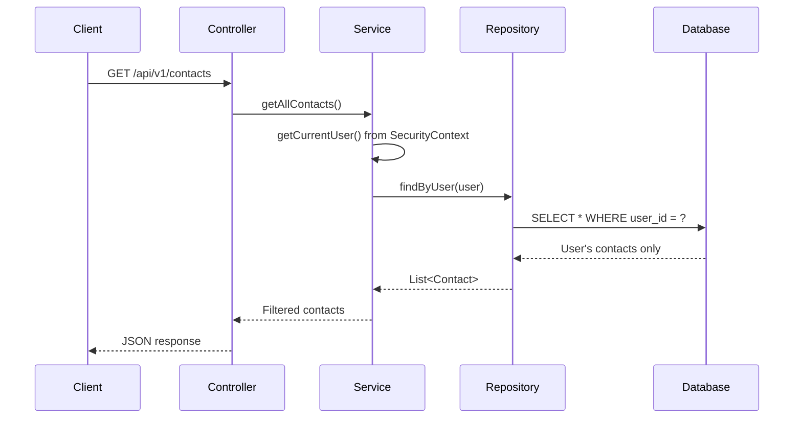

# ADR-0039: Phase 5 Security and Observability Implementation

**Status**: Accepted
**Date**: 2025-12-01
**Owners**: Justin Guida

**Related**: [ADR-0018](ADR-0018-authentication-and-authorization-model.md),
[ADR-0038](ADR-0038-authentication-implementation.md),
[RateLimitingFilter.java](../../src/main/java/contactapp/config/RateLimitingFilter.java),
[CorrelationIdFilter.java](../../src/main/java/contactapp/config/CorrelationIdFilter.java),
[Dockerfile](../../Dockerfile)

## Context
- Phase 5 requires implementing remaining security and observability features beyond basic authentication.
- Per-user data isolation is needed to support multi-tenancy.
- Rate limiting protects against brute force and denial-of-service attacks.
- Structured logging with correlation IDs enables distributed tracing.
- Prometheus metrics support production monitoring.
- Docker packaging enables consistent deployments.

## Decisions

### 1. Per-User Data Isolation

**Implementation**:
- Added `user_id` column (NOT NULL, FK to users.id) to contacts, tasks, appointments tables via Flyway V5 migration.
- Updated JPA entities with `@ManyToOne User` relationship.
- Updated repositories with user-aware query methods (`findByUser`, `findByIdAndUser`, `existsByIdAndUser`, `deleteByIdAndUser`).
- Services automatically filter by authenticated user from `SecurityContextHolder`.
- ADMIN users can access all records via `?all=true` query parameter.

**Data Flow**:


### 2. Rate Limiting with Bucket4j

**Configuration**:
| Endpoint | Limit | Window | Key |
|----------|-------|--------|-----|
| /api/auth/login | 5 requests | 60 seconds | IP address |
| /api/auth/register | 3 requests | 60 seconds | IP address |
| /api/v1/** | 100 requests | 60 seconds | Username |

**Design Rationale**:
- Login: 5 attempts/min allows typos while blocking credential stuffing.
- Register: 3 attempts/min prevents automated account creation.
- API: 100 req/min supports typical CRUD workflows while preventing resource exhaustion.

**Response Format**:
```json
{
  "error": "Rate limit exceeded. Please try again in 45 seconds.",
  "retryAfter": 45
}
```

### 3. Structured Logging with Correlation IDs

**Components**:
- `CorrelationIdFilter`: Extracts/generates X-Correlation-ID, sets MDC, adds to response.
- `RequestLoggingFilter`: Logs HTTP method, URI, status, duration (configurable via property).
- `PiiMaskingConverter`: Masks phone numbers (***-***-1234) and addresses in log messages.
- `logback-spring.xml`: Profile-specific logging (console in dev, JSON in prod).

**Log Format (Production)**:
```json
{
  "timestamp": "2025-12-01T15:15:23.456Z",
  "level": "INFO",
  "logger": "contactapp.api.ContactController",
  "message": "Creating contact with phone ***-***-1234",
  "correlationId": "abc-123-def",
  "thread": "http-nio-8080-exec-1",
  "application": "contact-service"
}
```

### 4. Prometheus Metrics

**Exposed Endpoints**:
- `/actuator/prometheus` - Prometheus-format metrics
- `/actuator/health/liveness` - Kubernetes liveness probe
- `/actuator/health/readiness` - Kubernetes readiness probe

**Custom Tags**:
- `application`: contact-service
- `environment`: local/docker/staging/production

### 5. Docker Packaging

**Dockerfile Features**:
- Multi-stage build (builder + runtime)
- Eclipse Temurin 17 JRE runtime
- Layered JAR extraction for optimal caching
- Non-root user (appuser, UID 1001)
- Configurable JVM options via JAVA_OPTS

**docker-compose.yml Stack**:
- `postgres`: PostgreSQL 16 with health checks
- `app`: Spring Boot application with resource limits
- `pgadmin`: Optional database management UI

## Test Infrastructure

### Observability Testing
- **`@AutoConfigureObservability`**: Required for Prometheus actuator tests. Spring Boot test slices disable metrics by default, so this annotation explicitly enables the Micrometer registry for integration tests that verify `/actuator/prometheus` endpoints.
- **Micrometer Dependency**: Use `micrometer-registry-prometheus-simpleclient` (not just `micrometer-registry-prometheus`) for Micrometer 1.13+ compatibility. The simpleclient variant provides the necessary Prometheus exposition format support.

### Database Migration Testing
- **H2 Identity Sequence Reset**: V5 migration includes `ALTER TABLE users ALTER COLUMN id RESTART WITH 2` to avoid conflicts with the system user (id=1) seeded in V4. Without this, H2's auto-increment could attempt to reuse id=1, causing unique constraint violations in tests.

### Test Utilities
- **`@WithMockAppUser`**: Custom Spring Security annotation for tests requiring an authenticated user context. Automatically creates a mock `UserPrincipal` with configurable username, roles, and authorities.
- **`TestUserSetup`**: Test helper that persists User entities to satisfy foreign key constraints when testing contacts, tasks, and appointments. Ensures referential integrity in service and repository tests.
- **`TestUserFactory`**: Factory class for creating unique test users with randomized usernames and emails to avoid collisions in parallel test execution.

## Consequences

### Positive
- Multi-tenant data isolation ensures users only see their own data.
- Rate limiting protects against common attack vectors.
- Correlation IDs enable end-to-end request tracing.
- PII masking prevents sensitive data in logs.
- Prometheus metrics integrate with standard monitoring tools.
- Docker packaging enables consistent deployments.

### Trade-offs
- Per-user isolation adds `instanceof JpaStore` checks in services.
- Rate limit buckets consume memory (mitigated by ConcurrentHashMap).
- JSON logging increases log volume vs plain text.

## Alternatives Considered

### Per-User Isolation
- **Separate databases per user**: Rejected; adds operational complexity.
- **Row-level security in PostgreSQL**: Rejected; requires DB-specific setup.
- **Spring Data JPA filters**: Considered but explicit user parameters are clearer.

### Rate Limiting
- **Spring Cloud Gateway**: Rejected; adds infrastructure dependency.
- **Redis-backed distributed rate limiting**: Deferred; single-instance sufficient for now.
- **Nginx rate limiting**: Rejected; want application-level control.

### Logging
- **Log4j2**: Rejected; Logback is Spring Boot default with adequate features.
- **Elastic APM agent**: Deferred; Prometheus/Micrometer sufficient for Phase 5.

## Files Changed

### New Files
- `src/main/resources/db/migration/V5__add_user_id_columns.sql`
- `src/main/java/contactapp/config/RateLimitConfig.java`
- `src/main/java/contactapp/config/RateLimitingFilter.java`
- `src/main/java/contactapp/config/CorrelationIdFilter.java`
- `src/main/java/contactapp/config/RequestLoggingFilter.java`
- `src/main/java/contactapp/config/PiiMaskingConverter.java`
- `src/main/resources/logback-spring.xml`
- `Dockerfile`
- `docker-compose.yml`
- `.env.example`
- `.dockerignore`

### Modified Files
- All entity classes (added user relationship)
- All repository classes (added user-aware methods)
- All service classes (added user isolation logic)
- All controllers (added ?all=true support for ADMIN)
- `pom.xml` (bucket4j, micrometer-prometheus, logstash-encoder)
- `application.yml` (rate-limit, prometheus, logging config)
