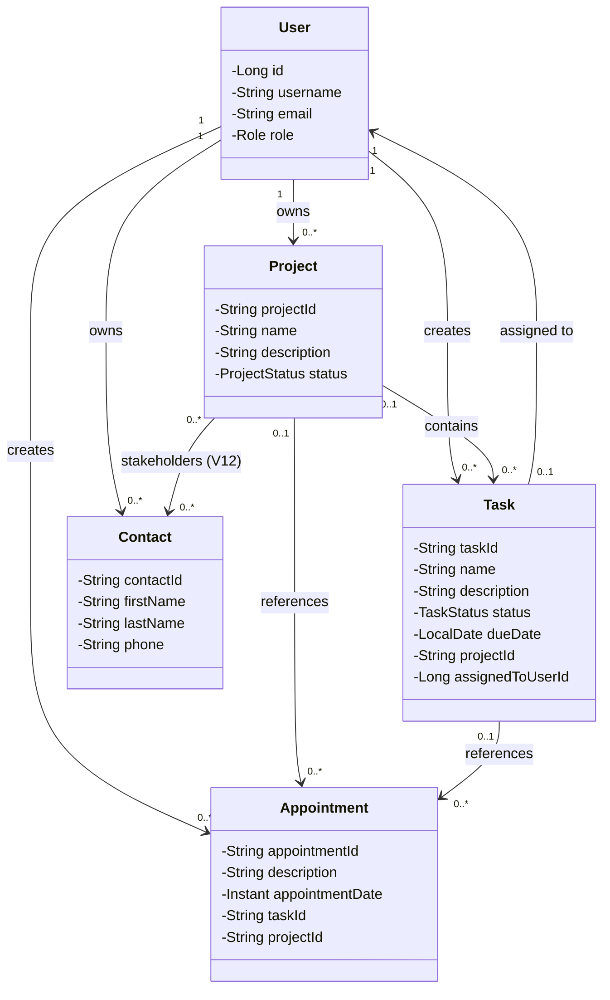
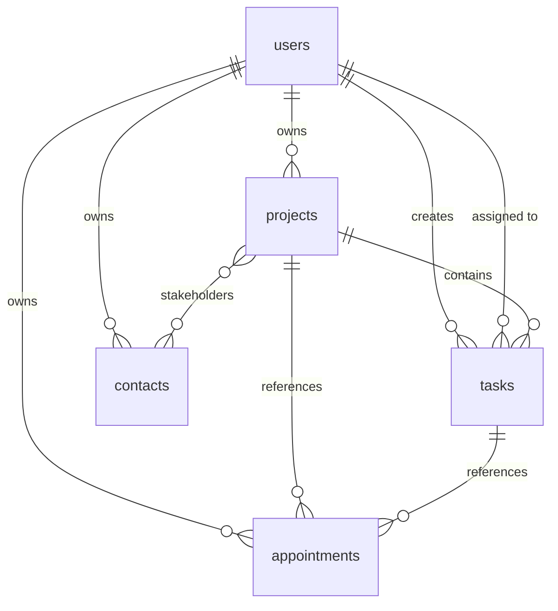

# ADR-0045: Project/Task Tracker Evolution

**Status**: Accepted
**Date**: 2025-12-01
**Owners**: Justin Guida

**Related**: [IMPLEMENTATION_PLAN_OPTION_C.md](../IMPLEMENTATION_PLAN_OPTION_C.md),
[Task.java](../../src/main/java/contactapp/domain/Task.java),
[Appointment.java](../../src/main/java/contactapp/domain/Appointment.java),
[Validation.java](../../src/main/java/contactapp/domain/Validation.java),
[ADR-0024](ADR-0024-persistence-implementation.md),
[ADR-0037](ADR-0037-user-entity-validation-and-tests.md)

## Summary

**Implementation Status**: Phases 1-5 complete (2025-12-01). Phase 6 deferred to future.

**Completed Features**:
- ✅ Project entity with full CRUD operations and status tracking (ACTIVE/ON_HOLD/COMPLETED/ARCHIVED)
- ✅ Task enhancements: status (TODO/IN_PROGRESS/DONE), due dates, timestamps
- ✅ Task-project linking for organization and filtering
- ✅ Appointment-task/project linking for calendar context
- ✅ Task assignment for team collaboration with access control

**Deferred Features**:
- ⏸️ Contact-project linking (stakeholder management via V13 junction table)

**Database Migrations**: V7 (projects), V8 (task status/dates), V10 (task-project FK), V11 (appointment links), V12 (task assignment)

**API Endpoints**: Full CRUD at `/api/v1/projects`, enhanced `/api/v1/tasks` and `/api/v1/appointments` with query parameters for filtering by project, task, status, assignee, and due dates.

**Test Coverage**: 951 total tests with comprehensive coverage across domain, persistence, service, and API layers for all implemented phases.

## Context

The existing Contact/Task/Appointment application needs to evolve into a **per-user project + task + calendar tracker** to support team collaboration and work organization. The current system has:

- **Contact**: External persons (clients/stakeholders)
- **Task**: Simple work items with ID, name, and description only
- **Appointment**: Calendar events with date/time but no project context
- **User**: Account/team member (from Phase 5)

**Requirements**:
1. Group tasks into projects (like Trello boards/Jira projects)
2. Track task status (TODO/IN_PROGRESS/DONE) and due dates
3. Link tasks to projects for organization
4. Link appointments to tasks/projects for context
5. Support task assignment between users for collaboration
6. Maintain backward compatibility with existing APIs
7. Preserve all existing Contact functionality

**Constraints**:
- Follow established validation patterns (Validation.java)
- Use Flyway migrations (V7-V12) for schema evolution
- JPA entity/mapper/store patterns from ADR-0024
- No breaking changes to existing Task/Appointment APIs
- All new fields must have sensible defaults

## Decision

Implement a **6-phase evolution plan** introducing a new Project aggregate and enhancing Task/Appointment entities with optional relationships.

### Phase 1: Project Entity (Foundation)

**New Domain Class**: `Project.java`
```java
public final class Project {
    private final String projectId;      // 1-10 chars, immutable
    private String name;                 // 1-50 chars
    private String description;          // 1-100 chars (optional, nullable)
    private ProjectStatus status;        // ACTIVE, ON_HOLD, COMPLETED, ARCHIVED
}
```

**New Enum**: `ProjectStatus.java`
- ACTIVE (default)
- ON_HOLD
- COMPLETED
- ARCHIVED

**Validation Constants** (added to Validation.java):
- `MAX_PROJECT_NAME_LENGTH = 50`
- `MAX_PROJECT_DESCRIPTION_LENGTH = 100`

**Migration V7**: `V7__create_projects_table.sql`
```sql
CREATE TABLE projects (
    id BIGSERIAL PRIMARY KEY,
    project_id VARCHAR(10) NOT NULL,
    name VARCHAR(50) NOT NULL,
    description VARCHAR(100),
    status VARCHAR(20) NOT NULL DEFAULT 'ACTIVE',
    user_id BIGINT NOT NULL,
    created_at TIMESTAMP NOT NULL DEFAULT CURRENT_TIMESTAMP,
    updated_at TIMESTAMP NOT NULL DEFAULT CURRENT_TIMESTAMP,
    version BIGINT DEFAULT 0 NOT NULL,
    CONSTRAINT fk_projects_user FOREIGN KEY (user_id)
        REFERENCES users(id) ON DELETE CASCADE,
    CONSTRAINT uq_projects_project_id_user_id
        UNIQUE (project_id, user_id),
    CONSTRAINT chk_projects_status
        CHECK (status IN ('ACTIVE', 'ON_HOLD', 'COMPLETED', 'ARCHIVED'))
);

CREATE INDEX idx_projects_user_id ON projects(user_id);
CREATE INDEX idx_projects_status ON projects(status);
```

**Persistence Layer**:
- `ProjectEntity.java` - JPA entity with @Version for optimistic locking
- `ProjectRepository.java` - Spring Data JPA repository
- `ProjectMapper.java` - Entity/Domain bidirectional mapper
- `ProjectStore.java` - Interface extending DomainDataStore
- `JpaProjectStore.java` - JPA-backed implementation

**Service Layer**: `ProjectService.java`
- `addProject(Project project)` - returns boolean
- `updateProject(String projectId, ...)` - returns boolean
- `deleteProject(String projectId)` - returns boolean
- `getProjectById(String projectId)` - returns Optional<Project>
- `getAllProjects()` - per-user filtered
- `getAllProjectsAllUsers()` - ADMIN only
- `getProjectsByStatus(ProjectStatus status)` - filtered query

**API Layer**: RESTful CRUD
```
POST   /api/v1/projects              - Create (201)
GET    /api/v1/projects              - List (200) + ?status=ACTIVE filter
GET    /api/v1/projects/{id}         - Get by ID (200/404)
PUT    /api/v1/projects/{id}         - Update (200/404)
DELETE /api/v1/projects/{id}         - Delete (204/404)
```

### Phase 2: Task Enhancements (Status + Due Date)

**Domain Updates**: `Task.java` - add fields:
```java
private TaskStatus status;           // TODO, IN_PROGRESS, DONE (default: TODO)
private LocalDate dueDate;           // Optional, nullable
private Instant createdAt;           // Auto-populated on creation
private Instant updatedAt;           // Auto-populated on update
```

**New Enum**: `TaskStatus.java`
- TODO (default)
- IN_PROGRESS
- DONE

**Validation Method** (added to Validation.java):
```java
public static LocalDate validateDueDateNotPast(LocalDate date, String label, Clock clock)
```

**Migration V8**: `V8__enhance_tasks_with_status_and_duedate.sql`
```sql
ALTER TABLE tasks ADD COLUMN status VARCHAR(20) NOT NULL DEFAULT 'TODO';
ALTER TABLE tasks ADD COLUMN due_date DATE;
ALTER TABLE tasks ADD COLUMN created_at TIMESTAMP NOT NULL DEFAULT CURRENT_TIMESTAMP;
ALTER TABLE tasks ADD COLUMN updated_at TIMESTAMP NOT NULL DEFAULT CURRENT_TIMESTAMP;

ALTER TABLE tasks ADD CONSTRAINT chk_tasks_status
    CHECK (status IN ('TODO', 'IN_PROGRESS', 'DONE'));

CREATE INDEX idx_tasks_status ON tasks(status);
CREATE INDEX idx_tasks_due_date ON tasks(due_date);
```

**Service Updates**: `TaskService.java`
- `updateTask(String taskId, String name, String description, TaskStatus status, LocalDate dueDate)`
- `getTasksByStatus(TaskStatus status)`
- `getTasksDueBefore(LocalDate date)`
- `getTasksDueBetween(LocalDate start, LocalDate end)`
- `getOverdueTasks()` - due_date < today AND status != DONE

**API Updates**:
- TaskRequest DTO adds optional `status` and `dueDate` fields
- TaskResponse DTO adds `status`, `dueDate`, `createdAt`, `updatedAt`
- Query parameters: `?status=TODO`, `?dueBefore=2024-12-31`, `?overdue=true`

### Phase 3: Task-Project Linking (Organization) - IMPLEMENTED

**Status**: ✅ Complete (2025-12-01)

**Domain Update**: `Task.java` - add field:
```java
private String projectId;  // Optional FK to Project (nullable = unassigned)
```

**Migration V10**: `V10__add_project_fk_to_tasks.sql`
```sql
ALTER TABLE tasks ADD COLUMN project_id BIGINT;

ALTER TABLE tasks ADD CONSTRAINT fk_tasks_project
    FOREIGN KEY (project_id) REFERENCES projects(id) ON DELETE SET NULL;

CREATE INDEX idx_tasks_project_id ON tasks(project_id);
```

**Persistence Update**: `TaskEntity.java`
```java
@ManyToOne(fetch = FetchType.LAZY)
@JoinColumn(name = "project_id")
private ProjectEntity project;  // nullable
```

**Service Updates**: `TaskService.java`
- `getTasksByProject(String projectId)`
- `getUnassignedTasks()` - tasks with no project
- `assignTaskToProject(String taskId, String projectId)`
- `removeTaskFromProject(String taskId)` - sets projectId to null

**API Updates**:
- `GET /api/v1/tasks?projectId={projectId}` - tasks in project
- `GET /api/v1/tasks?projectId=none` - unassigned tasks
- `PATCH /api/v1/tasks/{id}/project` - assign/remove project
- TaskResponse adds `projectId` and `projectName` (for display)

**Implementation Notes**:
- Migration V10 executed successfully
- FK constraint uses ON DELETE SET NULL to preserve tasks when project deleted
- Query parameters implemented with Spring Data JPA repository methods
- TaskMapper updated to handle projectId translation between domain and entity
- Comprehensive test coverage added for project linking operations

### Phase 4: Appointment Linking (Calendar Integration) - IMPLEMENTED

**Status**: ✅ Complete (2025-12-01)

**Domain Update**: `Appointment.java` - add fields:
```java
private String taskId;     // Optional FK to Task (soft reference)
private String projectId;  // Optional FK to Project (soft reference)
```

**Semantics**:
- Appointment with `taskId` = meeting/review for this task
- Appointment with `projectId` only = project milestone/demo/release
- Appointment with neither = standalone calendar event (current behavior)

**Migration V11**: `V11__link_appointments_to_tasks_projects.sql`
```sql
ALTER TABLE appointments ADD COLUMN task_id BIGINT;
ALTER TABLE appointments ADD COLUMN project_id BIGINT;

ALTER TABLE appointments ADD CONSTRAINT fk_appointments_task
    FOREIGN KEY (task_id) REFERENCES tasks(id) ON DELETE SET NULL;
ALTER TABLE appointments ADD CONSTRAINT fk_appointments_project
    FOREIGN KEY (project_id) REFERENCES projects(id) ON DELETE SET NULL;

CREATE INDEX idx_appointments_task_id ON appointments(task_id);
CREATE INDEX idx_appointments_project_id ON appointments(project_id);
```

**Service Updates**: `AppointmentService.java`
- `getAppointmentsByTask(String taskId)`
- `getAppointmentsByProject(String projectId)`

**API Updates**:
- `GET /api/v1/appointments?start=2024-01-01&end=2024-01-31` - date range
- `GET /api/v1/appointments?projectId={id}` - by project
- `GET /api/v1/appointments?taskId={id}` - by task
- AppointmentResponse adds `taskId`, `projectId`

**Implementation Notes**:
- Migration V11 executed successfully
- Foreign keys use ON DELETE SET NULL to preserve appointments as standalone events
- AppointmentMapper enhanced to handle taskId and projectId translations
- Repository methods added for filtering by task and project
- Query parameter parsing implemented in AppointmentController
- Test coverage includes linked appointments and filter combinations

### Phase 5: Task Assignment (Collaboration) - IMPLEMENTED

**Status**: ✅ Complete (2025-12-01)

**Domain Update**: `Task.java` - add field:
```java
private Long assigneeId;  // FK to User (nullable = unassigned)
```

**Migration V12**: `V12__add_assignee_to_tasks.sql`
```sql
ALTER TABLE tasks ADD COLUMN assigned_to_user_id BIGINT;

ALTER TABLE tasks ADD CONSTRAINT fk_tasks_assignee
    FOREIGN KEY (assigned_to_user_id) REFERENCES users(id) ON DELETE SET NULL;

CREATE INDEX idx_tasks_assigned_to_user_id ON tasks(assigned_to_user_id);
```

**Service Updates**: `TaskService.java`
- `assignTask(String taskId, Long userId)`
- `unassignTask(String taskId)`
- `getTasksAssignedToMe()` - current user
- `getTasksAssignedTo(Long userId)` - for project owners/admins
- `getTasksCreatedByMeAssignedToOthers()`

**Access Control** - Visibility Rules:
1. Users see tasks they **own** (created)
2. Users see tasks **assigned to them** (even if owned by another user)
3. Project owners see all tasks in their projects
4. ADMIN sees everything

**API Updates**:
- `PATCH /api/v1/tasks/{id}/assignee` - assign task
- `DELETE /api/v1/tasks/{id}/assignee` - unassign task
- `GET /api/v1/tasks?assignee=me` - my assigned tasks
- `GET /api/v1/tasks?assignee={userId}` - tasks assigned to user
- TaskResponse adds `assigneeId`, `assigneeUsername`

**Implementation Notes**:
- Migration V12 executed successfully
- Domain field named `assigneeId` for consistency with response DTOs
- ON DELETE SET NULL ensures tasks remain visible after user deletion
- Repository methods filter by assigned_to_user_id column
- TaskMapper maps between domain assigneeId and entity assignedToUser relationship
- Access control implemented in service layer using Spring Security context
- Comprehensive test coverage for assignment operations and visibility rules

### Phase 6: Contact-Project Linking (Deferred/Future)

**Status**: Not implemented. Deferred to future enhancement.

**Planned Implementation**:

**Migration V13**: `V13__create_project_contacts_table.sql`
```sql
CREATE TABLE project_contacts (
    project_id BIGINT NOT NULL,
    contact_id BIGINT NOT NULL,
    role VARCHAR(50),  -- 'CLIENT', 'STAKEHOLDER', 'VENDOR', etc.
    PRIMARY KEY (project_id, contact_id),
    FOREIGN KEY (project_id) REFERENCES projects(id) ON DELETE CASCADE,
    FOREIGN KEY (contact_id) REFERENCES contacts(id) ON DELETE CASCADE
);
```

**Service Layer**: `ProjectContactService` (planned)
- `addContactToProject(Long projectId, Long contactId, String role)`
- `removeContactFromProject(Long projectId, Long contactId)`
- `getProjectContacts(Long projectId)` - List of contacts with roles
- `getContactProjects(Long contactId)` - List of projects for a contact

**API Layer**: RESTful endpoints (planned)
```
POST   /api/v1/projects/{id}/contacts     - Add contact to project
GET    /api/v1/projects/{id}/contacts     - List project stakeholders
DELETE /api/v1/projects/{id}/contacts/{contactId} - Remove contact from project
```

**Rationale for Deferral**:
- Core task tracking functionality (Phases 1-5) provides immediate value for project/task organization and team collaboration
- Contact-Project linking is a nice-to-have feature for stakeholder management but not essential for MVP
- Can be implemented later without breaking changes (new junction table, additive API endpoints)
- Current focus is on stabilizing and documenting the implemented features

## Architecture Diagram



## Entity Relationships



## Validation Summary

| Entity | Field | Constraint | Default |
|--------|-------|------------|---------|
| Project | projectId | 1-10 chars, immutable | - |
| Project | name | 1-50 chars | - |
| Project | description | 0-100 chars (optional) | null |
| Project | status | ACTIVE/ON_HOLD/COMPLETED/ARCHIVED | ACTIVE |
| Task | status | TODO/IN_PROGRESS/DONE | TODO |
| Task | dueDate | Optional LocalDate | null |
| Task | projectId | Optional FK, ON DELETE SET NULL | null |
| Task | assignedToUserId | Optional FK, ON DELETE SET NULL | null |
| Appointment | taskId | Optional FK, ON DELETE SET NULL | null |
| Appointment | projectId | Optional FK, ON DELETE SET NULL | null |

## Migration Strategy

All migrations use **additive-only changes**:

| Migration | Description | Breaking? | Status |
|-----------|-------------|-----------|--------|
| V7 | CREATE projects table | No - new table | ✅ Complete |
| V8 | ALTER tasks ADD status, due_date, timestamps | No - defaults provided | ✅ Complete |
| V9 | (Reserved - migration numbering adjustment) | - | - |
| V10 | ALTER tasks ADD project_id FK | No - nullable | ✅ Complete |
| V11 | ALTER appointments ADD task_id, project_id FKs | No - nullable | ✅ Complete |
| V12 | ALTER tasks ADD assigned_to_user_id FK | No - nullable | ✅ Complete |
| V13 | CREATE project_contacts junction table | No - new table | Future |

**Key Points**:
- All new columns are nullable or have sensible defaults (status='TODO', etc.)
- Foreign keys use `ON DELETE SET NULL` to prevent cascading deletes of tasks/appointments
- Existing records remain valid after each migration
- No data transformations required

## Backward Compatibility

### API Compatibility

**Task API** - Existing clients sending `{id, name, description}` continue to work:
- `status` defaults to `TODO`
- `dueDate`, `projectId`, `assignedToUserId` default to `null`
- Response includes new fields but clients can ignore them

**Appointment API** - Same pattern:
- `taskId`, `projectId` default to `null`
- Existing appointments remain standalone calendar events

**Example** - Legacy Task Creation:
```json
POST /api/v1/tasks
{
  "id": "TASK001",
  "name": "Review PR",
  "description": "Code review"
}

Response 201:
{
  "id": "TASK001",
  "name": "Review PR",
  "description": "Code review",
  "status": "TODO",           // Auto-populated
  "dueDate": null,            // Not provided
  "projectId": null,          // Not assigned
  "assignedToUserId": null,   // Not assigned
  "createdAt": "2024-01-15T10:30:00Z",
  "updatedAt": "2024-01-15T10:30:00Z"
}
```

### Service Layer Compatibility

- All existing service methods retain their signatures
- New overloaded methods support enhanced functionality
- Legacy `getInstance()` pattern continues to work for backward compatibility

## Testing Strategy

### Test Files Per Phase

**Phase 1 - Project** (~10 test files):
- `ProjectTest.java` - Domain validation
- `ProjectStatusTest.java` - Enum coverage
- `ProjectEntityTest.java` - JPA entity tests
- `ProjectRepositoryTest.java` - Repository slice tests
- `ProjectMapperTest.java` - Mapper bidirectional tests
- `JpaProjectStoreTest.java` - Store integration tests
- `ProjectServiceTest.java` - Service layer tests
- `ProjectServiceIT.java` - Integration tests with Testcontainers
- `ProjectControllerTest.java` - REST API tests
- `ProjectControllerUnitTest.java` - Unit tests with mocks

**Phase 2-5** - Update existing Task/Appointment tests:
- Extend existing test classes with new field coverage
- Add parameterized tests for status transitions
- Add boundary tests for due dates
- Add filter query tests
- Add assignment/visibility tests

**Total New Tests**: 10 (Project) + ~30 (Task/Appointment enhancements) = **40+ new test classes/files**

### Test Coverage Goals

- Domain validation: 100% branch coverage
- Service layer: 90%+ line coverage
- API layer: All status codes (200/201/204/400/404/409) covered
- Integration tests: Happy path + error scenarios

## Implementation Order

```
Phase 1: Project Entity                    [2-3 days] ✅ COMPLETE
    ├── Domain + Validation constants
    ├── Migration V7
    ├── Persistence layer (Entity/Repo/Mapper/Store)
    ├── Service layer
    ├── API layer (Controller + DTOs)
    └── Full test coverage

Phase 2: Task Status + Due Date            [1-2 days] ✅ COMPLETE
    ├── Domain updates
    ├── Migration V8
    ├── Persistence updates
    ├── Service updates
    ├── API updates
    └── Update existing tests

Phase 3: Task-Project Linking              [1 day] ✅ COMPLETE
    ├── Domain updates
    ├── Migration V10
    ├── Persistence updates
    ├── Service updates
    └── API updates + Tests

Phase 4: Appointment Linking               [1 day] ✅ COMPLETE
    ├── Domain updates
    ├── Migration V11
    └── Full stack updates + Tests

Phase 5: Task Assignment                   [1-2 days] ✅ COMPLETE
    ├── Domain updates
    ├── Migration V12
    ├── Service updates
    ├── Access control updates
    └── API updates + Tests

Phase 6: Contact-Project Linking           [Future/Optional]
    └── Migration V13 + Full stack
```

**Phases 1-5 Complete** (2025-12-01): All core project/task tracker features implemented with full test coverage.

## Consequences

### Positive

- **Project Organization**: Users can group related tasks into projects for better visibility
- **Task Management**: Status tracking and due dates enable workflow management
- **Calendar Context**: Appointments linked to tasks/projects provide meeting context
- **Team Collaboration**: Task assignment enables delegation and workload distribution
- **Backward Compatible**: All existing APIs continue to work without changes
- **Incremental Rollout**: Each phase is independently deployable
- **Consistent Patterns**: Follows established ADR-0024 persistence patterns
- **Optimistic Locking**: Version fields on all entities prevent race conditions (ADR-0044)

### Negative

- **Schema Complexity**: 6 new migrations increase schema version from V6 to V12
- **Query Complexity**: JOIN queries needed for tasks-with-project-name responses
- **Access Control Complexity**: Task visibility rules (owner/assignee/project-owner/admin) require careful implementation
- **Test Maintenance**: 40+ new test files to maintain

### Neutral

- **Entity Count**: 5 core entities (User, Project, Task, Appointment, Contact) is manageable
- **API Surface**: 15+ new endpoints but all follow RESTful conventions
- **Database Size**: Foreign key columns add minimal storage overhead
- **Performance**: Indexes on status/due_date/project_id mitigate query performance impact

## Alternatives Considered

### Alternative 1: Embedded Status/DueDate in Task Description
- **Rejected**: Parsing free-text descriptions is error-prone and prevents filtering/sorting
- **Why**: Structured fields enable database queries and UI filtering

### Alternative 2: Separate TaskProject Junction Table
- **Rejected**: Tasks belong to 0..1 projects, not many-to-many
- **Why**: Simple FK column (`project_id`) is simpler and performs better

### Alternative 3: Hard-Delete Tasks When Project Deleted
- **Rejected**: Users may want to preserve task history even if project is deleted/archived
- **Why**: `ON DELETE SET NULL` preserves tasks as "unassigned" for recovery

### Alternative 4: Task Assignment via Junction Table (multi-assignee)
- **Rejected**: Single assignee per task matches common PM tools (Jira/Trello)
- **Why**: Future enhancement can add `task_assignees` junction table if needed

### Alternative 5: Store projectId as String (domain ID) in Task
- **Rejected**: Foreign keys require numeric IDs for referential integrity
- **Why**: Service layer can translate between domain IDs and entity IDs

### Alternative 6: Contact-Project Linking in Phase 1
- **Deferred to Phase 6**: Stakeholder management is lower priority than core task tracking
- **Why**: Can be added later without impacting core functionality

## References

- [IMPLEMENTATION_PLAN_OPTION_C.md](../IMPLEMENTATION_PLAN_OPTION_C.md) - Complete implementation plan
- [ADR-0024](ADR-0024-persistence-implementation.md) - Persistence patterns
- [ADR-0037](ADR-0037-user-entity-validation-and-tests.md) - User entity and validation
- [ADR-0044](ADR-0044-optimistic-locking.md) - Optimistic locking with @Version
- [Validation.java](../../src/main/java/contactapp/domain/Validation.java) - Centralized validation constants
