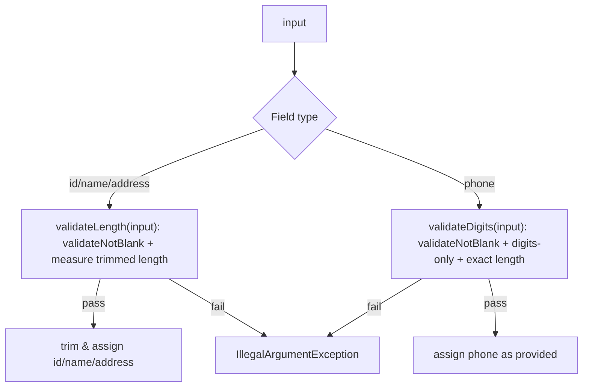
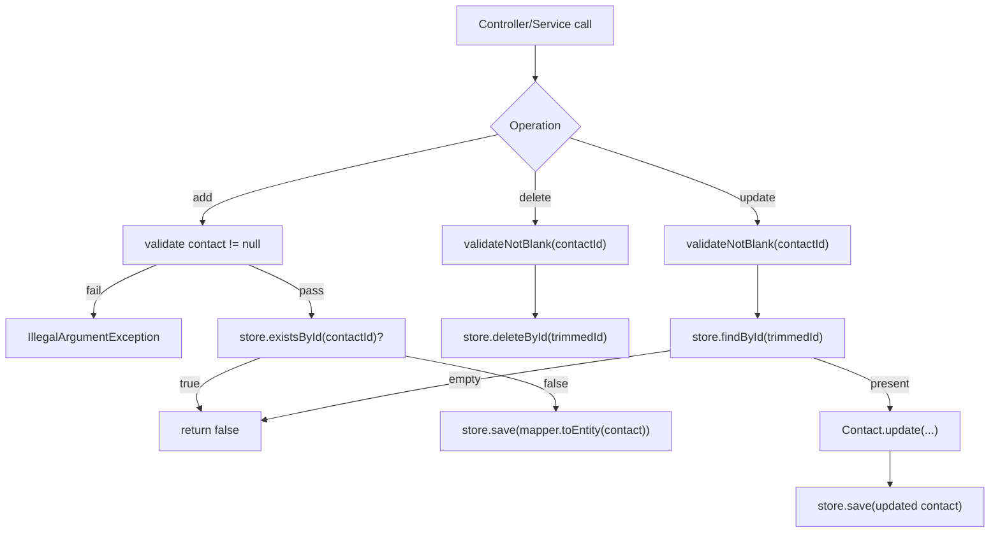
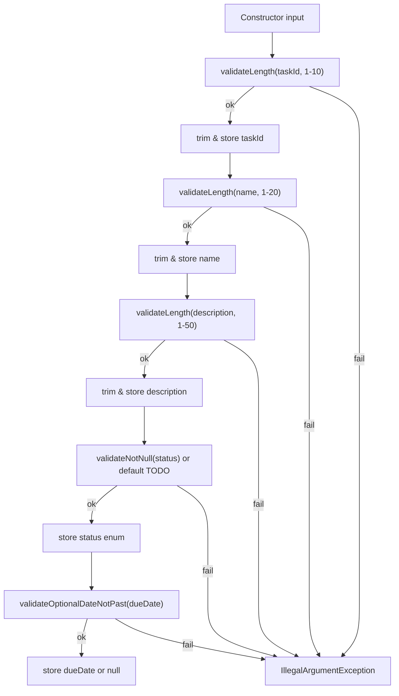
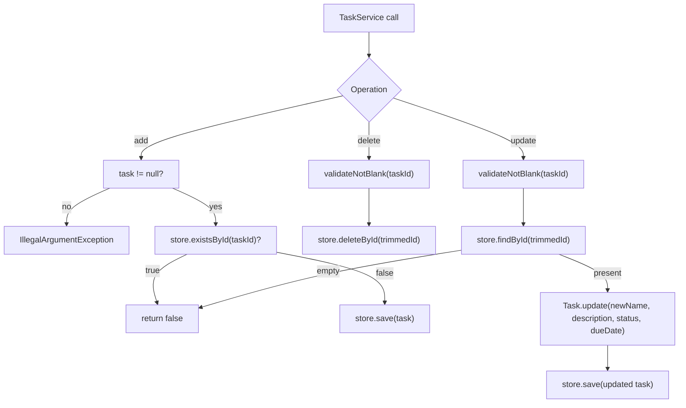
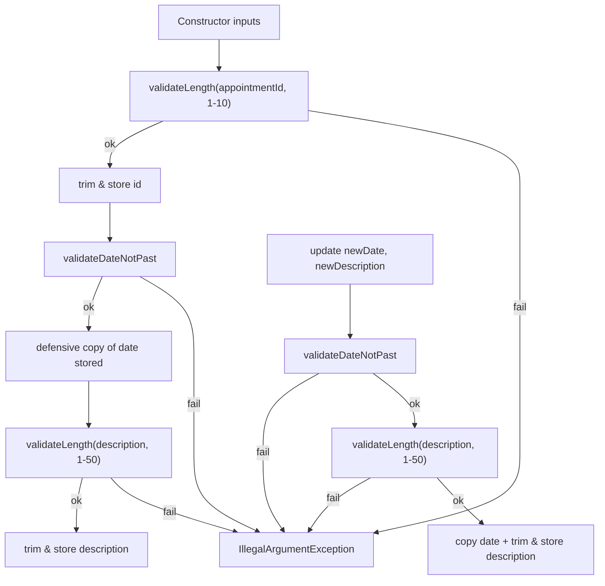
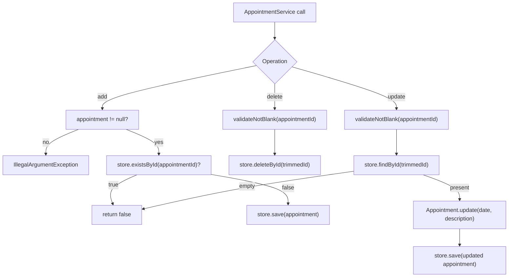
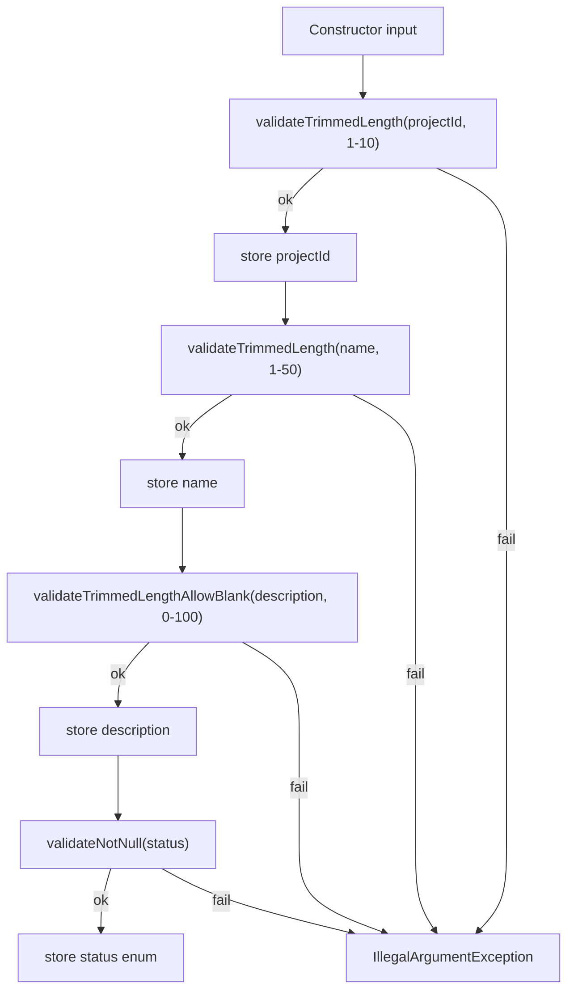
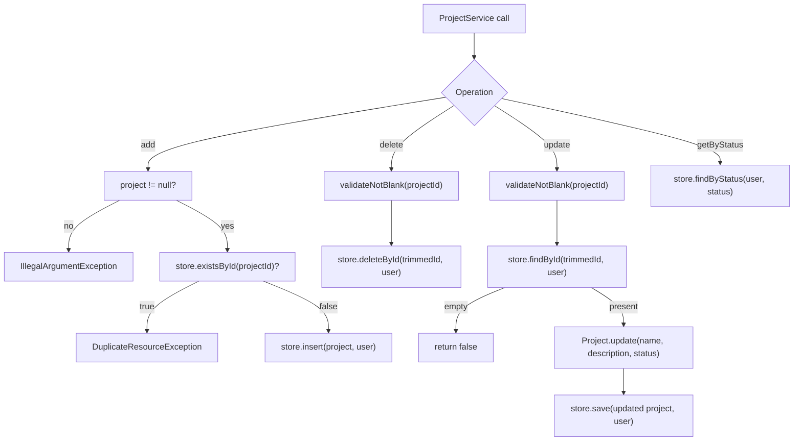

# Backend Domain & Services Reference

> **Note**: This document provides comprehensive implementation details for all domain entities and services. For informal explanations, see the individual design notes. For formal decisions, see the referenced ADRs.

## Contact Domain

### Contact.java Validation Pipeline



- Text fields (`contactId`, `firstName`, `lastName`, `address`): `validateLength` first calls `validateNotBlank` on the original input, then measures `input.trim().length()` against the bounds. If valid, the caller trims and stores.
- Phone numbers: `validateDigits` calls `validateNotBlank` on the original input, then checks for digits-only and exact length. No trimming; whitespace fails the digit check.
- Because the constructor routes through the setters, the exact same pipeline applies whether the object is being created or updated.

### Error Message Philosophy

```java
// Bad
throw new IllegalArgumentException("Invalid input");

// Good
throw new IllegalArgumentException("firstName length must be between 1 and 10");
```

Specific, label-driven messages make debugging easier and double as documentation. Tests assert on the message text so regressions are caught immediately.

### Exception Strategy

| Exception Type | Use Case           | Recovery? | Our Choice |
|----------------|--------------------|-----------|------------|
| Checked        | Recoverable issues | Maybe     | ❌          |
| Unchecked      | Programming errors | Fix code  | ✅          |

We throw `IllegalArgumentException` (unchecked) because invalid input is a caller bug and should crash fast.

### ContactService Persistence Flow



### ContactTest Scenario Coverage

- `testSuccessfulCreation` validates the positive constructor path (all fields stored).
- `testValidSetters` ensures setters update fields when inputs pass validation.
- `testConstructorTrimsStoredValues` confirms IDs, names, and addresses are normalized via `trim()`.
- `testFailedCreation` (`@ParameterizedTest`) enumerates every invalid ID/name/phone/address combination and asserts the corresponding message.
- `testFailedSetFirstName` (`@ParameterizedTest`) exercises the setter's invalid inputs (blank/long/null).
- `testUpdateRejectsInvalidValuesAtomically` (`@MethodSource`) proves invalid updates throw and leave the existing Contact state unchanged.
- `testCopyRejectsNullInternalState` (`@ParameterizedTest`) uses reflection to corrupt each internal field, proving the `validateCopySource()` guard triggers for all null branches.

### ContactServiceTest Scenario Coverage

- `testGetInstance` ensures the singleton accessor always returns a concrete service.
- `testGetInstanceReturnsSameReference` proves repeated invocations return the same singleton instance.
- `testAddContact` proves the happy path and that the map contains the stored entry.
- `testAddDuplicateContactFails` confirms the boolean contract for duplicates.
- `testAddContactNullThrows` hits the defensive null guard.
- `testDeleteContact` exercises removal plus assertion that the key disappears.
- `testDeleteMissingContactReturnsFalse` covers the branch where no contact exists.
- `testDeleteContactBlankIdThrows` shows ID validation runs even on deletes.
- `testUpdateContact` verifies every mutable field changes via setter delegation.
- `testUpdateContactTrimsId` confirms IDs are trimmed before lookups.
- `testUpdateContactBlankIdThrows` ensures update throws when the ID is blank.
- `testUpdateMissingContactReturnsFalse` covers the "not found" branch.
- `testGetDatabaseReturnsDefensiveCopies` proves callers cannot mutate internal state.
- `testGetContactByIdReturnsDefensiveCopy` verifies defensive copies are returned.

#### Security Tests (Per-User Isolation)

- `getAllContactsAllUsers_requiresAdminRole` proves non-ADMIN users get `AccessDeniedException`.
- `getAllContactsAllUsers_returnsDataForAdmins` proves ADMIN users can fetch contacts from multiple users.
- `getContactById_onlyReturnsCurrentUsersRecords` proves users cannot see contacts owned by other users.
- `deleteContact_doesNotRemoveOtherUsersData` proves users cannot delete contacts owned by other users.
- `updateContact_doesNotAffectOtherUserRecords` proves users cannot update contacts owned by other users.

---

## Task Domain

### Task.java Validation Pipeline



### TaskService Persistence Flow



### TaskTest Scenario Coverage

- Constructor stores trimmed values and rejects null/blank/too-long IDs, names, and descriptions.
- Setters accept valid updates and reject invalid ones with the same helper-generated messages.
- `update(...)` replaces both mutable fields atomically and never mutates on invalid input.
- `testUpdateRejectsInvalidValuesAtomically` (`@MethodSource`) enumerates invalid name/description pairs.
- `testCopyRejectsNullInternalState` (`@ParameterizedTest`) uses reflection to corrupt each internal field.

### TaskServiceTest Security Tests

- `getAllTasksAllUsers_requiresAdminRole` proves non-ADMIN users get `AccessDeniedException`.
- `getAllTasksAllUsers_returnsDataForAdmins` proves ADMIN users can fetch tasks from multiple users.
- `getTaskById_onlyReturnsCurrentUsersTasks` proves users cannot see tasks owned by other users.
- `deleteTask_doesNotAllowOtherUsersToDelete` proves users cannot delete tasks owned by other users.
- `updateTask_doesNotAllowCrossUserModification` proves users cannot update tasks owned by other users.

---

## Appointment Domain

### Appointment.java Validation Pipeline



### AppointmentService Persistence Flow



### AppointmentTest Scenario Coverage

- `testSuccessfulCreationTrimsAndCopiesDate` validates trim/defensive copy on construction.
- `testUpdateReplacesValuesAtomically` confirms date/description updates and defensive date copy.
- `testSetDescriptionAcceptsValidValue` covers setter happy path.
- `testGetAppointmentDateReturnsDefensiveCopy` ensures callers can't mutate stored dates.
- `testConstructorValidation` enumerates invalid id/description/null/past date cases.
- `testSetDescriptionValidation` covers invalid description setter inputs.
- `testUpdateRejectsInvalidValuesAtomically` enumerates invalid update inputs.
- `testCopyProducesIndependentInstance` verifies copy() produces an independent instance.
- `testCopyRejectsNullInternalState` (`@ParameterizedTest`) uses reflection to corrupt each field.

### AppointmentServiceTest Security Tests

- `getAllAppointmentsAllUsers_requiresAdminRole` proves non-ADMIN users get `AccessDeniedException`.
- `getAllAppointmentsAllUsers_returnsDataForAdmins` proves ADMIN users can fetch appointments from all users.
- `getAppointmentById_onlyReturnsCurrentUsersAppointments` proves users cannot see appointments owned by others.
- `deleteAppointment_doesNotAllowCrossUserDeletion` proves users cannot delete appointments owned by others.
- `updateAppointment_doesNotAllowCrossUserModification` proves users cannot update appointments owned by others.

---

## Project Domain

### Project.java Validation Pipeline



### ProjectService Persistence Flow



### ProjectTest Scenario Coverage

- Constructor stores trimmed values and rejects null/blank/too-long IDs and names.
- Description allows empty strings but rejects over-length values.
- Status rejects null with `IllegalArgumentException`.
- `update(...)` replaces all mutable fields atomically and never mutates on invalid input.
- `testCopyRejectsNullInternalState` uses reflection to corrupt each internal field.

### ProjectServiceTest Security Tests

- `getAllProjectsAllUsers_requiresAdminRole` proves non-ADMIN users get `AccessDeniedException`.
- `getAllProjectsAllUsers_returnsDataForAdmins` proves ADMIN users can fetch projects from all users.
- `getProjectById_onlyReturnsCurrentUsersProjects` proves users cannot see projects owned by others.
- `deleteProject_doesNotAllowCrossUserDeletion` proves users cannot delete projects owned by others.
- `updateProject_doesNotAllowCrossUserModification` proves users cannot update projects owned by others.

---

## Mutation-Focused Test Additions (+71 Tests)

Tests added specifically to catch surviving mutants by targeting boundary conditions:

| Test File             | +Tests | Focus Areas                                                                                                                                                        |
|-----------------------|--------|--------------------------------------------------------------------------------------------------------------------------------------------------------------------|
| `ValidationTest.java` | +14    | Length boundaries (`<` vs `<=`), digit validation (`!=` operator), date millisecond precision, email max length (100 vs 101 chars), blank vs empty string handling |
| `ContactTest.java`    | +16    | ID max length (10 vs 11), name/address boundaries, phone digit count (9/10/11), copy independence verification, atomic update semantics                            |
| `TaskTest.java`       | +13    | ID/name/description boundary values, min/max length validation, copy-doesn't-affect-original assertions                                                            |
| `ProjectTest.java`    | +19    | Special `minLength=0` for description, empty string after trimming, all `ProjectStatus` enum values, whitespace trimming edge cases                                |
| `JwtServiceTest.java` | +9     | Token expiration at exact boundary (1ms), refresh window `<=` operator, case-sensitive username comparison, `equals()` vs `==` verification                        |

**Mutation patterns targeted:**
- Comparison operators: `<` ↔ `<=`, `>` ↔ `>=`, `==` ↔ `!=`
- Boundary off-by-one: testing at `max`, `max+1`, `min`, `min-1`
- Boolean inversions: null checks, empty string checks
- Return value mutations: ensuring correct object returns from `copy()`
- Conditional removals: verifying validation is actually called

See [ADR-0046](../../adrs/ADR-0046-test-coverage-improvements.md) for the full rationale.

---

## Multi-User Data Isolation Tests

Each service enforces per-user data isolation via `user_id` foreign keys. Tests use a `runAs(username, role, action)` helper to simulate different authenticated users:

| Service            | Test Class               | Key Scenarios                                                                                                                                |
|--------------------|--------------------------|----------------------------------------------------------------------------------------------------------------------------------------------|
| ContactService     | `ContactServiceTest`     | `getAllContactsAllUsers_requiresAdminRole`, `getContactById_onlyReturnsCurrentUsersRecords`, `deleteContact_doesNotRemoveOtherUsersData`      |
| TaskService        | `TaskServiceTest`        | `getAllTasksAllUsers_requiresAdminRole`, `getTaskById_onlyReturnsCurrentUsersTasks`, `deleteTask_doesNotAllowOtherUsersToDelete`              |
| AppointmentService | `AppointmentServiceTest` | `getAllAppointmentsAllUsers_requiresAdminRole`, `getAppointmentById_onlyReturnsCurrentUsersAppointments`, `deleteAppointment_doesNotAllowCrossUserDeletion` |
| ProjectService     | `ProjectServiceTest`     | `getAllProjectsAllUsers_requiresAdminRole`, `getProjectById_onlyReturnsCurrentUsersProjects`, `deleteProject_doesNotAllowCrossUserDeletion`  |

---

## Authenticated Test Utilities

Security hardening introduced specialized test utilities:

- **`@WithMockAppUser`** - Custom annotation that populates the SecurityContext with a real `User` entity. Use `@WithMockAppUser` on test methods or customize with `@WithMockAppUser(username = "admin", role = Role.ADMIN)` for role-specific tests.

- **`TestUserSetup`** - Spring `@Component` that persists a test user to the database and configures the SecurityContext. Inject via `@Autowired` and call `setupTestUser()` in `@BeforeEach`. Essential for integration tests with real database persistence.

- **`@AutoConfigureObservability`** - Spring Boot Test annotation enabling actuator metrics endpoints in test contexts.

---

## Persistence & Mapper Coverage

- Mapper tests (`ContactMapperTest`, `TaskMapperTest`, `AppointmentMapperTest`) assert the null-input short-circuit paths.
- JPA entity tests (`ContactEntityTest`, `TaskEntityTest`, `AppointmentEntityTest`) exercise protected constructors and setters for Hibernate proxies.
- Legacy `InMemory*Store` suites assert the `Optional.empty` branch of `findById`.

**Current metrics**: 930 tests with ~83.1% mutation kills and ~89.9% line coverage (higher on stores/mappers).

---

## Related Files

| File | Location |
|------|----------|
| Contact.java | `src/main/java/contactapp/domain/Contact.java` |
| ContactService.java | `src/main/java/contactapp/service/ContactService.java` |
| Task.java | `src/main/java/contactapp/domain/Task.java` |
| TaskService.java | `src/main/java/contactapp/service/TaskService.java` |
| Appointment.java | `src/main/java/contactapp/domain/Appointment.java` |
| AppointmentService.java | `src/main/java/contactapp/service/AppointmentService.java` |
| Project.java | `src/main/java/contactapp/domain/Project.java` |
| ProjectService.java | `src/main/java/contactapp/service/ProjectService.java` |
| Validation.java | `src/main/java/contactapp/domain/Validation.java` |

## Related ADRs

- [ADR-0001](../../adrs/ADR-0001-validation-normalization.md) - Validation and Normalization
- [ADR-0003](../../adrs/ADR-0003-update-atomicity.md) - Update Atomicity
- [ADR-0010](../../adrs/ADR-0010-task-validation-and-tests.md) - Task Validation and Tests
- [ADR-0011](../../adrs/ADR-0011-taskservice-singleton-and-crud-tests.md) - TaskService Singleton and CRUD Tests
- [ADR-0024](../../adrs/ADR-0024-persistence-implementation.md) - Persistence Implementation
- [ADR-0046](../../adrs/ADR-0046-test-coverage-improvements.md) - Test Coverage Improvements