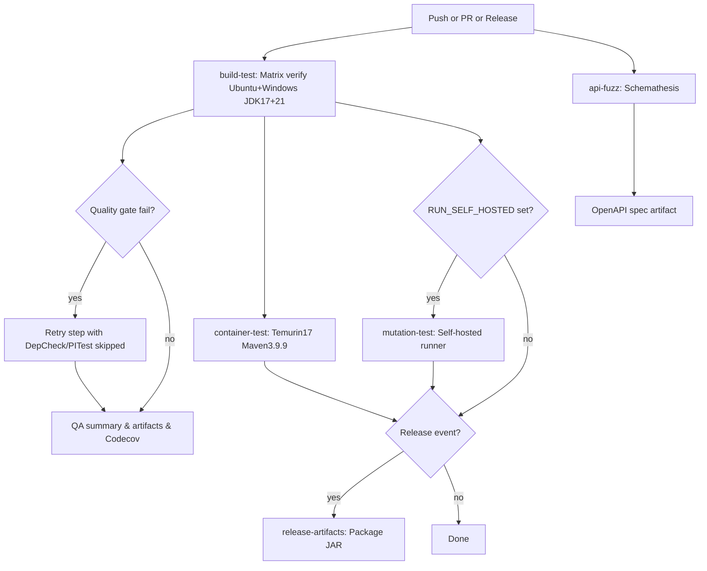

# CI/CD Operations Guide

> **Note**: This document provides operational details for the CI/CD pipeline. For phase checklists and planning, see [ci_cd_plan.md](../../ci-cd/ci_cd_plan.md). For formal decisions, see ADR-0029 and ADR-0042.

## Jobs at a Glance

| Job                 | Trigger                                                                             | What it does                                                                                                                                                                                                                                                                                                                                                                                                             | Notes                                                                                                      |
|---------------------|-------------------------------------------------------------------------------------|--------------------------------------------------------------------------------------------------------------------------------------------------------------------------------------------------------------------------------------------------------------------------------------------------------------------------------------------------------------------------------------------------------------------------|------------------------------------------------------------------------------------------------------------|
| `build-test`        | Push/PR to main/master, release, manual dispatch                                    | Matrix `{ubuntu, windows} × {JDK 17, 21}` running `mvn verify` (tests + Checkstyle + SpotBugs + JaCoCo + PITest + Dependency-Check), builds QA dashboard, posts QA summary, uploads reports, Codecov upload. **Note:** Ubuntu runners explicitly run `-DskipITs=false` while Windows runners skip Testcontainers integration tests (`-DskipITs=true`) because GitHub-hosted Windows runners cannot run Linux containers. | Retries `mvn verify` with Dependency-Check/PITest skipped if the first attempt fails due to feed/timeouts. |
| `api-fuzz`          | Push/PR to main/master, manual dispatch                                             | Starts Spring Boot app, runs Schemathesis against `/v3/api-docs`, exports OpenAPI spec, publishes JUnit XML results. Fails on 5xx errors or schema violations.                                                                                                                                                                                                                                                           | 20-minute timeout; exports spec as artifact for ZAP.                                                       |
| `container-test`    | Always (needs `build-test`)                                                         | Re-runs `mvn verify` inside `maven:3.9.9-eclipse-temurin-17` using the H2/`-DskipTestcontainersTests=true` profile (no Docker socket available); retries with Dependency-Check/PITest skipped on failure.                                                                                                                                                                                                                | Uses same MAVEN_OPTS for PIT attach; skips Testcontainers suites by design.                                |
| `mutation-test`     | Only when repo var `RUN_SELF_HOSTED == 'true'` and a `self-hosted` runner is online | Runs `mvn verify` on the self-hosted runner with PITest enabled; retries with Dependency-Check/PITest skipped on failure.                                                                                                                                                                                                                                                                                                | Optional lane; skipped otherwise.                                                                          |
| `release-artifacts` | Release event (`published`)                                                         | Packages the JAR and uploads it as an artifact; generates release notes.                                                                                                                                                                                                                                                                                                                                                 | Not run on normal pushes/PRs.                                                                              |

## Local Command Cheat Sheet

| Command                                                                 | Purpose                                                                                  |
|-------------------------------------------------------------------------|------------------------------------------------------------------------------------------|
| `mvn verify`                                                            | Full build: compile, unit tests, Checkstyle, SpotBugs, JaCoCo, PITest, Dependency-Check. |
| `mvn -Ddependency.check.skip=true -Dpit.skip=true verify`               | Fast local build when Dependency-Check feed is slow/unavailable.                         |
| `mvn spotbugs:check`                                                    | Run only SpotBugs and fail on findings.                                                  |
| `mvn -DossIndexServerId=ossindex verify`                                | Opt-in authenticated OSS Index for Dependency-Check (see Sonatype section).              |
| `cd ui/qa-dashboard && npm ci && npm run build`                         | Build the React QA dashboard locally (already built in CI).                              |
| `pip install schemathesis && python scripts/api_fuzzing.py --start-app` | Run API fuzzing locally (starts app, fuzzes, exports spec).                              |

## Matrix Verification

- `.github/workflows/java-ci.yml` runs `mvn -B verify` across `{ubuntu-latest, windows-latest} × {Java 17, Java 21}` to surface OS and JDK differences early.
- **Ubuntu runners** execute the full test suite including Testcontainers integration tests (Postgres via Docker).
- **Windows runners** skip integration tests (`-DskipITs=true`) because GitHub-hosted Windows runners only support Windows containers, not the Linux containers required by Testcontainers/Postgres. Unit tests, MockMvc tests, and all quality gates still run.
- **Local developers** also skip the Testcontainers suite by default (Maven property `skipITs=true`). Opt in with `mvn verify -DskipITs=false` once Docker Desktop/Colima is running to mirror the CI configuration.
- `container-test` reruns `mvn verify` inside `maven:3.9.9-eclipse-temurin-17` **with `-DskipTestcontainersTests=true -Pskip-testcontainers`** (H2 only; no Docker socket); if quality gates fail, it retries with Dependency-Check and PITest skipped.

## Quality Gate Behavior

**Sequential execution** (`forkCount=1` in pom.xml): Required because singleton services share state across test classes. Spring Boot test context caching reuses ApplicationContext instances, and `@Isolated` tests need sequential execution to avoid collisions when clearing shared state (SecurityContext, seed users, singleton instances).

**Profile strategy**: Linux CI runs full suite with Testcontainers/Postgres; Windows CI uses `skip-testcontainers` profile on H2 (no Docker) with reduced JaCoCo threshold (75% vs 80%); legacy `getInstance()` suites tagged `legacy-singleton` run separately via `mvn test -Plegacy-singleton`.

- Each matrix job executes the quality gate suite (unit tests, JaCoCo, Checkstyle, SpotBugs, Dependency-Check, PITest). Integration tests run only on Ubuntu.
- Checkstyle enforces formatting/import/indentation rules while SpotBugs scans bytecode for bug patterns and fails the build on findings.
- SpotBugs runs as part of every `mvn verify` run on the supported JDKs (currently 17 and 21 in CI) and fails the build on findings.
- Dependency-Check throttling is tuned via `nvdApiDelay` (defaults to 3500ms when an NVD API key is configured, 8000ms without a key) and honors `-Ddependency.check.skip=true` if the NVD feed is unreachable.
- Python 3.12 is provisioned via `actions/setup-python@v5` so `scripts/ci_metrics_summary.py` runs consistently on both Ubuntu and Windows runners.
- Node.js 22 is provisioned via `actions/setup-node@v4` and the React dashboard under `ui/qa-dashboard/` is built every run so the artifacts contain the interactive QA console.
- Mutation coverage relies on GitHub-hosted runners by default; the self-hosted lane is opt-in and only fires when the repository variable `RUN_SELF_HOSTED` is set.
- Dependabot checks run every Monday at 15:30 ET so Maven updates appear as automated PRs.

## Caching Strategy

- Maven artifacts are cached via `actions/cache@v4` (`~/.m2/repository`) to keep builds fast.
- Dependency-Check data is intentionally purged every run (see the "Purge Dependency-Check database cache" step) to avoid stale or corrupted NVD downloads. If feed reliability improves we can re-enable caching in the workflow, but for now the clean slate proved more stable.

## CI/CD Flow Diagram



## QA Summary & Metrics

Each GitHub Actions matrix job writes a QA table (tests, coverage, mutation score, Dependency-Check status) to the run summary. The table includes colored icons, ASCII bars, and severity breakdowns.

**Current Test Metrics (full Linux matrix):**
- 930 test executions (parameterized)
- +71 mutation-focused tests targeting boundary conditions
- ~83.1% mutation kill rate (PIT)
- ~89.9% line coverage overall
- Windows matrix executes 700 tests under `-DskipTestcontainersTests=true` (H2)

The summary script emits a dark-mode HTML dashboard (`target/site/qa-dashboard/index.html`) with quick stats and links to the JaCoCo, SpotBugs, Dependency-Check, and PITest HTML reports.

## QA Console React Dashboard

To view the interactive QA dashboard:

```bash
cd ~/Downloads/quality-reports-<os>-jdk<ver>
python serve_quality_dashboard.py --path site
```

Modern browsers block ES modules when loaded directly from `file://` URLs, so the helper launches a tiny HTTP server and opens `http://localhost:<port>/qa-dashboard/index.html`.

## Coverage Publishing (Codecov)

After JaCoCo generates `target/site/jacoco/jacoco.xml`, the workflow uploads it to Codecov.

**Setup steps (once per repository):**
1. Sign in to Codecov with GitHub and add this repo.
2. Generate a repository token in Codecov and save it as the GitHub secret `CODECOV_TOKEN`.
3. Re-run the workflow; each matrix job uploads coverage with a `flags` label (`os-jdk`).

## CodeQL Security Analysis

- `.github/workflows/codeql.yml` runs independently of the matrix job.
- Pins Temurin JDK 17 via `actions/setup-java@v4`, caches Maven dependencies, and enables the `+security-and-quality` query pack.
- Triggers: pushes/PRs to `main` or `master`, weekly scheduled scan (`cron: 0 3 * * 0`), and manual dispatch.

### Log Injection Prevention

Log injection vulnerabilities (CWE-117) are prevented through inline validation:
- Strip CR/LF and control characters before logging
- Validate against safe character patterns (`^[A-Za-z0-9 .:@/_-]+$`)
- Truncate overly long values (max 120 chars)
- Return safe placeholder values (`[null]`, `[empty]`, `[unsafe-value]`) for invalid input

## API Fuzzing (Schemathesis)

- `.github/workflows/api-fuzzing.yml` runs Schemathesis against the live OpenAPI spec.
- **All Schemathesis phases pass**: Coverage, Fuzzing, and Stateful phases (30,668 test cases, 0 failures).
- **Failure criteria**: Any 5xx response or response schema violation fails the workflow.
- **Local testing**: `pip install schemathesis && python scripts/api_fuzzing.py --start-app`

## Self-Hosted Mutation Runner Setup

Register a runner per GitHub's instructions (Settings -> Actions -> Runners -> New self-hosted runner).

**For macOS:**
```bash
# Create runner directory
mkdir actions-runner && cd actions-runner

# Download the latest runner package (check GitHub for exact URL)
# For Intel Mac:
curl -o actions-runner-osx-x64-2.321.0.tar.gz -L https://github.com/actions/runner/releases/download/v2.321.0/actions-runner-osx-x64-2.321.0.tar.gz
# For Apple Silicon Mac:
# curl -o actions-runner-osx-arm64-2.321.0.tar.gz -L https://github.com/actions/runner/releases/download/v2.321.0/actions-runner-osx-arm64-2.321.0.tar.gz

# Extract and configure
tar xzf ./actions-runner-osx-*.tar.gz
./config.sh --url https://github.com/jguida941/contact-suite-spring-react --token YOUR_TOKEN_FROM_GITHUB

# Set MAVEN_OPTS permanently (for zsh)
echo 'export MAVEN_OPTS="--enable-native-access=ALL-UNNAMED -Djdk.attach.allowAttachSelf=true"' >> ~/.zshrc
source ~/.zshrc

# Start the runner
./run.sh
```

**Workflow toggle**: The `mutation-test` job only runs when the repository variable `RUN_SELF_HOSTED` is set to `true`.

## SpotBugs Commands

```bash
# Run SpotBugs as part of the normal build
mvn -Ddependency.check.skip=true verify

# Fail fast on SpotBugs findings during local iterations
mvn spotbugs:check

# Generate the HTML report at target/spotbugs.html
mvn spotbugs:spotbugs

# Open the SpotBugs GUI to inspect findings interactively
mvn spotbugs:gui
```

## Sonatype OSS Index (optional)

Dependency-Check also pings the Sonatype OSS Index service. To avoid rate limiting:

1. Create a free account at [ossindex.sonatype.org](https://ossindex.sonatype.org/) and generate an API token.
2. Add credentials to your Maven `settings.xml`:
   ```xml
   <settings>
     <servers>
       <server>
         <id>ossindex</id>
         <username>YOUR_OSS_INDEX_USERNAME</username>
         <password>YOUR_OSS_INDEX_API_TOKEN</password>
       </server>
     </servers>
   </settings>
   ```
3. Run Maven with `-DossIndexServerId=ossindex`.

## Release Automation

- Successful workflows publish build artifacts.
- The `release-artifacts` job is gated with `if: github.event_name == 'release' && github.event.action == 'published'`.
- It only runs when a GitHub release/tag is published.

## Related ADRs

- [ADR-0029](../../adrs/ADR-0029-ci-as-quality-gate.md) - CI as Quality Gate Philosophy
- [ADR-0042](../../adrs/ADR-0042-docker-containerization-strategy.md) - Docker Containerization Strategy
