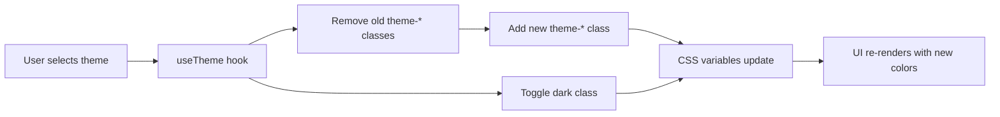

# Frontend Architecture (React UI)

> **Note**: This document consolidates frontend implementation details. For formal decisions, see ADR-0017, ADR-0025, ADR-0026, ADR-0027, and ADR-0028.

## Technology Stack

| Layer | Technology | Version |
|-------|------------|---------|
| Framework | React | 19 |
| Build Tool | Vite | Latest |
| Language | TypeScript | 5.x |
| Styling | Tailwind CSS | v4 |
| Components | shadcn/ui | Copy-paste architecture |
| State (Server) | TanStack Query | v5 |
| State (Forms) | React Hook Form + Zod | Latest |
| Routing | React Router | v7 |

## Architecture Decisions

### Component Library (ADR-0025)

**Choice**: shadcn/ui with copy-paste architecture (not npm dependencies).

**Rationale**:
- Components copied into `ui/contact-app/src/components/ui/` for full source control
- Prevents upstream breaking changes
- Eliminates vendor lock-in
- Built on Radix UI primitives for WCAG 2.1 AA accessibility

### Theme System (ADR-0026)

**5 Professional Themes**: Slate (default), Ocean (fintech), Forest (productivity), Violet (startup), Zinc (developer tools).

**Implementation**:
- CSS variable-based with Tailwind v4 `@theme` directive
- Light/dark variants via `.dark` class toggle on `<html>`
- Runtime theme switching without page reload
- WCAG 2.1 AA compliant (4.5:1 contrast ratios verified)



### App Shell Layout (ADR-0027)

```
┌─────────────────────────────────────────────────────────────────┐
│ ┌──────────┐ ┌─────────────────────────────────────────────────┐│
│ │  Logo    │ │ TopBar: [Title]              [🔍] [🌙] [👤]    ││
│ ├──────────┤ └─────────────────────────────────────────────────┘│
│ │ Overview │ ┌──────────────────────────────────┬──────────────┐│
│ │ Contacts │ │                                  │              ││
│ │ Tasks    │ │   Content Area                   │   Sheet      ││
│ │ Appts    │ │   (list/table/cards)             │   (details)  ││
│ │          │ │                                  │              ││
│ ├──────────┤ │                                  │              ││
│ │ Settings │ │                                  │              ││
│ │ Help     │ │                                  │              ││
│ └──────────┘ └──────────────────────────────────┴──────────────┘│
└─────────────────────────────────────────────────────────────────┘
```

**Responsive Breakpoints**:

| Breakpoint | Sidebar | Navigation | Drawer |
|------------|---------|------------|--------|
| Desktop (≥1024px) | Full width with labels | Left sidebar | Right sheet |
| Tablet (768-1023px) | Icons only | Left sidebar (narrow) | Right sheet |
| Mobile (<768px) | Hidden | Bottom nav (future) | Full-screen sheet |

### Build Integration (ADR-0028)

**Maven Plugin**: `frontend-maven-plugin`
- Installs Node.js 22.11.0 + npm 10.9.0
- Runs `npm ci` for reproducible installs
- Executes Vitest tests
- Builds production bundle via `npm run build`
- Copies `dist/` into `target/classes/static/` for JAR packaging

**Single-command deployment**: `mvn clean package && java -jar target/*.jar`

## File Structure

```
ui/contact-app/
├── src/
│   ├── components/
│   │   ├── layout/           # AppShell, Sidebar, TopBar
│   │   ├── forms/            # ContactForm, TaskForm, AppointmentForm
│   │   ├── dialogs/          # DeleteConfirmDialog
│   │   ├── auth/             # RequireAuth, RequireAdmin
│   │   └── ui/               # shadcn/ui components
│   ├── hooks/                # useTheme, useMediaQuery, useProfile, useToast
│   ├── lib/                  # api.ts, schemas.ts, utils.ts, queryClient.ts
│   ├── pages/                # OverviewPage, ContactsPage, etc.
│   ├── App.tsx               # Router + QueryClient setup
│   ├── index.css             # Tailwind + theme CSS variables
│   └── main.tsx              # React DOM entry
├── e2e/                      # Playwright E2E tests
├── components.json           # shadcn/ui configuration
├── package.json              # Dependencies
├── tsconfig.app.json         # TypeScript config with @/* alias
├── vite.config.ts            # Vite + Tailwind plugin + API proxy
├── vitest.config.ts          # Vitest configuration
└── playwright.config.ts      # Playwright configuration
```

## API Integration

**CSRF-aware fetch wrapper**:
```typescript
const METHODS_REQUIRING_CSRF = new Set(['POST', 'PUT', 'PATCH', 'DELETE']);

async function fetchWithCsrf(input: RequestInfo | URL, init: RequestInit = {}): Promise<Response> {
  const headers = new Headers(init.headers ?? {});
  const method = (init.method ?? 'GET').toUpperCase();
  if (METHODS_REQUIRING_CSRF.has(method)) {
    const token = await ensureCsrfToken();
    if (token) headers.set('X-XSRF-TOKEN', token);
  }
  return fetch(input, { credentials: 'include', ...init, headers });
}
```

**Cookie-based auth**: JWTs stored in HttpOnly cookies. Profile metadata cached in `sessionStorage` via `useProfile` hook.

## Validation Alignment

Zod schemas mirror backend `Validation.java` constants:

```typescript
// lib/schemas.ts
export const ValidationLimits = {
  MAX_ID_LENGTH: 10,
  MAX_NAME_LENGTH: 10,
  MAX_ADDRESS_LENGTH: 30,
  MAX_TASK_NAME_LENGTH: 20,
  MAX_DESCRIPTION_LENGTH: 50,
  PHONE_LENGTH: 10,
} as const;
```

## Testing

| Tool | Count | Purpose |
|------|-------|---------|
| Vitest | 22 tests | Component/schema tests |
| Playwright | 5 tests | E2E CRUD happy path |

**Running tests**:
```bash
cd ui/contact-app
npm run test:run       # Vitest unit/component tests
npm run test:e2e       # Playwright E2E tests
npm run test:coverage  # Vitest with coverage report
```

## Development

**Start both servers**:
```bash
python scripts/dev_stack.py                    # H2 in-memory
python scripts/dev_stack.py --database postgres  # Persistent Postgres
```

**Manual start**:
```bash
# Terminal 1: Backend
mvn spring-boot:run

# Terminal 2: Frontend
cd ui/contact-app
npm install
npm run dev
```

**URLs**:
| URL | Purpose |
|-----|---------|
| http://localhost:5173 | React UI (use this for web app) |
| http://localhost:8080/api/v1/* | REST API (JSON responses) |
| http://localhost:8080/swagger-ui.html | API documentation |

## Related ADRs

- [ADR-0017](../../adrs/ADR-0017-frontend-stack-and-application-shell.md) - Frontend Stack and Application Shell
- [ADR-0025](../../adrs/ADR-0025-ui-component-library.md) - UI Component Library Selection
- [ADR-0026](../../adrs/ADR-0026-theme-system-and-design-tokens.md) - Theme System and Design Tokens
- [ADR-0027](../../adrs/ADR-0027-application-shell-layout.md) - Application Shell Layout Pattern
- [ADR-0028](../../adrs/ADR-0028-frontend-backend-build-integration.md) - Frontend-Backend Build Integration