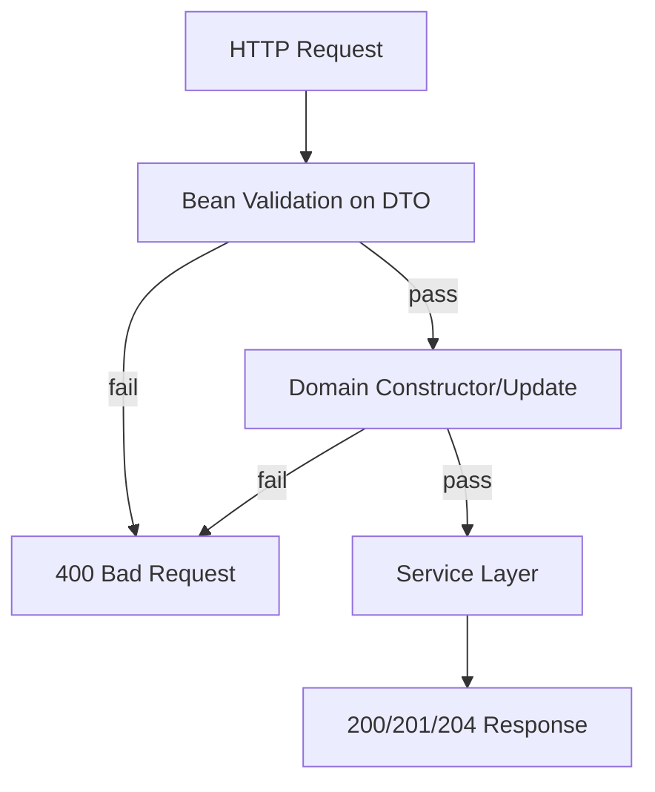

# REST API Layer (Phase 2)

> **Note**: This document covers REST API implementation details. For formal decisions, see ADR-0012, ADR-0021, and ADR-0022.

## API Snapshot

- **Three REST controllers** expose CRUD endpoints under `/api/v1/{contacts,tasks,appointments}`.
- **Service-level lookup methods** - Controllers use `getAllXxx()` and `getXxxById(id)` service methods for better encapsulation instead of accessing `getDatabase()` directly.
- **DTOs with Bean Validation** (`ContactRequest`, `TaskRequest`, `AppointmentRequest`) validate input at the HTTP boundary before reaching domain logic.
- **Global exception handling** via `@RestControllerAdvice` maps exceptions to consistent JSON error responses.
- **Custom error controller** ensures ALL errors return JSON, including container-level errors (malformed requests, invalid paths) that bypass Spring MVC exception handling.
- **OpenAPI/Swagger UI** available at `/swagger-ui.html` and `/v3/api-docs` (powered by springdoc-openapi).
- **Enhanced OpenAPI spec**: Controllers use `@Tag`, `@Operation`, and `@ApiResponses` annotations to produce a production-quality spec with `application/json` content types and documented error responses (400/404/409).

## Endpoint Summary

| Resource     | Create (POST)          | Read (GET)                                          | Update (PUT)                | Delete (DELETE)             |
|--------------|------------------------|-----------------------------------------------------|-----------------------------|-----------------------------|
| Contacts     | `/api/v1/contacts`     | `/api/v1/contacts`, `/api/v1/contacts/{id}`         | `/api/v1/contacts/{id}`     | `/api/v1/contacts/{id}`     |
| Tasks        | `/api/v1/tasks`        | `/api/v1/tasks`, `/api/v1/tasks/{id}`               | `/api/v1/tasks/{id}`        | `/api/v1/tasks/{id}`        |
| Appointments | `/api/v1/appointments` | `/api/v1/appointments`, `/api/v1/appointments/{id}` | `/api/v1/appointments/{id}` | `/api/v1/appointments/{id}` |
| Projects     | `/api/v1/projects`     | `/api/v1/projects`, `/api/v1/projects/{id}`         | `/api/v1/projects/{id}`     | `/api/v1/projects/{id}`     |

## Query Parameters (Filtering)

| Endpoint                   | Parameter              | Description                    | Example                                  |
|----------------------------|------------------------|--------------------------------|------------------------------------------|
| `GET /api/v1/tasks`        | `?projectId={id}`      | Filter tasks by project        | `/api/v1/tasks?projectId=PROJ001`        |
| `GET /api/v1/tasks`        | `?projectId=none`      | Get unassigned tasks           | `/api/v1/tasks?projectId=none`           |
| `GET /api/v1/tasks`        | `?assigneeId={userId}` | Filter tasks by assignee       | `/api/v1/tasks?assigneeId=123`           |
| `GET /api/v1/tasks`        | `?status={status}`     | Filter tasks by status         | `/api/v1/tasks?status=TODO`              |
| `GET /api/v1/appointments` | `?taskId={id}`         | Filter appointments by task    | `/api/v1/appointments?taskId=TASK001`    |
| `GET /api/v1/appointments` | `?projectId={id}`      | Filter appointments by project | `/api/v1/appointments?projectId=PROJ001` |
| `GET /api/v1/projects`     | `?status={status}`     | Filter projects by status      | `/api/v1/projects?status=ACTIVE`         |

## HTTP Status Codes

| Status | Meaning      | When Used                                                                                                                      |
|--------|--------------|--------------------------------------------------------------------------------------------------------------------------------|
| 200    | OK           | GET by ID, PUT update success                                                                                                  |
| 201    | Created      | POST create success                                                                                                            |
| 204    | No Content   | DELETE success                                                                                                                 |
| 400    | Bad Request  | Validation failure, malformed JSON                                                                                             |
| 401    | Unauthorized | Missing/expired JWT or no `auth_token` cookie                                                                                  |
| 403    | Forbidden    | Authenticated user lacks access (per-user isolation, admin override checks on `POST /api/v1/admin/query` / legacy `?all=true`) |
| 404    | Not Found    | Resource with given ID does not exist                                                                                          |
| 409    | Conflict     | Duplicate ID on create or optimistic locking version mismatch                                                                  |

GlobalExceptionHandler and the Spring Security filter chain surface the `401`/`403` rows even for controller methods that do not reference them directly.

## Validation Strategy (Two Layers)



- **Bean Validation** (`@NotBlank`, `@Size`, `@Pattern`, `@FutureOrPresent`) catches invalid input early with user-friendly error messages. DTOs use `@Schema(pattern = ".*\\S.*")` to document non-whitespace requirement in OpenAPI.
- **Path variable validation**: `@NotBlank @Size(min=1, max=10)` on `{id}` path parameters enforces ID constraints (no whitespace-only, max 10 chars). Controllers are annotated with `@Validated` (required for Spring to enforce method-level constraints on `@PathVariable`).
- **Domain validation** (`Validation.validateLength`, `validateDigits`, `validateDateNotPast`) acts as a backup layer—same rules, same constants.
- DTO constraints use static imports from `Validation.MAX_*` constants to stay in sync with domain rules.

## Error Response Format

All errors return consistent JSON:

```json
{
  "error": "Bad Request",
  "message": "contactId length must be between 1 and 10",
  "timestamp": "2025-12-03T10:15:30Z",
  "path": "/api/v1/contacts"
}
```

## Controller Tests (MockMvc)

| Test Class                  | Tests | Coverage                                                                                       |
|-----------------------------|-------|------------------------------------------------------------------------------------------------|
| **ContactControllerTest**   | 21    | @Test covering CRUD, validation errors, boundary tests, 404/409 scenarios |
| **TaskControllerTest**      | 35    | @Test covering CRUD, status/dueDate/projectId fields, boundary tests |
| **AppointmentControllerTest** | 19  | @Test covering date validation, past-date rejection, ISO 8601 handling |
| **GlobalExceptionHandlerTest** | 7  | Direct unit tests for exception handler methods                                                 |
| **CustomErrorControllerTest** | 17   | @Test + @ParameterizedTest for container-level error handling                      |
| **JsonErrorReportValveTest** | 17   | Unit tests for Tomcat valve JSON error handling                                                 |

## Test Isolation Pattern

Controller tests use reflection to access package-private `clearAll*()` methods:

```java
@BeforeEach
void setUp() throws Exception {
    final Method clearMethod = ContactService.class.getDeclaredMethod("clearAllContacts");
    clearMethod.setAccessible(true);
    clearMethod.invoke(contactService);  // Use autowired service, not getInstance()
}
```

## JsonErrorReportValve (ADR-0022)

Two-layer JSON error handling ensures consistent responses:
1. **`JsonErrorReportValve`** intercepts errors at the Tomcat container level
2. **`CustomErrorController`** handles Spring-level errors

### JsonErrorReportValveTest Scenario Coverage

- `report_successfulResponse_doesNotWriteBody` - Verifies successful responses (status < 400) are not processed.
- `report_committedResponse_doesNotWriteBody` - Verifies already-committed responses are skipped to avoid corruption.
- `report_badRequest_writesJsonBody` - Verifies 400 errors write JSON with correct Content-Type, Content-Length, and message.
- `report_notFound_writesCorrectMessage` - Verifies 404 errors return "Resource not found" message.
- `report_resetBufferThrowsException_returnsEarly` - Verifies valve handles `IllegalStateException` gracefully.
- `report_ioException_handledGracefully` - Verifies IOException during write doesn't throw.
- `report_statusCodeMapping` (parameterized) - Verifies all HTTP status codes map to correct error messages.
- `report_withThrowable_stillWritesJson` - Verifies throwable parameter doesn't affect JSON output.
- `report_statusBelowThreshold_doesNotWriteBody` - Verifies 399 status (below threshold) is not processed.
- `report_exactlyAtThreshold_writesBody` - Verifies 400 status (exactly at threshold) is processed.

## Content-Length Fix for Chunked Encoding

`JsonErrorReportValve` sets explicit `Content-Length` to avoid "invalid chunk" errors during API fuzzing. The valve implements five safeguards:
1. `isCommitted()` check
2. Buffer reset
3. `IllegalStateException` bailout
4. Explicit `Content-Length`
5. Binary write via `OutputStream`

This is the standard Tomcat pattern: guard → reset → set headers → write bytes → flush.

## Related ADRs

- [ADR-0012](../../adrs/ADR-0012-rest-api-design.md) - REST API Design
- [ADR-0021](../../adrs/ADR-0021-global-exception-handling.md) - Global Exception Handling
- [ADR-0022](../../adrs/ADR-0022-json-error-report-valve.md) - JSON Error Report Valve