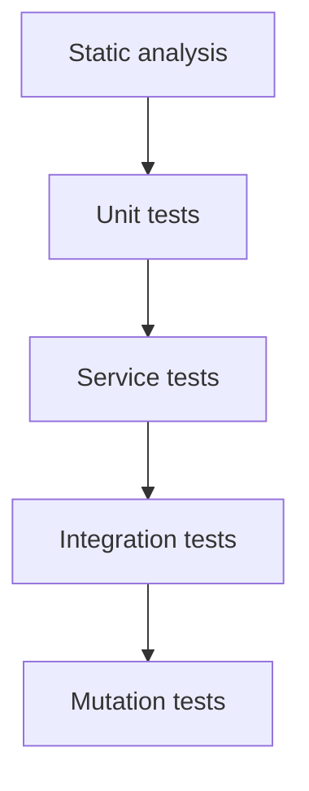

# Testing Strategy & Quality Gates

> **Note**: This document consolidates the testing philosophy, tools, and quality gates from across the codebase. For formal decisions, see the ADRs referenced throughout.

## Testing Philosophy

We follow a layered testing approach where each layer adds confidence without duplicating effort:



**Key Principles**:
- Every validator rule started as a failing test, then implementation was written until the suite passed
- Tests serve as living documentation covering both success paths and error scenarios
- Parameterized tests enumerate invalid inputs to avoid boilerplate duplication

## Quality Gate Stack

| Layer               | Tool                       | Focus                                                                                |
|---------------------|----------------------------|--------------------------------------------------------------------------------------|
| Coverage            | **JaCoCo**                 | Line/branch coverage enforcement during `mvn verify` (80% threshold on Linux)        |
| Mutation            | **PITest**                 | Ensures assertions catch injected faults; threshold currently 70%                    |
| Style & complexity  | **Checkstyle**             | Formatting, naming, indentation, import ordering, boolean simplification             |
| Bug patterns        | **SpotBugs**               | Bytecode bug-pattern scanning (fails build on findings)                              |
| Dependency security | **OWASP Dependency-Check** | CVE scanning backed by `NVD_API_KEY` with optional skip fallback                     |
| Semantic security   | **CodeQL**                 | Detects SQLi/XSS/path-traversal patterns in separate workflow                        |

Each layer runs automatically in CI, so local `mvn verify` mirrors the hosted pipelines.

## Testcontainers Strategy (ADR-0048)

Tests use a **single static PostgreSQL container** for the entire test suite (not per-class containers).

**The Problem**: `@Testcontainers/@Container` annotations create NEW containers for EACH test class, but Spring Boot's test context caching REUSES the same ApplicationContext (and HikariCP connection pool) across test classes with identical configuration. This causes port mismatches between containers and cached connection pools.

**The Solution** (`PostgresContainerSupport.java`):
```java
@ServiceConnection
protected static final PostgreSQLContainer<?> postgres;
static {
    postgres = new PostgreSQLContainer<>("postgres:16-alpine");
    postgres.start();
}
```

**Result**: Tests complete in ~15 seconds instead of 12+ minutes (48x speedup).

## Profile Strategy

| Environment | Profile | Database | Coverage Gate |
|-------------|---------|----------|---------------|
| Linux CI    | `integration` | Testcontainers/Postgres | Full (80% JaCoCo) |
| Windows CI  | `skip-testcontainers` | H2 | Reduced (75% JaCoCo) |
| Local dev   | default | H2 | N/A |
| Legacy tests | `legacy-singleton` | In-memory | N/A |

## Test Isolation

- **`@Isolated` annotation**: Suites that mutate singleton state use this to prevent Surefire from running them in parallel
- **`TestCleanupUtility`**: Resets SecurityContext, reseeds test users, and resets singleton instances via reflection
- **Sequential execution** (`forkCount=1`): Required because singleton services share state across test classes

## Mutation Testing (PITest)

**Why mutation testing matters**: Line coverage (JaCoCo) shows what code executes, not whether tests catch bugs. A test that runs code but never asserts anything still counts as "covered". Mutation testing proves tests actually work by injecting faults and verifying tests fail.

**Current metrics**:
- ~83% mutation kill rate
- +71 mutation-focused tests targeting boundary conditions and comparison operators

**Mutation patterns targeted**:
- Comparison operators: `<` ↔ `<=`, `>` ↔ `>=`, `==` ↔ `!=`
- Boundary off-by-one: testing at `max`, `max+1`, `min`, `min-1`
- Boolean inversions: null checks, empty string checks
- Return value mutations: ensuring correct object returns from `copy()`
- Conditional removals: verifying validation is actually called

See [ADR-0031](../../adrs/ADR-0031-mutation-testing-for-test-quality.md) for the full rationale.

## Checkstyle Rules

| Check Group | Focus |
|-------------|-------|
| `ImportOrder`, `AvoidStarImport` | Ordered imports, no wildcards |
| `NeedBraces`, `LeftCurly`, `RightCurly` | Consistent brace placement |
| `WhitespaceAround`, `SingleSpaceSeparator` | Consistent spacing |
| `Indentation`, `LineLength` (120 chars) | Align indentation |
| `ModifierOrder`, `RedundantModifier` | Canonical modifier order |
| `MagicNumber` | Encourage constants |
| `SimplifyBooleanExpression` | Reduce complex boolean logic |

## Running Tests Locally

```bash
# Full build with all quality gates
mvn verify

# Fast local build (skip slow checks)
mvn -Ddependency.check.skip=true -Dpit.skip=true verify

# Run only SpotBugs
mvn spotbugs:check

# Run legacy singleton tests separately
mvn test -Plegacy-singleton
```

## Related ADRs

- [ADR-0009](../../adrs/ADR-0009-test-strategy.md) - Test Strategy & Full Range Coverage
- [ADR-0029](../../adrs/ADR-0029-ci-as-quality-gate.md) - CI as Quality Gate Philosophy
- [ADR-0031](../../adrs/ADR-0031-mutation-testing-for-test-quality.md) - Mutation Testing to Validate Test Strength
- [ADR-0046](../../adrs/ADR-0046-test-coverage-improvements.md) - Test Coverage Improvements
- [ADR-0047](../../adrs/ADR-0047-test-isolation-cleanup-utility.md) - Test Isolation Cleanup Utility
- [ADR-0048](../../adrs/ADR-0048-testcontainers-single-container-lifecycle.md) - Testcontainers Single Container Lifecycle